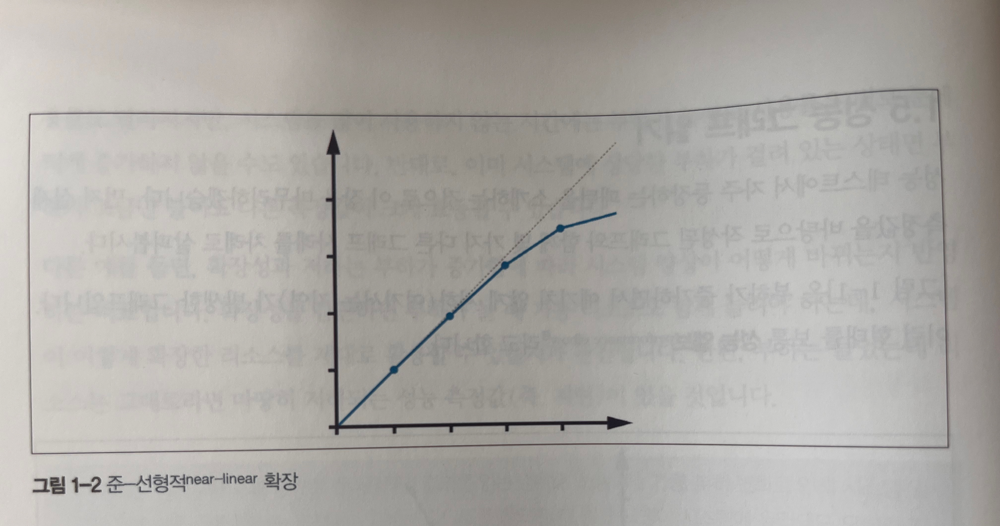
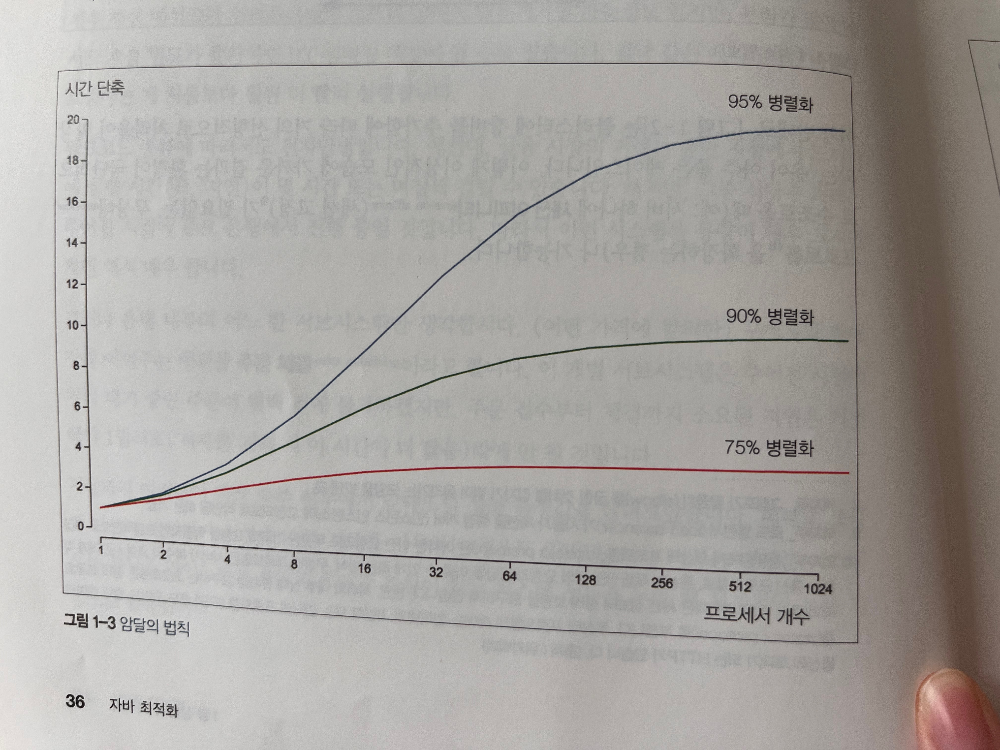
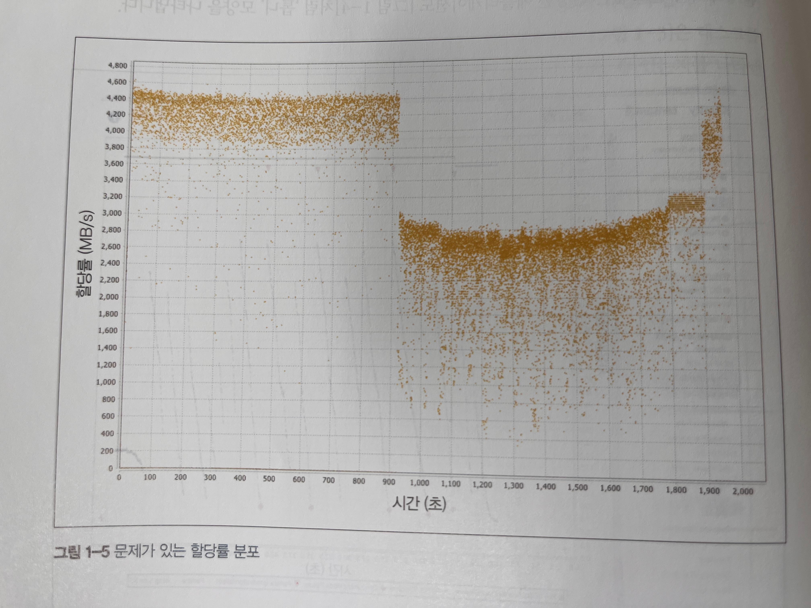
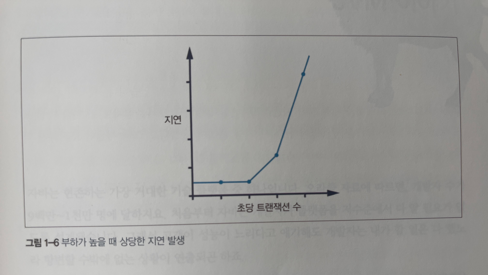

---

marp : true

---

# Chapter 1
## 성능과 최적화

---

# 1.1 자바 성능

* 우수한 성능 목표를 달성하기 위해 필요한 여러가지 단면을 종합적으로 집중 조명한다.
  * 전체 소프트웨어 수명주기의 성능 방법론
  * 성능과 연계된 테스트 이론
  * 측정, 통계, 툴링(도구 선정)
  * (시스템 + 데이터) 분석 스킬
  * 하부 기술과 메커니즘(장치, 수단)
* 모든 최적화 기법에는 사용하기 전에 알아야할 함정과 트레이드오프가 있으니 조심해야한다.

---

# 1.2 자바 성능 개요

* 자바는 처음부터 지극히 실용적인 언어로 생산성을 높이는 대가로 어느 정도의 성능 희생을 감수하였음
* 비교적 최근에 핫스팟 같은 정교한 JVM이 성숙했기에 고성능 컴퓨팅 애플리케이션에 적합한 수준에 이르렀다
* 자바의 실용성을 추구하는 성격을 서브시스템(하위계)에서 확인할 수 있다.

---

# 1.2 자바 성능 개요 : 서브 시스템

* 서브시스템은 하위계로 개발자가 일일이 용량을 세세하게 관리하는 부담을 덜어주고, 대신 저수준으로 제어 가능한 일부 기능을 포기하자는 발상이다.
* 자바는 메모리 관리, 스레드 관리, 동기화, I/O, 네트워킹, 보안 등의 기능을 서브시스템으로 제공한다.

---

# 1.2 자바 성능 개요 : 측정

* JVM 애플리케이션의 성능 측정값은 정규 분포를 따르지 않는 경우가 많다.
* JVM에서 특이점은 매우 중요한 의미를 내표할 수 있다.
* 자바 성능 측정값 때문에 판단이 흐려지기 쉬우므로 조심해야 한다.
* 측정하는 행위 자체도 오버헤드를 일으키며, 너무 자주 샘플링하거나 매번 경과를 기록하는 것 역시 성능 결과 수치에 적잖은 영향을 끼친다.
* 자바를 우직한 기법으로 접근하면 부정확한 결과가 나올 공산이 큽니다.

---

# 1.3 성능은 실험과학이다

* JVM 성능 튜닝은 기술, 방법론, 정량적 측정값, 툴을 망라한 개념이다.
* 목표는 시스템 소유자/유저가 추구하는 측정 결과를 얻는 것이다.
* 성능 분석은 비기능 요건을 정의하고 달성하는 활동이다.
* 즉, 다음의 과정을 통해 원하는 결과를 얻는 일종의 실험과학이라고 볼 수 있다.
  * 원하는 결과를 정의한다.
  * 기존 시스템을 측정한다.
  * 요건을 충적시키려면 무슨 일을 해야 할지 정한다.
  * 개선 활동을 추진한다.
  * 다시 테스트한다.
  * 목표가 달성됐는지 판단한다.

---

# 1.4 성능 분류

* 다음은 가장 일반적인 기본 성능 지표이다
  * 처리율
  * 지연
  * 용량
  * 사용률
  * 효율
  * 확장성
  * 저하

---

## 1.4.1 처리율

* 처리율은 서브시스템이 수행 가능한 작업 비율을 나타낸 지표이다.
* 보통 일정 시간동안 완료한 작업 단위 수로 표시한다.
* 처리율이 실제 성능을 반영하는 의미 있는 지표가 되려면 수치를 얻은 기준 플랫폼에 대해서도 내용을 기술해야 한다.
* 처리율은 시스템의 특정 부분에 대해서도 측정할 수 있다.
* 예를 들어, 데이터베이스의 처리율은 초당 트랜잭션 수로 표시할 수 있다.

---

## 1.4.2 지연

* 지연은 하나의 트랜잭션을 처리하고 그 결과를 반환할때까지 소요된 시간이다.
* 예를 들어, 데이터베이스의 지연은 트랜잭션의 평균 응답 시간으로 표시할 수 있다.

---

## 1.4.3 용량

* 용량은 시스템이 보유한 작업 병렬성의 총량, 즉 시스템이 동시 처리 가능한 작업 단위 개수를 말한다.
* 예를 들어, 데이터베이스의 용량은 동시 접속 가능한 세션 수로 표시할 수 있다.

---

## 1.4.4 사용률

* 성능 분석 업무 중 가장 흔한 태스크는 효율적으로 활용하는것이다.
* 사용률은 워크로드에 따라서 리소스별로 들쑥날쑥할 수 있다.
* 예를 들어, 데이터베이스의 사용률은 CPU, 메모리, 디스크, 네트워크 등의 리소스에 대한 사용률로 표시할 수 있다.

---

## 1.4.5 효율

* 전체 시스템의 효율은 처리율을 리소스 사용률로 나눈 값으로 측정한다.
* 대형 시스템에서는 원가 회계 형태로 효율을 측정하는 방법도 있다.

---

## 1.4.6 확장성

* 리소스 추가에 따른 처리율 변화는 시스템/애플리케이션의 확장성을 가능하는 척도이다.
* 시스템 확장성은 궁극적으로는 정확히 리소스를 투입한 만틈 처리율이 변경되는 형태로 지향합니다.
* 예를 들어, 데이터베이스의 확장성은 CPU, 메모리, 디스크, 네트워크 등의 리소스를 추가했을 때 처리율이 얼마나 증가하는지로 표시할 수 있다.

---

## 1.4.7 저하

* 요청(또는 클라이언트) 개수가 증가하건, 요청 접수 속도가 증가하건, 어떤 형태로든 시스템이 더 많은 부하를 받으면 지연 또는 처리율 측정값에 변화가 생긴다.
* 변화는 사용률에 따라 다르다.
* 시스템이 풀 가동된 상태에서 처리율이 더는 늘지 않고, 지연이 증가하는 현상을 부하 증가에 따른 저하라고 한다.

---

## 1.4.8 측정값 사이의 연관 관계

* 다양한 성능 측정값은 어떤 식으로든 서로 연결돼 있다. 또 구체적인 상호 관계는 시스템이 풀 가동 중인지 여부에 따라 달라진다.

---

# 1.5 성능 그래프 읽기 : 성능 엘보

* 부하가 증가하면서 예기치 않게 저하가 발생한 그래프의 형태를 성능 엘보라고 한다.
  

---

# 1.5 성능 그래프 읽기 : 준 성형적 증가

* 클러스터에 장비를 추가함에 따라 거의 선형적으로 처리율이 확장되는 케이스다.
  

---

# 1.5 성능 그래프 읽기 : 암달의 법칙

* 테스크를 처리할 때 프로세서 개수를 늘려도 실행 속도를 최대 어느 정도까지 높일 수 있는지를 나타낸 그래프다.

---

# 1.5 성능 그래프 읽기 : 건강한 메모리

* JVM 가비지 수집 서브시스템의 메모리 사용 패턴은 그 하부 기술 때문에 부하가 별로 없는 건강한 애플리케이션에서도 톱니 모양을 나타낸다.
  

---

# 1.5 성능 그래프 읽기 : 문제가 있는 할당률 분표

* 애플리케이션에서 메모리 할당률을 성능 튜닝할 때 아주 중요한 메모리 그래프이다.
  

---

# 1.5 성능 그래프 읽기 : 지연 발생

* 아래의 그래프는 시스템 리소스가 누수될 때 흔히 나타나는 징후이다.
* 부하가 증가하면서 지표가 차츰 악하되다가 결국 시스템 성능이 급락하는 변곡접에 이르게 된다.
  

