# 3장 : 하드웨어와 운영체제

자바 언어는 컴퓨팅 파워가 향상되면서 여러모로 많은 혜택을 받았습니다. 하지만 가용 리소스를 최대한 활용하기 위해서는 자바 플랫폼의 근간 원리와 기술을 잘 알고 있어야 합니다.

## 3.1 최신 하드웨어 소개

## 3.2 메모리

무어의 법칙에 따라 CPU의 트랜지스터의 수는 빠르게 증가하였지면 이에 메모리는 그렇지 못했습니다. 이로 인해 메모리와 CPU 사이의 속도 차이가 커지게 되었습니다.

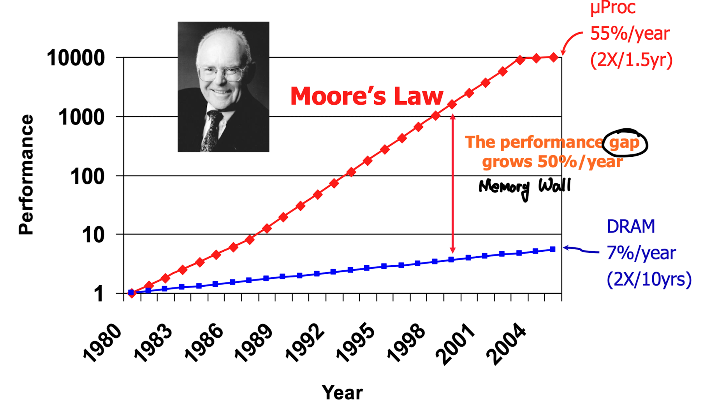

### 3.2.1 메모리 캐시

메모리와 CPU 사이의 속도 차이로 인해 CPU 캐시가 고안됐습니다. CPU 캐시는 CPU에 있는 메모리 영역입니다. 레지스터보다는 느리지만 메인 메모리보다는 훨씬 빠릅니다.

프로세 아키택처에 따라 캐시 구성이 다를 수 있습니다. 일반적으로 각 실행 코어에 L1, L2를 두고, 일부 또는 전체가 공유하는 L3를 둡니다.

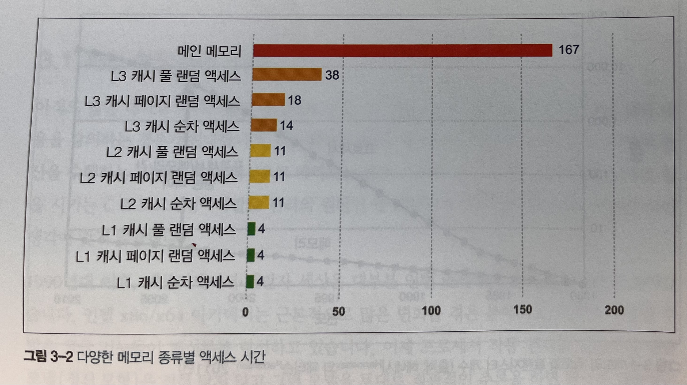

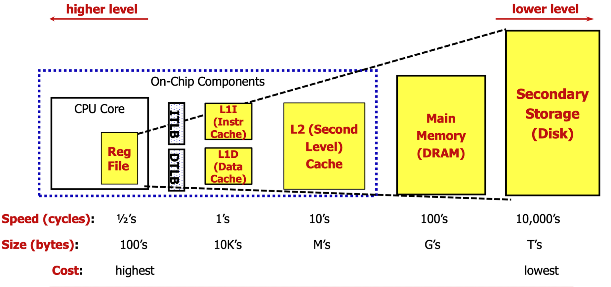

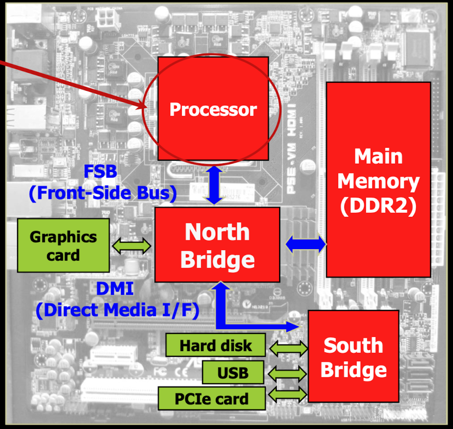

이러한 캐시 구조를 통해서 프로세스 처리율은 현저히 개선이 되었습니다. 하지만 메모리에 있는 데이터를 어떻게 캐시로 가져오고 캐시한 데이터를 어떻게 메모리에 다시 써야할지 결정해야 했습니다. 이를 캐시 일관성 프로토콜이라는 방법으로 해결합니다.

프로세스의 가장 저수준에서 MESI라는 프로토콜이 있습니다. 이는 캐시 라인(보통 64바이트) 상태는 다음 네 가지로 정의합니다.

* Modified(수정) : 데이터가 수정된 상태 
* Exclusive(배타) : 이 캐시에만 존재하고 메인 메모리 내용과 동일한 상태
* Shared(공유) : 둘 이상의 캐시에 데이터가 들어 있고 메모리 내용과 동일한 상태
* Invalid(무효) : 다른 프로세스가 데이터를 수정하여 무효한 상태

요점은 멀티 프로세스가 동시에 공유 상태에 있을 수 있다는 것입니다. 하지만, 어느 한 프로세스가 배타나 수정 상태로 바뀌면 다른 프로세스는 모두 강제로 무효 상태가 됩니다.

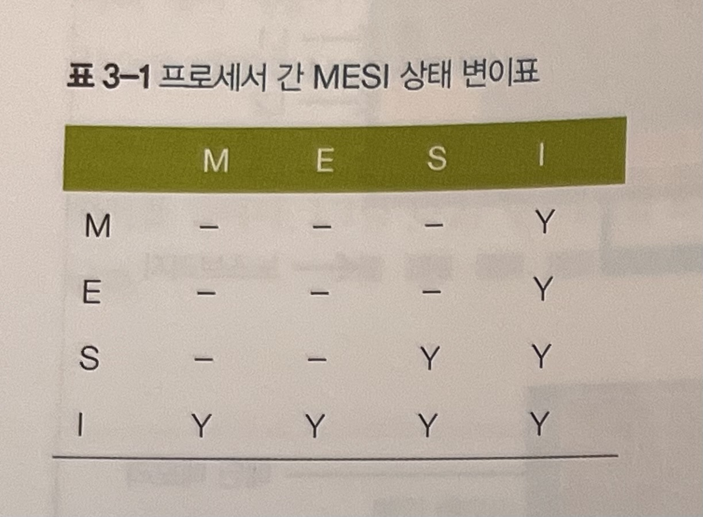

 캐시 연산 결과 저장 방법은 다음과 같습니다.

* write through : cache hit인 상황에서는 cache, memory 데이터 둘다 변경, cache miss인 상태에서는 memory 데이터를 직접 수정 
* write back : cache hit인 상황에서는 cache에 있는 데이터 변경 후 dirty bit 설정, cache miss 인 상황에서는 memory에서 cache로 데이터를 복사한후에 해당 데이터를 수정 및 dirty bit 설정

캐시 기술 덕분에 데이터를 신속하게 메모리에서 쓰고 읽을 수 있게 됐습니다. 메모리 대역폭 측면에서 그 효과를 나타낼 수 있습니다.
이론 적으로 가능한 **최대 전송률**은 다음 인자에 따라 달라집니다.
* 메모리 클럭 주파수
* 메모리 버스 폭(보통 64비트)
* 인터페이스 개수(요즘 대부분 2개)

## 3.3 최신 프로세서의 특성

### 3.3.1 변환 색인 버퍼(TLB)

변환 색인 버퍼(TLB)는 여러 캐시에서 아주 긴요하게 쓰이는 장치입니다.
가상 메모리 주소를 물리 메모리 주소로 매핑하는 페이지 테이블의 캐시 역할을 수행합니다.

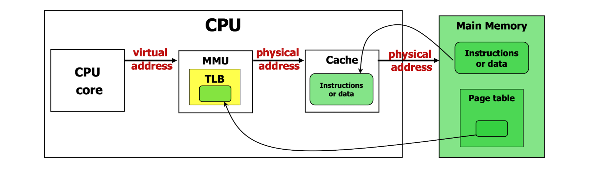

### 3.3.2 분기 예측과 추측 실행

분기 예측은 최신 프로세스의 고급 기법 중 하나입니다. 프로세스가 조건 분기하는 기준값을 평가하느라 대기하는 현상을 방지해줍니다.
이런 모델에서는 조건물을 다 평가하기 전까지 분기 이후 다음 명령을 알 수 없는 게 문제입니다. 그에따라 분기문 뒤의 파이프라인 명령어들을 비우는 동안 프로세스는 여러 사이클동안 멎게 됩니다.

이러한 일을 방지하기 위해 트랜지스터를 적극 활용하여 가장 발생 가능성이 큰 브랜치를 미리 결정하는 휴리스틱을 형성합니다.

### 3.3.3 하드웨어 메모리 모델

"어떻게 하면 서로 다른 여러 CPU가 일관되게 동일한 메모리 주소를 액세스할 수 있을까?"는 멀티코어 시스템에서 메모리에 관한 가장 근본적인 질문입니다.

이는 하드웨어에 따라 다르지만, JIT 컴파일러인 javac와 CPU는 일반적으로 코드 실행 순서를 바꿀 수 있습니다. 이에 따른 현재 스레드가 바라보는 결과는 아무런 영향이 없다는 전제가 필요합니다.

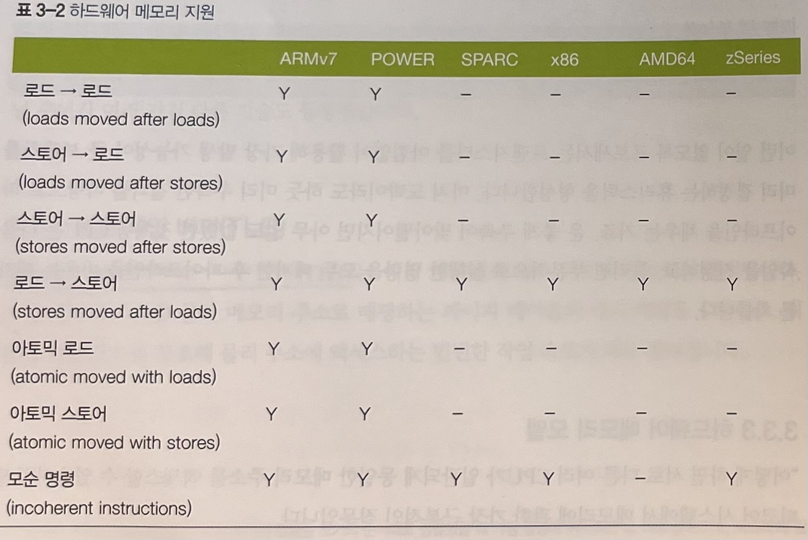

JMM은 프로세스 타입별로 상이한 메모리 액세스 일관성을 고려하여 명시적으로 약한 모델로 설계됐습니다.
하지만 이러한 약한 모델로 인해 명시적인 동기화 기법(Synchronized, volatile 등)을 사용하여 메모리 일관성을 보장하거나 순서를 조정해야 할 수 있습니다.

> Java의 volatile
>
> volatile 키워드는 메모리 일관성과 스레드 간의 동기화를 보장하기 위해 사용됩니다.
> volatile 키워드가 붙은 변수는 메인 메모리에 직접 접근하며, 컴파일러와 CPU의 최적화를 제한합니다.
> 또한 volatile 변수는 스레드 사이에서 가시성을 보장하므로, 한 스레드에서 수정한 변수의 값을 다른 스레드가 즉시 확인할 수 있습니다.
>
> C 언어의 volatile과의 차이점으로는 Java의 volatile에서 스레드 간의 동기화를 제공한다는 점이 있습니다.

## 3.4 운영체제

OS의 주 임무는 여러 실행 프로세스가 공유하는 리소스 액세스를 관장하는 일입니다. 리소스 중에서 메모리와 CPU 시간은 가장 중요한 요소입니다.

메모리 관리 유닛(MMU)을 통한 가상 주소 방식과 페이지 테이블은 메모리 액세스 제어의 핵심으로서, 한 프로세스가 소유한 메모리 영역을 다른 프로세스가 함부로 훼손하지 못하게 합니다.

### 3.4.1 스케줄러

프로세스 스케줄러는 CPU 액세스를 통제합니다. 이때 실행 큐라는 큐를 이용합니다.

스케줄러는 인터럽트에 응답하고 CPU 코어 액세스를 관리합니다.

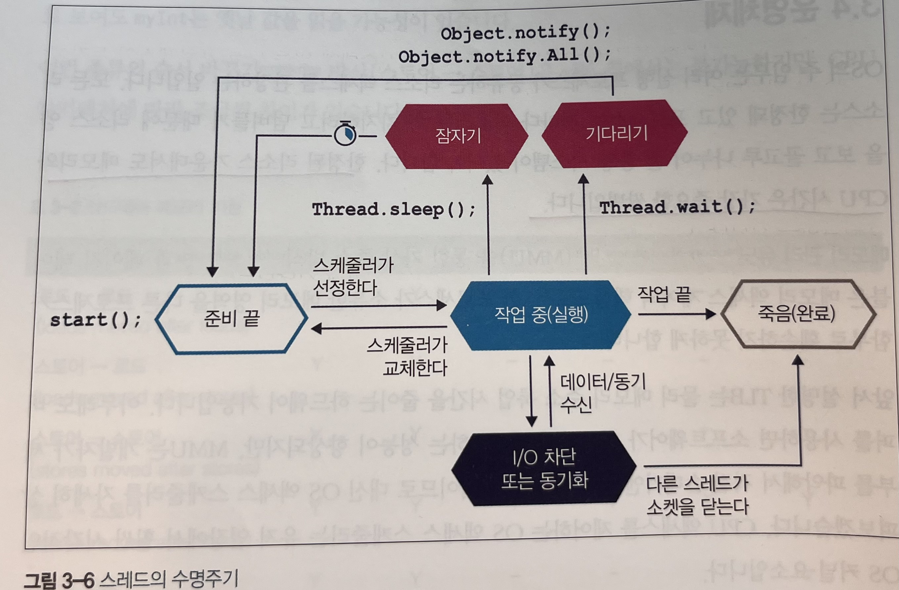

### 스레드 타입

| 스레드 타입           | 설명                                | Java Thread(M) : Native Thread(N) |
|------------------|-----------------------------------|-----------------------------------|
| Platform Threads | 운영체제가 직접 관리하는 스레드                 | 1: 1                              |
| Green Threads    | 여러 Green Thread가 단일 OS 스레드에서 동작   | M: 1                              |
| Virtual Threads  | 여러 Virtual Thread가 여러 OS 스레드에서 동작 | M:N                               |

### 3.4.2 시간 문제

POSIX(Portable Operating System Interface, 이식 가능 운영체제 인터페이스) 같은 업계 표준이 있어도 OS는 저마다 다르게 작동합니다.

### 3.4.3 컨텍스트 교환

컨텍스트 교환은 OS 스케줄러가 현재 실행 중인 스레드/태스크를 없애고 대기 중인 다른 스레드/태스크로 대체하는 프로세스입니다. 종류는 다양하지만 간단히 말해, 컨텍스트 교환은 스레드 실행 명령과 스택 상태를 교체하는 모든 일에 연관되어 있습니다.

유저 스레드 사이에 발생하거나, 유저 모드에서 커널 모드로 바뀌면서(모드 교환) 컨텍스트 교환은 비싼작업입니다.

> 유저 모드 : 프로세스가 일반 사용자가 실행하는 영역입니다. 프로세스가 일반적인 응용 프로그램이 동작하며, 직접적으로 시스템 호출과 같은 특정 인터페이스를 통해 커널 모드로 전환하여 운영체제의 기능에 접근해야만 더 높은 권한의 작업을 수행할 수 있습니다.
> 커널 모드 : 운영체제의 핵심 부분인 커널이 동작하는 영역입니다. 커널 모드에서는 운영체제가 시스템의 모든 자원과 하드웨어를 직접적으로 제어하고, 민감한 시스템 동작과 특권 명령어를 실행할 수 있습니다.

## 3.5 단순 시스템 모델

 시스템 모델의 근본은 유닉스 계열 OS에서 작동하는 자바 애플리케이션의 단순한 개념으로, 다음 기본 컴포넌트로 구성됩니다.
* 애플리케이션이 실행되는 하드웨어와 OS
* 애플리케이션이 실행되는 JVM/컨테이너
* 애플리케이션 코드 자체
* 애플리케이션이 호출하는 외부 시스템
* 애플리케이션으로 유입되는 트래픽

## 3.6 기본 감지 전략

애플리케이션이 잘 돌아간다는 건 CPU 사용량, 메모리, 네트워크, I/O 대역폭 등 시스템 리소스를 효율적으로 잘 이용하고 있다는 뜻입니다.

성능 진단의 첫 단추는 어느 리소스가 한계에 다다랐는지 밝히는 일입니다.

### 3.6.1 CPU 사용률

CPU 사용률은 애플리케이션 성능을 나타내는 핵심 지표입니다. CPU 효율적인 사용은 성능 향상의 지름길입니다. 또한 부하가 집중되는 도중에는 사용률이 가능한 한 100%에 가까워야 합니다.

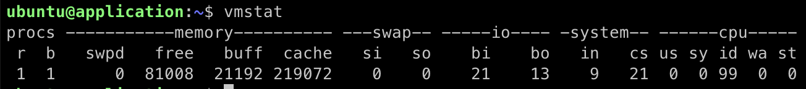
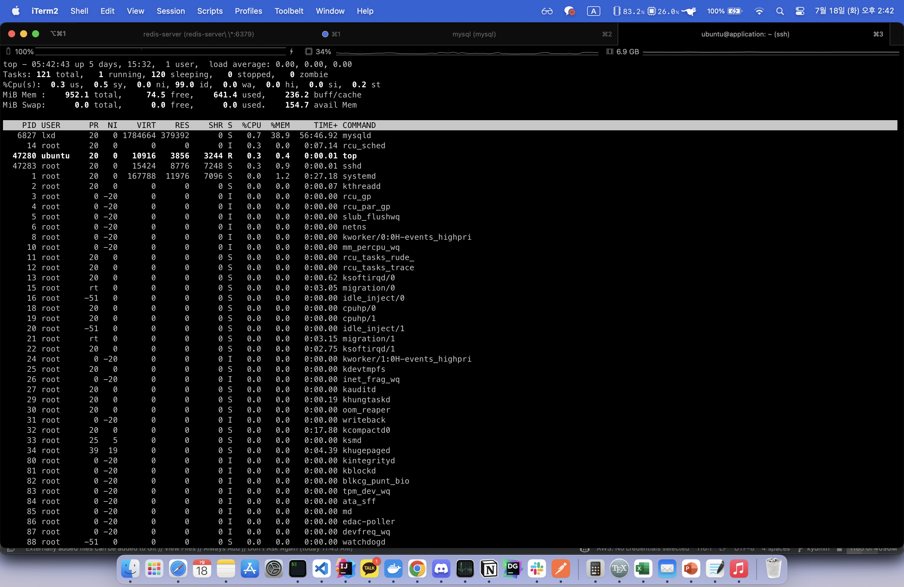

* proc 색션 :  실행가능한(r) 프로세스, 블록킹된(b) 프로세스 개수를 나타냅니다.
* memory 섹션 : 스왑메모리(swpd), 미사용 메모리(free), 버퍼로 사용한 메모리(buff), 캐시로 사용한 메모리(cache)가 표현됩니다.
* swap 섹션 : 디스크로 교체되어 들어간(스왑-인) 메모리(si), 디스크에서 교체되어 빠져나온(스왑-아웃) 메모리(so) 정보입니다. 최신 서버급 머신은 보통 스왑이 별로 많이 일어나지 않습니다.
* io 섹션 : 블록-인(bi), 블록-아웃(bo) 개수는 각각 블록(I/O) 장치에서 받은 512바이트 블록, 블록 장치로 보낸 512 바이트 블록 개수입니다.
* system 섹션 : 인터럽트(in) 및 초당 컨텍스트 교환(cs) 횟수입니다.
* cpu 섹션 : CPU와 직접 연관된 지표를 CPU 사용률로 표기합니다. 좌측부터 차례로 유저시간(us), 커널 시간(sy), 유휴 시간(id), 대기 시간(wa), 도둑맞은 시간(st)입니다.

### 3.6.2 가비지 수집

핫스팟 JVM은 시작 시 메모리를 유저 공간에 할당/관리합니다. 그래서 메모리를 할당하느라 시스템 콜을 할필요가 없습니다. 즉, 가비지 수집을 하려고 커널 교환을 할 일이 거의 없습니다.

따라서 어떤 시스템에서 CPU 사용률이 아주 높게 나타난다면, GC는 대부분의 시간을 소비하는 주범이 아닙니다. GC는 유저 공간의 CPU 사이클을 소비하되 커널 공간의 사용률에는 영향을 미치지 않는 활동입니다.

하지만 JVM 프로세스가 유저 공간에서 CPU를 100% 사용한다면 GC를 의심해야합니다. JVM에서 유저 공간의 CPU 사용률이 높은 건 거의 대부분 GC 서브시스템 탓입니다.

JVM에서 GC 로깅은 거의 꽁짜입니다. GC 로깅은 분석용 데이터의 원천으로서도 가치가 높기 때문에 JVM 프로세스는 예외 없이, 특히 운영 환경에서는 GC 로그를 꼭 남겨야합니다.

### 3.6.3 입출력

파일 I/O는 예로부터 전체 시스템 성능에 암적인 존재였습니다. 메모리 분야는 가상 메모리라는 우아한 격리 장치가 있지만, I/O는 그에 상응하여, 애플리케이션 개발자가 적절히 추상화할 장치가 없습니다.

커널 바이패스 I/O는 커널을 이용하는 직접 하드웨어와 상호작용하는 방법을 말합니다. 이를 통해 더  빠른 I/O 처리와 최적화된 성능을 얻을 수 있습니다.

### 3.6.4 기계 공감

 기계 공감은 성능을 조금이라도 쥐어짜내야 하는 상황에서 하드웨어를 폭넓게 이해하고 공감할 수 있는 능력이 무엇보다 중요하다는 생각입니다.

기계 공감은 자바 개발자가 무시하기 쉬운 관심사입니다. JVM이 하드웨어를 추상화했는데 굳이 개발자가 성능 관련 내용을 일일이 파악할 필요는 없습니다. 하지만 고성능, 저지연이 필수인 분야에서는 JVM을 효율적으로 활용하기 위해서는 JVM이 무엇이고, 하드웨어와 어떻게 상호작용하는지 이해해야 합니다.

## 3.7 가상화

 가상화는 다양한 종류가 있지만 이미 실행 중인 다른 OS위에서 OS 사본을 하나의 프로세스로 실행시키는 모양새가 보통입니다. 가상화 환경이 베어 메탈에서 실행되는 비가상(실) OS 안에서 일개 프로세스로 작동하는 것입니다.

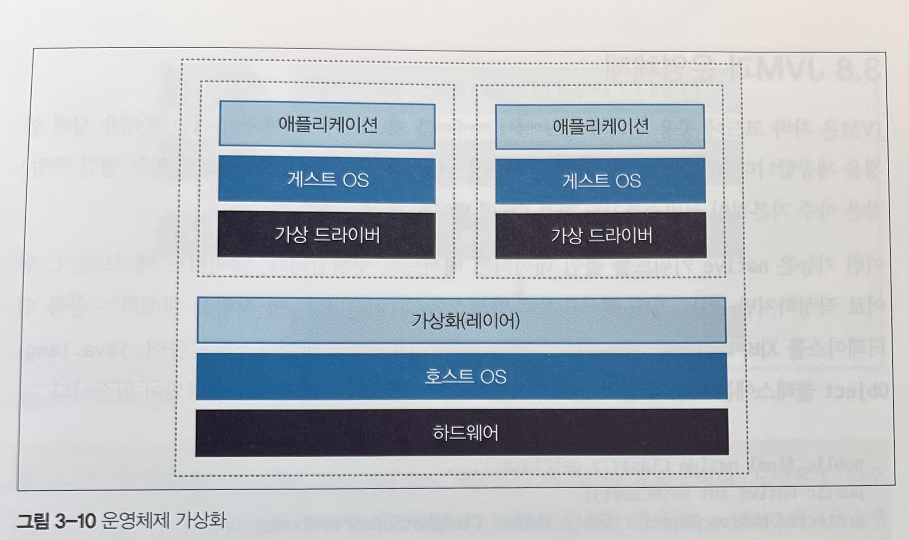

## 3.8 JVM과 운영체제

 JVM은 자바 코드에 공용 인터페이스를 제공하여 OS에 독립적인 휴대용 실행 환경을 제공합니다. 하지만 스레드 스케줄링 같은 아주 기본적인 서비스조차도 하부 OS에 반드시 액세스해야 합니다.

이런 기능은 native 키워드를 붙인 네이티브 메서드로 구현합니다. 네이티브 메서드는 C 언어로 작성하지만, 여느 자바 메서드처럼 액세스할 수 있습니다. 이 작업을 대행하는 공통 인터페이스를 자바 네이티브 인터페이스(JNI)라고 합니다.

~~~java
public final native Class<?> getClass();
public native int hashCode();
        ...
~~~

 자바 네이티브 인터페이스를 처리하는 순서는 다음과 같습니다.

우선 os::javaTimeMillis() 함수는 자바 정적 메서드 System.currentTimeMillis()에 구현된 로직을 처리합니다. 실제 코드는 C++로 작성됐지만 자바에서 C 코드'브리지'를 통해 액세스할 수 있습니다.

네이티브 메서드 System.currentTimeMillis()는 JVM_CurrentTimeMillis()라는 JVM 엔트리 포인트 메서드에 매핑됩니다.
JVM_CurrentTimeMillis()는 VM 진입점에 해당하는 메서드를 호출합니다. 결국 OpenJDK 매크로 2개로 감싼 os::javaTimeMillis()를 호출하는 구조입니다.

이 메서드는 os 이름공간에 정의되어 있고 당연히 OS에 의존합니다.

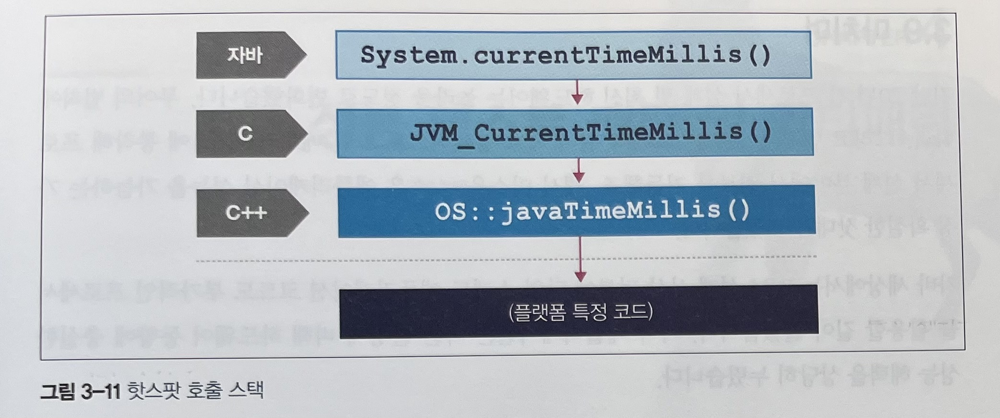

> 참조 :
>
> 홍익대학교 컴퓨터 구조 강의록
> 
> Virtual Theads(https://stackoverflow.com/questions/74639116/what-is-the-difference-between-green-threads-and-virtual-threads)