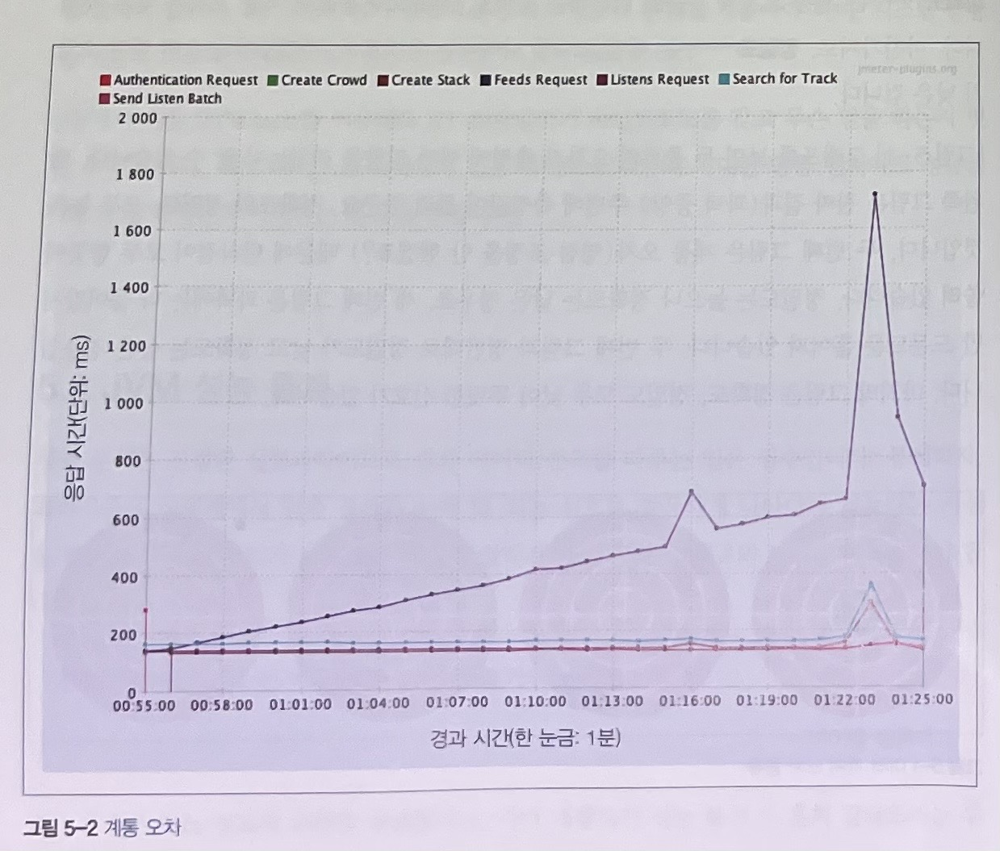
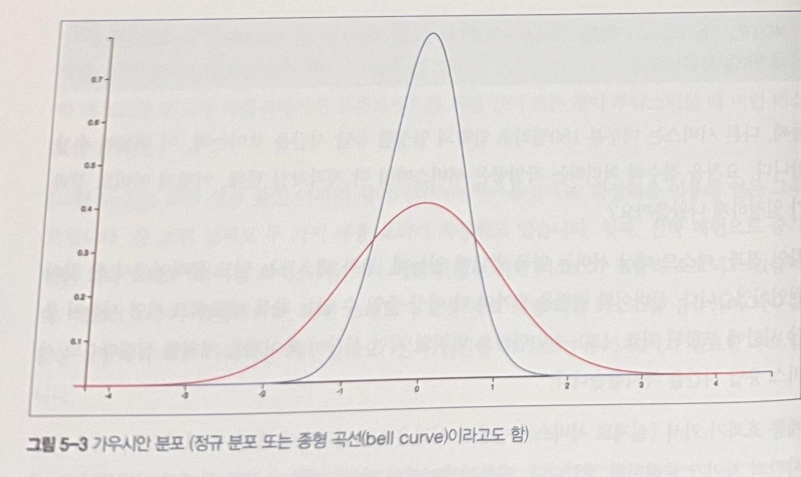
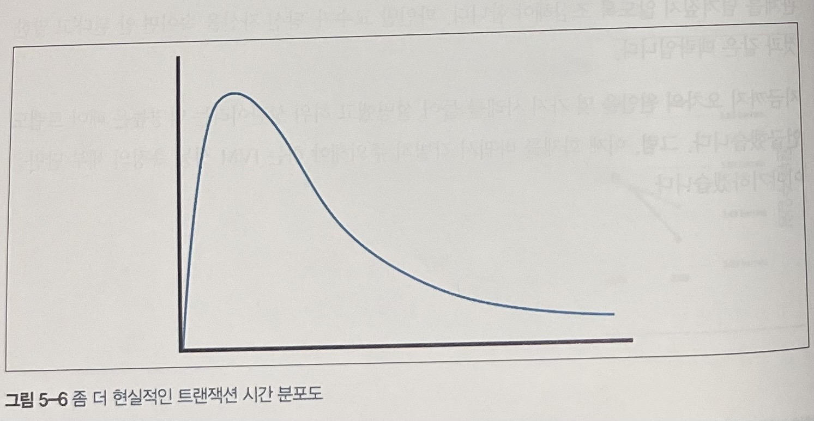
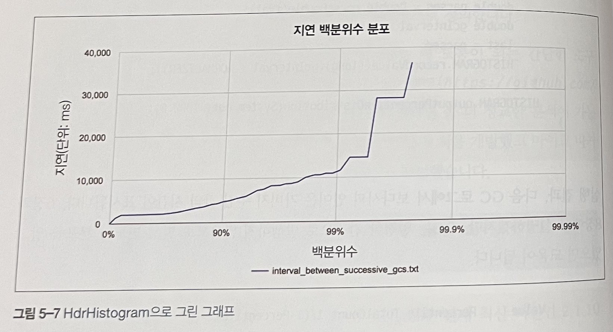
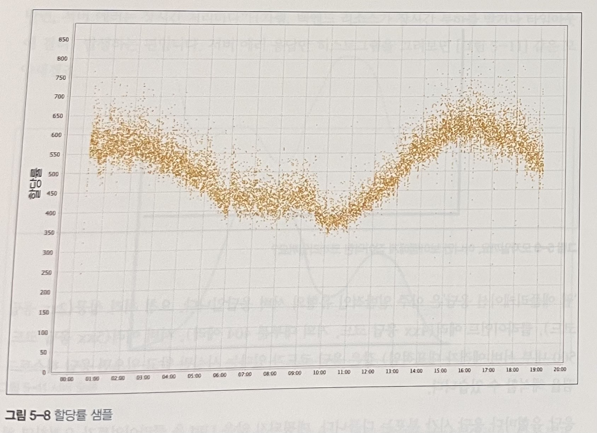
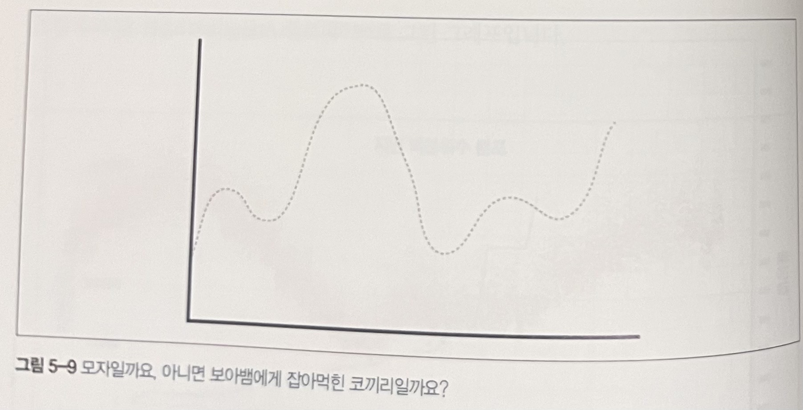
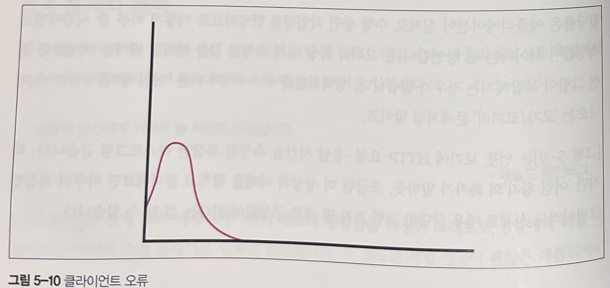
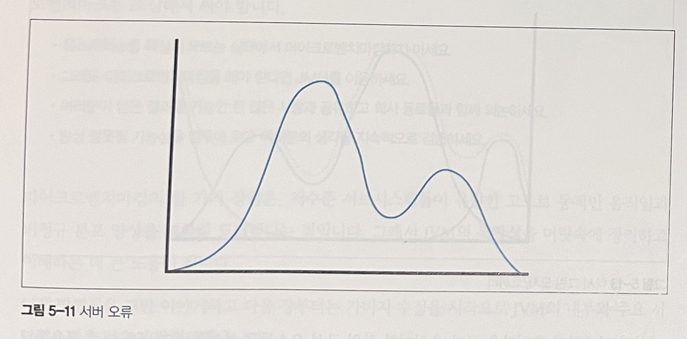
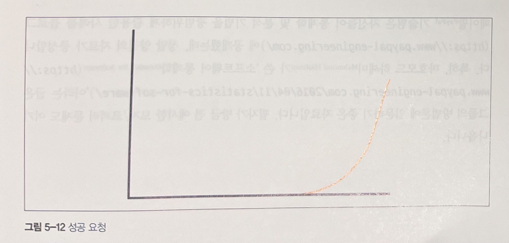
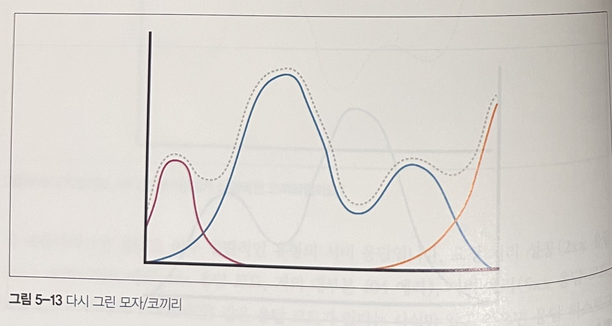

# 5장 : 마이크로벤치마킹과 통계

작은 자바 코드 한 조각의 성능을 정확히 측정하기란 매우 미묘하고 어려운일 입니다. 이 장에서는 마이크로벤치마킹이란 무엇인지, 그리고 올바른 사용법을 무엇인지 설명합니다.

## 5.1 자바 성능 측정 기초

* 성능 분석은 기초 실험과학 분야로 귀결된 다양한 기술 측면을 종합한 것입니다. 
  * 벤치마크를 하나의 과학 실험처럼 바라보면 좋은 벤치마크를 작성하는 데에 큰 도움이 됩니다. 
  * 시스템의 어느 한 곳만 변경하고 다른 외부 요인은 벤치마크 안에 두고 통제하면 좋습니다.

* 자바 플렛폼을 벤치마크할 때에는 자바 런타임의 정교함이 가장 문제입니다.
  * 자바에서의 JIT 컴파일러, 메모리 관리 등의 자바 런타임이 제공하는 서브 시스템과 완전히 독립적으로 생각할 수 없습니다.

이런 상황에서 흔히 저지를 실수가 있습니다. 
* JVM의 웜업을 고려하지 않는 것입니다. 
  * JVM의 JIT 컴파일러가 최적화를 수행하기 전에는 코드가 느리게 실행됩니다. 따라서 벤치마크를 실행하기 전에 JVM을 웜업 시키는 것이 중요합니다. 
  * 또 한가지 고려할 요인으로는 GC 입니다. 하지만 개발자가 직접 설정하기 어렵습니다. 따라서 GC가 일어날 가능성이 큰 시기에 타이밍을 캡처하지 않는 게 최선입니다.
  * 다른 실수로는 테스트하려는 코드에서 생성된 결과를 실제로 사용하지 않는것입니다.
  * 한번 측정한 결과로는 평균을 내도 벤치마크가 어떻게 수행됐는지 전체 사정을 속속들이 알 길이 없습니다. 
* 이에 혀용 오차를 수집해 신뢰도를 파악하면 좋습니다. 하지만 허용 오차가 큰 것은 통제불능 변수가 있거나, 개발된 코드 자체가 성능 기준에 미치지 못함을 의미합니다. 어느 쪽이든 허용 오차를 구하지 않고서는 문제의 존재조차 알 수 없습니다.

벤치마크 코드를 바로잡는 일은 대단히 복잡하고 여러 요인을 고려해야합니다. 이에대안 해결방법은 다음과 같습니다.
1. 시스템 전체를 벤치마크합니다. 저수준 수치는 수집하지 않거나 그냥 무시합니다.
2. 연관된 저수준의 결과를 의미있게 비교하기 위해 앞서 언급한 많은 문제를 공통 프레임워크를 이용해 처리하는 것입니다.

## 5.2 JMH 소개

대부분 애플리케이션에서 마이크로벤치마킹은 적합하지 않은 기술로 밝혀지는 경우가 많습니다.

### 5.2.1 될 수 있으면 마이크로벤치마크하지 말지어다(실화)

마이크로벤치마크는 특정 작은 코드를 테스트하는 것입니다. 하지만 전체적인 관점에서 봐야지만 찾을 수 있는 문제일 수도 있습니다.
즉, 개발자는 큰 그림을 못 보고 자기 코드가 성능을 떨어뜨렸을 거란 강박 관념에 사로잡힐 수 있습니다.

### 5.2.2 휴리스틱 : 마이크로벤치마킹은 언제 하나?

자바 플랫폼은 원래 천성이 동적인 데다 GC, JIT에 의해 성능을 직접 가늠하기가 어렵습니다. 설상가상으로, 실제 애플리케이션을 측정한 각 런타임 환경마다 성능 수치도 제각각입니다.

하지만 마이크로벤치마킹을 진행해야할 경우가 있을 수 있습니다. 그 예는 다음과 같습니다. 
1. 사용 범위가 넓은 범용 라이브러리 코드를 개발한다.
2. OpenJDK 또는 다른 자바 플랫폼 구현체를 개발한다.
3. 지연에 극도로 민감한 코드를 개발한다.

일반적으로 마이크벤치마크는 가장 극단적인 애플리케이션에 한하여 사용하면 좋습니다. 딱 정해진 기준은 없지만, 다음 기준을 대부분 충족하는 애플리케이션이 아니라면 마이크로벤치마크를 수행해도 진정 가치 있는 결과를 도출하기 어렵습니다.
1. 총 코드 경로 실행 시간은 적어도 1밀리초, 실제로 100마이크로초보다 짧아야 합니다.
2. 메모리 할당률을 측정하는데, 그 값은 1MB/s 미만, 가급적 0에 가까운 값이어야 한다.
3. 100% 가깝게 cpu를 사용하며 시스템 이용률은 낮게 유지해야한다.
4. 실행 프로파일러로 cpu를 소비하는 메서들의 분포를 이해해야 한다. 분포 그래프에서 지배적인 영향을 끼치는 메서드는 많아야 두세 개 정도이다.

### 5.2.3 JMH 프레임워크

JMH는 앞선 이슈들을 해소하고자 개발된 프레임워크입니다.

* JMH는 JVM을 빌드한 사람들이 직접 만든 프레임워크입니다.
* JMH 제작자는 JVM 버전별로 숨겨진 함정과 최적화 베어 트랩을 어떻게 피하는지 누구보다 잘 알고 있습니다. 
* JMH는 각 JVM 릴리즈마다 꼭 맞는 벤치마킹 툴 세트로 함께 진화해왔고, 덕분에 개발자는 툴 사용법을 익히고 벤치마크 코드에만 전념할 수 있게 되었습니다.
* JMH는 리플랙션이 아닌 애노테이션을 통한 자바 소스를 추가하는 방식으로 작동합니다.

벤치마크 프레임워크가 유저 코드를 엄청나게 반복 호출하는 경우, 루프 최적화를 수행하는 것도 문제입니다. 벤치마크 코드를 실행하는 실제 프로세스가 결과 신뢰도에 영향을 미칠 가능성이 있습니다.

JMH는 벤치마크 코드가 루프 최적화에 걸리지 않을 정도로 조심스레 반복 횟수를 설정한 루프 안에 감싸 넣는 기지를 발휘합니다.

### 5.2.4 벤치마크 실행

gradle을 이용하여 JMH를 설정할 수 있습니다.
우선 gradle 의존성과 설정으로는 다음과 같습니다.
> JMH gradle : https://github.com/melix/jmh-gradle-plugin#configuration-options
~~~
plugins {
    id 'java'
    id "me.champeau.jmh" version("0.6.3")
}

group 'org.example'
version '1.0-SNAPSHOT'

repositories {
    mavenCentral()
}

dependencies {
    jmh 'org.openjdk.jmh:jmh-core:0.9'
    jmh 'org.openjdk.jmh:jmh-generator-annprocess:0.9'

    testImplementation 'org.junit.jupiter:junit-jupiter-api:5.8.1'
    testRuntimeOnly 'org.junit.jupiter:junit-jupiter-engine:5.8.1'
}

test {
    useJUnitPlatform()
}

jmh {
    fork = 1
    warmupIterations = 1
    iterations = 1
}
~~~
코드는 다음과 같이 작성할 수 있습니다. 이는 ArrayList와 Stream의 filter를 통한 성능 비교입니다.
~~~java
@State(Scope.Benchmark)
@BenchmarkMode(Mode.AverageTime)
@OutputTimeUnit(TimeUnit.NANOSECONDS)
public class Sample {

	private List<Integer> list;

	@Setup
	public void setup() {
		list = new ArrayList<>();

		for (int i = 0; i < 10000; i++) {
			list.add(i);
		}
	}

	@Benchmark
	public void ArrayListBenchmark( Blackhole blackhole){
		blackhole.consume(arrayListMethod(list));
	}

	@Benchmark
	public void StreamBenchmark(Blackhole blackhole){
		blackhole.consume(streamMethod(list));
	}

	private List<Integer> arrayListMethod(List<Integer> list){
		List<Integer> result = new ArrayList<>();

		for (Integer val : list) {
			if(val % 5 == 0){
				result.add(val);
			}
		}

		return result;
	}

	private List<Integer> streamMethod(List<Integer> list){
		return list.stream().filter(val -> val % 5 == 0).collect(Collectors.toList());
	}
}
~~~
결과를 확인하는 가장 간단한 방법으로는 이 java 파일을 빌드를하면 /build/results/jmh/results.txt에서 확인할 수 있습니다.
~~~
Benchmark                  Mode  Cnt      Score   Error  Units
Sample.ArrayListBenchmark  avgt       21337.402          ns/op
Sample.StreamBenchmark     avgt       18431.550          ns/op
~~~

JVM과 밀접하게 맞닿아 작동하는 JMH는 아주 강력한 기능을 자랑합니다.
* 컴파일러를 제어한다.
* 벤치마크 도중 CPU 사용 수준을 시뮬레이션한다.

블랙홀을 이용하면 실제로 CPU 사이클을 소모해 다양한 CPU 부하 상황에서 벤치마크를 시뮬레이션해볼 수 있습니다.

* JMH를 사용할때 벤치마크가 통제된 환경을 나타낸다고 쉽게 가정하지만 실은 전혀 그렇지 못한 경우도 많습니다.
따라서 통제되지 않은 변수는 대게 찾아내기가 어려워서 JMH 같은 툴을 쓰더라도 각별히 잘 살펴야합니다.
* 스스로 인지 편향에 흔들리지 않도록 관심을 기울여야합니다. 시스템 양상을 있는 그대로 잘 나타낸 측정값을 얻고 있는지 확인해야 합니다.

## 5.3 JVM 성능 통계

성능 분석은 진정한 실험과학이므로 결과 데이터 분포를 다루는 일은 필수입니다. 우리는 우리가 보고 싶은 과장된 상태가 아닌, 있는 그대로의 세상을 바라보아야합니다.

모든 측정은 어느 정도의 오차를 수반합니다. 자바 개발자가 성능 분석 시 흔히 맞닥뜨리는 두가지 주요 오차 유형을 설명하겠습니다.

### 5.3.1 오차 유형

엔지니어가 자주 접하는 오차의 주된 근원은 두 가지입니다.
* 랜덤 오차(random error) : 측정 오차 또는 무관계 요인이 어떤 상관관계 없이 결과에 영향을 미칩니다.
* 계통 오차(systematic eror) : 원인을 알 수 없는 요인이 상관관계 있는 형태로 측정에 영향을 미칩니다.

**정확도**는 계통 오차 수준을 나타내는 용어로, 정확도가 높으면 계통 오차가 낮은 것입니다. 마찬가지로, **정밀도**는 랜덤 오차를 나타내는 용어로서, 정밀도가 높으면 랜덤 오차가 낮은 것입니다.

### 계통 오차

아래 측정치는 계통 효과가 작용하고 있습니다.
1. 선형 패턴으로 증가하는 위쪽 그래프를 통해 한정된 서버 리소스가 조금씩 소모됨을 알 수 있습니다.
2. 다른 요청들은 일정하지만 특정 요청만 수상한 결과를 보여줍니다.

이의 결과 테스트 대상 서버와 부하 테스트위치가 너무 멀어 네트워크 지연이 응답시간에 포함되었습니다.

계통 효과가 커서 실제 응답 시간의 차이가 묻혀버린겁니다. 애플리케이션이 아닌, 계통 오차가 문제인 사례입니다.

### 랜덤 오차

랜덤 오차는 원인을 알 수 없는, 또는 예기치 못한 환경상의 변화 때문에 일어납니다. 기초과학 실험에서는 그런 변화가 측정 장비나 환경 자체에서 일어나지만, 소프트웨어에서는 측정 툴을 못 믿을 이유가 없으므로 랜덤 오차의 근원은 오직 운영 환경입니다.

랜덤 오차는 대부분 정규 분포를 따릅니다. 정규 분포는 오차가 측정값에 미치는 긍적적/부정적 영향도가 얼추 비슷한 경우에는 적합하지만 JVM에는 이 모델이 맞지 않습니다.

### 하위 상관

통계학에서 아주 유명한 격언이 하나 있습니다. "상관은 인과를 나타내지 않는다." 즉, 두 변수가 비슷하게 움직인다고해도 이들 사이에 연결고리가 있다고 볼 수는 없습니다.

JVM과 성능 분석 영역에서는 그럴싸해 보이는 연결고리와 상관관계만 보고 측정값 간의 인관계를 넘겨짚지 않도록 조심해야 합니다.

### 5.3.2 비정규 통계학

위 분포의 형태는 우리가 JVM에 대해 직관적으로 알고 있는 것, 즉 모든 관련 코드가 이미 JIT 컴파일돼서 GC 사이클이 없는 핫 패스의 존재를 시사합니다.

이는 가우시간 통계학의 근본 가정과 정면으로 배치되는 이런 모습으로 비정규 분포를 생각하지 않을 수 없습니다.

JVM이 생성한 긴 꼬리형 비정규 분포를 다루는 데 아주 유용한 기법 중 하나는, 백분위 수 개념을 조금 변용하는 것입니다. 분포는 수치 하나로 나타낼 수 없는, 데이터 형상, 즉 전체 그래프라는 사실을 기억해야합니다.

다음은 메서드 타이밍 결과입니다. 긴 꼬리형 분포임을 감안하여 평균, 90% 백분위수를 구한 뒤, 이후부터 대수적으로 죽 샘플링한것입니다.
~~~
50.0% level was 23ns
90.0% level was 30ns
99.0% level was 43ns
99.9% level was 164ns
99.99% level was 248ns
99.999% level was 3458ns
99.9999% level was 17463ns
~~~

긴 꼬리형 분포는 고동적 범위 분포라고도 합니다. 보통 측정값의 동적 범위는 기록한 최댓값을 최솟값으로 나눈 값으로 정의합니다.

대수 백분위수는 긴 꼬리형 분포를 이해하는 데 도움이 되는 간단한 도구지만, 고도 동적 범위에 분표된 데이터셋을 처리하는 (HdrHistogram)라는 공개 라이브러리를 이용하면 좀 더 정교한 분석이 가능합니다.

## 5.4 통계치 해석

경험 데이터와 측정 결과는 아무 의미 없이 그냥 존재하지 않습니다. 애플리케이션을 측정해서 얻은 결괏값을 해석하는 일이야말로 가장 힘들고 어려운 일입니다.

아래 측정치는 실제 자바 애플리케이션의 메모리 할당률을 측정한 그래프로, 센섬이라는 GC로 캡처한 화면입니다.

할당 데이터는 비교적 신호가 명확한 편이라 해석하기 쉽습니다. 측정 시간 내내 할당률은 350~700MB/s로 안정적입니다.

할당률은 애플리케이션이 실제로 수행 중인 작업량을 반영하므로 이렇게 하루 중 시간대별로 측정값이 차이나는 건 당연합니다.

다음은 HTTP 요청-응답 시간을 측정한 복잡한 히스토그램처럼 생겼습니다. 하지만 이는 간단한 여러 조각으로 나눌 수 있습니다.

HTTP 응답으로 2xx, 4xx, 5xx로 나눌 수 있습니다. 따라서 위 히스토그램을 HTTP 응답 코드에 대해 나누면 다음과 같습니다. 

### 클라이언트 오류

### 서버 오류

### 성공 요청

### 모든 데이터 취합

이처럼 일반적인 측정값을 보다 유의미한 하위 구성 요소들로 분해하는 개념은 아주 유용합니다. 분석자는 결괏값을 보고 결론을 도출하기 전에 먼저 본인의 데이터 및 도메인을 충분히 이해해야 합니다. 데이터를 더 작은 집합으로 쪼개야 할 경우도 있습니다.

## 5.5 마치며

자바 성능 분야에서 마이크벤치마킹은 조심해서 사용해야 합니다.
* 유스케이스를 확실히 모르는 상태에서 마이크로벤치마킹하지 마세요
* 그래도 마이크로벤치마킹을 해야 한다면 JMH를 이용하세요
* 여러분이 얻은 결과를 가능한 한 많은 사람들과 공유하고 회사 동료들과 함께 의논하세요.
* 항상 잘못된 가능성을 염두에 두고 여러분의 생각을 지속적으로 검증하세요

마이크로벤치마킹의 한 가지 장점은, 저수준 서브시스템들이 유발한 고도로 동적인 움직임과 비정규 분포 양상을 명확히 드러낸다는 점입니다. 그래서 JVM의 복잡성을 머릿속에 정리하고 이해하는 데 큰도움이 됩니다.

> 참조
> 
> gradle 환경에서 JMH를 사용하여 벤치마킹하기(https://mong9data.tistory.com/131)