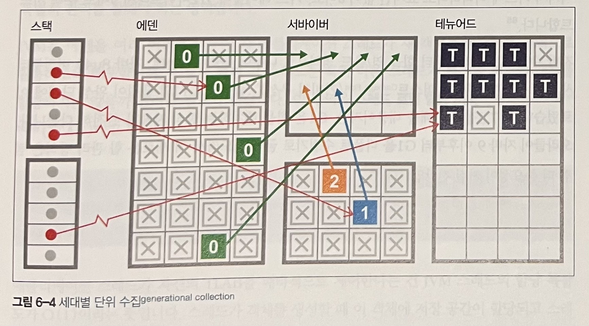
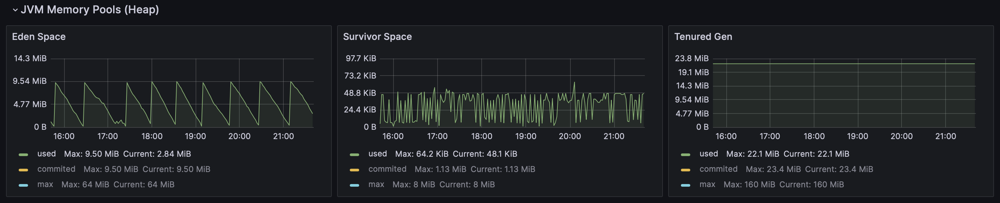
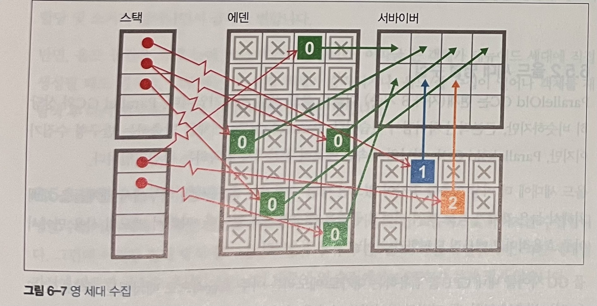
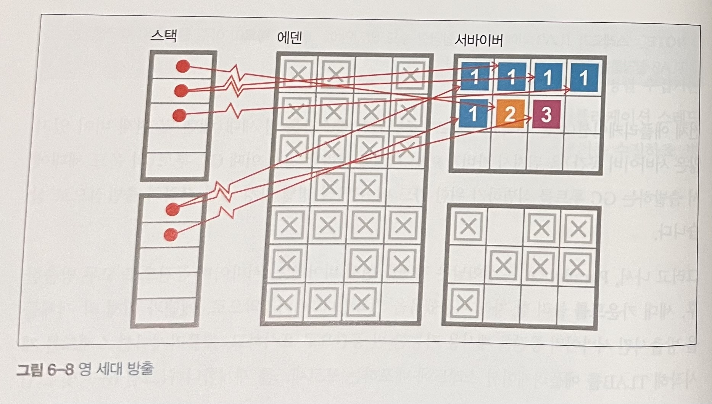
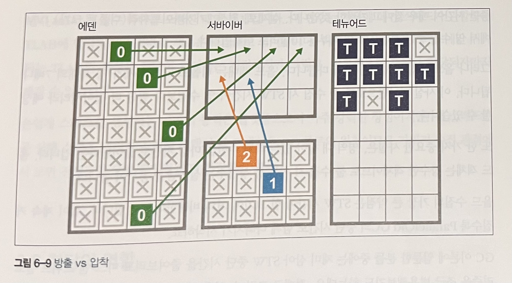

# 6장 가비지 수집 기초

* 신세대 프로그래밍 언어에서 메모리 관리는 프로그래머가 아닌, 컴파일러나 런타임의 영역이라고 보는 시각이 지배적입니다.
* 가비지 수집의 요체는, 런타임이 대신 객체를 추적하며 쓸모없는 객체를 알아서 제거하는 것입니다.

가비지 수집은 다음 두가지 기본 원칙을 준수해야 합니다.
* 알고리즘은 반드시 모든 가비지를 수집해야 한다.
* 살아 있는 객체는 절대로 수집해선 안 된다.

두번째 원칙이 더 중요합니다. 살아 있는 개체를 수집한다면 세그먼테이션 결함(Segmentation Fault)이 발생하거나 프로그램 데이터가 조용히 더렵혀집니다.

## 6.1 마크 앤 스위프

마크 앤 스위프 알고리즘은 할당됐지만, 아직 회수되지 않은 객체를 가리키는 포인터를 포함한 할당 리스트를 사용합니다.

전체적인 GC 알고리즘은 다음과 같습니다.
1. 할당 리스트를 순회하면서 마크 비트를 지운다.
2. GC 루트부터 살아 있는 객체를 찾는다.
3. 이렇게 찾은 객체마다 마크 비트를 세팅한다.
4. 할당 리스트를 순회하면서 마크 비트가 세팅되지 않은 객체를 찾는다.
   * 힙에서 메모리를 회수해 프리 리스트에 되돌린다.
   * 할당 리스트에서 객체를 삭제한다.

살아 있는 객체는 대부분 DFS 방식으로 찾습니다. 이렇게 해서 생성된 객체 그래프를 라이브 객체 그래프(Live Object Graph)라고 합니다. 접근 가능한 객체의 전이 폐쇄라고도 합니다.

## 6.1.1 가비지 수집 용어

* STW(Stop The World) : GC 사이클이 발생하여 가비지를 수집하는 동안 모든 애플리케이션이 중단 됩니다. 따라서 애플리케이션 코드는 GC 스레드가 바라보는 힙 상태를 무효화할 수 없습니다.
* 동시 : GC 스레드는 애플리케이션 스레드와 동시(병행) 실행될 수 있습니다. 이는 계산 비용 면에서 아주 어렵고 비싼 작업이며 100% 동시 실행을 보장하는 알고리즘은 없습니다.
* 병렬 : 여러 스레드를 동원해서 가비지 수집을 합니다.
* 정확 : 정확한 GC 스킴은 전체 가비지를 한방에 수집할 수 있게 힙 상태에 관한 충분한 타입 정보를 지니고 있습니다.
* 보수 : 보수적인 스킴은 정확한 스킴의 정보가 없습니다. 그래서 리소스를 낭비하는 일이 잦고 근본적으로 타입 체계를 무시하기에 훨씬 비효율적입니다.
* 이동 : 이동 수집기에서 객체는 메모리를 여기저기 오갈 수 있습니다. 즉, 객체 주소가 고정된 게 아닙니다.
* 압착 : 할당된 메모리는 GC 사이클 마지막에 연속된 단일 영역으로 배열되며, 객체 쓰기가 가능한 여백의 시작점을 가리키는 포인터가 있습니다. 압착 수집기는 메모리 단편화를 방지합니다.

## 6.2 핫스팟 런타임 개요

* 자바는 C++과 달리 주소를 역참조하는 일반적인 메커니즘은 없습니다.
* 오프셋 연산자(. 연산자)만으로 필드에 엑세스하거나 객체 레퍼런스의 메소드를 호출할 수 있습니다.
* 자바는 값으로 호출(call by value)방식으로만 메서드를 호출합니다. 물론, 객체 레퍼런스에 경우 복사된 값은 힘에 있는 객체의 주소입니다.

### 6.2.1 객체를 런타임에 표현하는 방법

* 핫스팟은 런타임에 oop라는 구조체로 자바 객체를 나타냅니다.
* oop는 평범한 객체 포인터의 줄임말이며, 참조형 지역 변수안에 위치합니다.(참조형 지역 변수는 값이 heap에 할당되며 stack에는 heap 메모리 주소가 저장됩니다.)

oop를 구성하는 자료 구조는 여러 가지가 있습니다. 이 중 instanceOop는 자바 클래스의 인스턴스를 나타냅니다.
* instanceOop는 Mark 워드, Klass 워드로 헤더가 구성됩니다.
  * Mark 워드 : 인스턴스 관련 메타데이터를 가리키는 포인터
  * Klass 워드 : 클래스 메타데이터를 가리키는 포인터
* 자바 7까지는 instanceOop의 Klass 워드가 자바 힙의 일부인 펌젠(PermGen)이라는 메모리 영역을 가리켰습니다.
* 자바 8부터는 Klass가 자바 힙의 주 영역 밖으로(JVM 프로세스의 C 힙 밖은 아님) 빠지게 되었습니다. 그래서 최신 버전의 자바는 Klass 워드가 자바 힙 밖을 가리키므로 객체 헤더가 필요 없습니다.

oop는 대부분 기계어 워드라서 각 프로세서의 비트에 맞춰 크기가 조정됩니다. 이런 구조는 메모리가 크게 낭비될 우려가 있기에 핫스팟은 메모리를 절약할 수 있게 압축 oop라는 기법을 제공합니다.

> -XX:+UseCompressedOops

힙에 있는 다음 oop가 압축됩니다.
* 힙에 있는 모든 객체의 Klass 워드
* 참조형 인스턴스 필드
* 객체 배열의 각 원소

핫스팟 객체 헤더는 일반적으로 다음과 같이 구성됩니다.
* Mark 워드
* Klass 워드(압축됐을 수 있음)
* 객체가 배열이면 length 워드(항상 32비트)
* 32비트 여백(정렬 규칙 때문에 필요한 경우)

### 6.2.2 GC 루트 및 아레나

GC 루트는 메모리의 **고정점**으로, 메모리 풀 외부에서 내부를 가리키는 포인터입니다.
메모리 풀 내부에서 같은 메모리 풀 내부의 다른 메모리 위치를 가리키는 **내부 포인터**와 정반대인, **외부 포인터** 입니다.

GC 루트는 다음과 같습니다.
* 스택 프레임
* JNI
* 레지스터(끌어올려진(호이스트된) 변수)
* (JVM 코드 캐시에서) 코드 루트
* 전역 객체
* 로드된 클래스의 메타데이터

GC는 아레나라는 메모리 영역에서 작동합니다. 핫스팟은 자바 힙을 관리할 때 시스템 콜을 하지 않습니다.

## 6.3 할당과 수명

자바 애플리케이션에서 가비지 수집이 일어나는 주된 원인은 다음 두 가지 입니다.
* 할당률 : 일정 기간 새로 생성된 객체가 사용한 메모리량입니다. 비교적 쉽게 측정할 수 있습니다.
* 객체 수명 : 대부분 측정하기 어렵습니다.

위 두 원인에서 객체 수명이 할당률보다 더 측정하기 어렵기에 가비지 컬랙션에서 더 핵심적인 요소입니다.

### 6.3.1 약한 세대별 가설

약한 세대별 가설은 소프트웨어 시스템의 런타임 작용을 관찰한 결과 알게 된 경험 지식으로, JVM 메모리 관리의 이론적 근간을 형성합니다.

> JVM 및 유사 소프트웨어 시스템에서 객체 수명은 이원적 분포 양상을 보인다. 거의 대부분의 객체는 아주 짧은 시간만 살아 있지만, 나머지 객체는 기대 수명이 훨씬 길다.

핫스팟은 몇 가지 메커니즘을 응용하여 약한 세대별 가설을 활용합니다.
* 객체마다 '세대 카운트'를 센다.
* 큰 객체를 제외한 나머지 객체는 에덴 공간에 생성한다. 여기서 살아남은 객체는 다른 곳으로 옮긴다.
* 장수했다고 할 정도로 충분히 오래 살아남은 객체들은 별도의 메모리 영역(올드 또는 테뉴어드(Tenured))에 보관한다.

핫스팟은 카트 테이블이라는 자료 구조에 늙은 객체가 젊은 객체를 참조하는 정보를 기록합니다.
카드 테이블은 JVM이 관리하는 바이트 배열로, 각 원소는 올대 세대 공간의 512바이트 영역을 가리킵니다.

핵심 로직은 늙은 객체 o에 있는 참조형 필드값이 바뀌면 o에 해당하는 instanceOop가 들어 있는 카드를 찾아 해당 엔트리를 더티 마킹합니다. 핫스팟은 레퍼런스 필드를 업데이터할 때마다 단순 쓰기 배리어를 이용합니다.

## 6.4 핫스팟의 가비지 수집

* 자바는 C/C++ 계열의 환경과 달리 OS를 이용해 동적으로 메모리를 관리하지 않습니다. 
* 일단 프로세스가 시작되면 JVM은 메모리를 할당하고 유저 공간에서 약속된 단일 메모리 풀을 관리합니다.
* 메모리 풀은 각자의 목적에 따라 다른 영역으로 구성됩니다.
* 객체는 보통 에덴 영역에 생성됩니다.
* 수집기가 줄곧 객체를 이동시키기에 객체가 차지한 주소는 대부분 시간이  흐르면서 빈번하게 바뀝니다. 객체를 이동시키는 것을 **방출**이라고 합니다.

### 6.4.1 스레드 로컬 할당

* JVM은 성능을 강화하여 에덴을 관리합니다.
* 에덴은 대부분의 객체가 탄생하는 장소이며 단명 객체는 다른 곳에는 위치할 수 없으므로 관리를 잘해야하는 영역입니다.
* JVM은 에덴을 여러 버퍼로 나누어 각 애플리케이션 스레드가 새 객체를 할당하는 구역으로 활용하도록 배포합니다. 이 구역을 스레드 로컬 할당 버퍼라고 합니다.
* 핫스팟은 애플리케이션 스레드에 발급한 TLAB 크기를 동적으로 조정합니다.

### 6.4.2 반구형 수집

* 반구형(방출) 수집기는 두 공간을 사용하는 독특한 방출 수집기입니다.
* 장수하지 못한 객체를 임시 수용소에 담아 두자는 아이디어입니다. 이를 통해 단명 객체가 테뉴어드 세대를 어지럽히지 않게 하고 풀 GC 발생 빈도를 줄일 수 있습니다.

이 두 공간(반구)는 두 가지 기본적인 특성을 지닙니다.
* 수집기가 라이브 반구를 수집할 때 객체들은 다른 반구로 압착시켜 옮기고 수집된 반구는 비워서 재사용한다.
* 절반의 공간은 항상 완전히 비운다.

이 방법을 사용한다면 수집기 반구 내부에 실제로 보관 가능한 메모리 공간보다 2배를 더 사용하게 되어 낭비지만, 공간이 너무 크지 않다면 유용한 기법입니다.
핫스팟은 이 반구형 기법과 공간을 접목시켜 영 세대 수집을 합니다.

핫스팟에서는 영 힙의 반구부를 서바이버(생존자) 공간이라고 합니다.

## 6.5 병렬 수집기

* 자바 8 이전까지 JVM 디폴트 가비지 수집기는 병렬 수집기입니다.
* 병렬 수집기는 처리율에 최적화되어 있고 영 GC, 풀 GC 모두 풀 STW를 일으킵니다.

병렬 수집기의 종류는 다음과 같습니다.
* Parallel GC : 가장 단순한 영 세대용 병렬 수집기입니다.
* ParNew GC : CMS 수집기와 함께 사용할 수 있게 Parallel GC를 조금 변형한 것입니다.
* ParallelOld GC : 올드(테뉴어드) 세대용 병렬 수집기입니다.

### 6.5.1 영 세대 병렬 수집

* 영 세대 수집은 가장 흔한 가비지 수집 형태입니다.
* 스레드가 에덴에 객체를 할당하려는데 자신이 할당받은 TLAB 공간은 부족하고 JVM은 새 TLAB를 할당할 수 없을 때 영 세대 수집이 발생합니다.

1. 영 세대(에덴 및 현재 비어 있지 않은 서바이버 공간)을 뒤져서 가비지 아닌 객체를 골라냅니다. 이때 GC 루트를 병렬 마킹 스캔 작업의 출발점으로 삼습니다.
2. ParallelGC는 살아남은 객체를 현재 비어 있는 서바이버 공간으로 모두 방출한 후, 세대 카운트를 증가시킵니다.
3. 애플리케이션 스레드를 재시작해 TLAB을 애플리케이션 스레드에 배포하는 프로세스를 재개합니다.

### 6.5.2 올드 세대 병렬 수집

ParallelOld GC는 현재(자바 8 기준) 디폴트 올드 세대 수집기입니다. Parallel GC와 상당히 비슷하지만, 근본적인 차이점이 있습니다.
ParallelOld GC는 하나의 연속된 메모리 공간에서 압착하는 수집기입니다.

* 올드 세대에 더 이상 방출할 공간이 없으면 병렬 수집기는 올드 세대 내부에서 객체들을 재배치해서 늙은 객체가 죽고 빠져 버린 공간을 회수합니다.
* 메모리 사용 면에서 아주 효율적이고 메모리 단편화가 일어날 일도 없습니다.
* 풀 GC 사이클 내내 CPU를 점유하는 대가로 메모리는 아주 효율적으로 배치됩니다.

### 6.5.3 병렬 수집기의 한계

병렬 수집기는 세대 전체 대상으로 한번에, 가능한 한 효율적으로 가비지를 수집합니다. 하지만 이러한 설계 방식에는 단점이 있습니다.
* 풀 STW를 유발합니다.
* 영 수집의 경우에는 STW 시간이 짧지만, 올드 수집은 올드 세대가 영 세대보다 크기에 STW 시간도 길어집니다. 
* 살아있는 객체의 수만큼 마킹하는 시간이 길어지기에 올드 세대가 커질수록 STW 시간도 길어집니다.
* 즉, 올드 수집은 힙 크기가 커질수록 STW 시간도 길어집니다.

## 6.6 할당의 역할

* 자바의 GC 사이클은 하나 이상의 힙 메모리 공간이 꽉 채워져 더 이상 객체를 생성할 공간이 없을 때 일어납니다.
* GC가 발생하면 모든 애플리케이션 스레드가 멈춥니다. JVM은 모든 코어를 총동원해 가비지를 수집하고 메모리를 회수한 후, 애플리케이션 스레드를 재개합니다.

이상적인 상황에서 객체 수명이 일정하다면 절대로 어느 객체도 테뉴어드 세대로 승격될 수 없습니다.
하지만 약한 세대별 가설에 따르면, 객체 수명은 고정된 게 아닌 어떤 분포를 보이며, 이 분포가 불확실한 탓에 결국 일부 객체는 테뉴어드에 도달할 것입니다.

할당률은 실제로 아주 심하게 변하거나 갑자기 확 치솟기도 합니다 이러한 상황에서 에덴에서 생성된 객체의 용량이 서바이버 공간보다 크다면 바로 테뉴어드로 보내며 이는 테뉴어드가 가득 차서 풀 GC가 발생하기 전까지 회수되지 않습니다.

이를 조기 승격이라고 합니다. 가비지 수집에서 가장 중요한 간접 효과이자, 많은 튜닝 활동의 출발점 중 하나입니다.

> 참조 
> 
> PermGen이 왜 삭제되었을까?(https://johngrib.github.io/wiki/java8-why-permgen-removed/)
> 
> [Java] 자바 메타스페이스(Metaspace)에 대해 알아보자.(https://jaemunbro.medium.com/java-metaspace에-대해-알아보자-ac363816d35e)
> 
> An object is a class instance or an array.(https://docs.oracle.com/javase/specs/jls/se8/html/jls-4.html#jls-4.3.1)