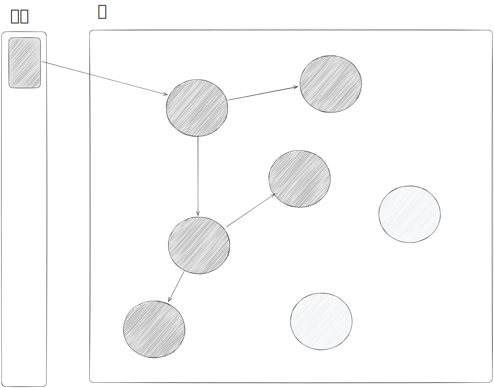
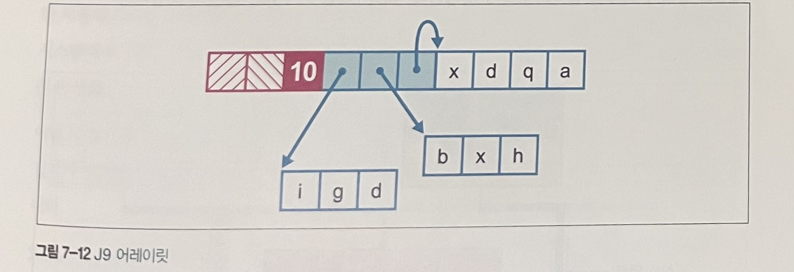
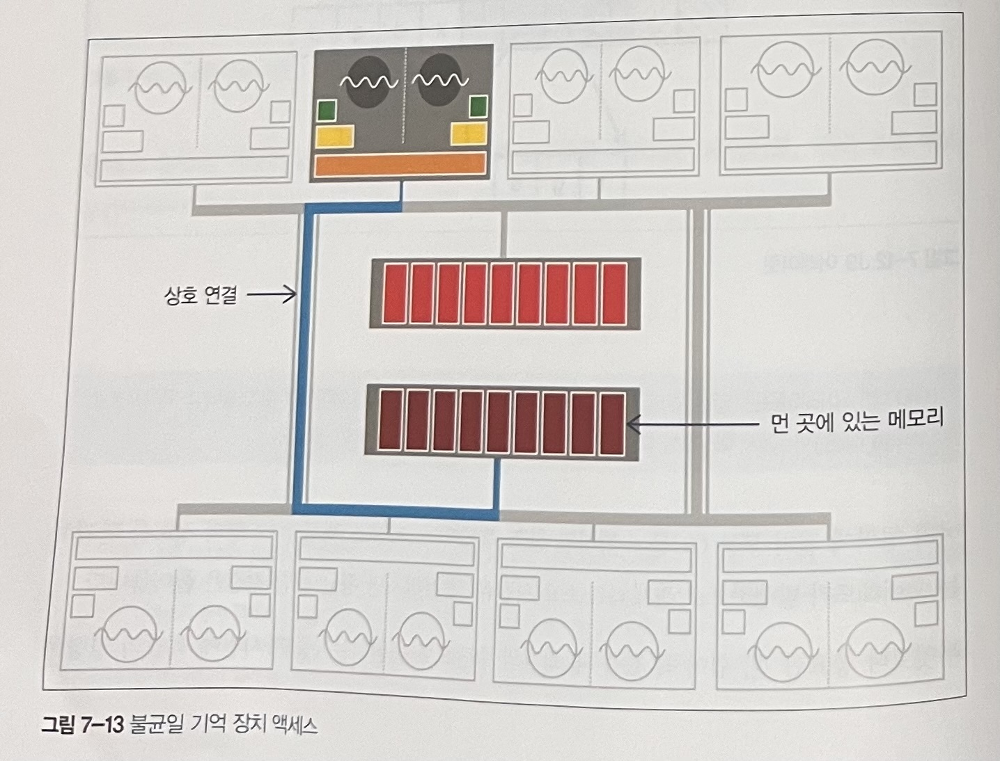

# 7장 가비지 수집 고급

## 7.1 트레이드오프와 탈착형 수집기

* 자바/JVM 명세서에는 GC를 구현하는 방법에 대해 일언반구도 없습니다.
* GC는 탈착형 서브시스템으로 같은 자바 프로그램이라도 코드 변경 없이 여러 가지 가비지 수집기에서 돌려볼 수 있습니다.
* 탈착형으로 사용하는것은 GC가 아주 일반적인 컴퓨팅 기법이며 같은 알고리즘이라도 모든 워크로드 유형에 다 적합한 건 아니기 때문입니다.

개발자는 가비지 수집기 선정 시 다음 항목을 충분히 고려해야합니다.
* 중단 시간(중단 길이 또는 기간이라고도 함)
* 처리율(애플리케이션 런타임 대비 GC 시간 %)
* 중단 빈도(수집기 때문에 애플리케이션이 얼마나 자주 멈추는가?)
* 회수 효율(GC 사이클 당 얼마나 많은 가비지가 수집되는가?)
* 중단 일관성(중단 시간이 고른 편인가?)

## 7.2 동시 GC 이론

* 범용 가비지 수집은 중단 결정을 내리는 데 참고할 만한 도메인 지식이 전혀 없으며 메모리 할당은 불확정성을 유발하는 직접적인 원인으로, 실제로도 많은 자바 응용 시스템에서 들쑥날쑥한 양상을 보입니다.
* 최신 GC 이론은 GC 기술의 가장 큰 걸림돌인, 불확정적 STW 중단 문제를 일단 해결하려고 시도합니다.
* 동시 수집기를 사용해 애플리케이션 스레드의 실행 도중 수집에 필요한 작업 일부를 수행해서 중단 시간을 줄이는 것도 방법입니다.

### 7.2.1 JVM 세이브 포인트

* JVM은 애플리케이션 스레드마다 세이프포인트라는 특별한 실행 지점을 둡니다.
* 세이프포인트는 스레드의 내부 자료 구조가 훤히 보이는 지점으로, 여기서 어떤 작업을 하기 위해 스레드는 잠시 중단될 수 있습니다.
* JVM은 다음 두 가지 규칙에 따라 세이프포인트를 처리합니다.
  * JVM은 강제로 스레드를 세이프포인트 상태로 바꿀 수 없다.
  * JVM은 스레드가 세이프포인트 상태에서 벗어나지 못하게 할 수 있다.
* 세이프포인트 요청을 받았을 때 그 지점에서 스레드가 제어권을 반납하게 만드는 코드가 VM 인터프리터 구현체와 JIT 컴파일한 메소드에 모두 존재해야 합니다.

세이프포인트 상태로 바뀌는 몇가지 일반적인 경우입니다.
* JVM이 전역 '세이프포인트 시간' 플래그를 세팅한다.
* 각 애플리케이션 스레드는 폴링하면서 이 플래그가 세팅됐는지 확인한다.
* 애플리케이션 스레드는 일단 멈췄다가 다시 깨어날 때까지 대기한다.

세이프포인트 시간 플래그를 세팅하면 모든 애플리케이션 스레드는 반드시 멈춰야합니다.

일반 애플리케이션 스레드는 다음 방식으로 폴링합니다.
* 인터프리터에서 바이트코드 2개를 실행할 때마다 체크합니다. 
* 컴파일드 코드에서는 보통 컴파일드 메소드 밖으로 나가거나 분기가 회귀하는 지점에 JIT 컴파일러가 세이프포인트 폴링 코드를 삽입합니다.

다음 각 경우에 스레드는 자동으로 세이프포인트 상태가 됩니다.
* 모니터에서 차단된다.
* JNI 코드를 실행한다.

다음 경우는 스레드가 꼭 세이프포인트 상태가 되는 건 아닙니다.
* 바이트코드를 실행하는 도중이다
* OS가 인터럽트를 걸었다.

### 7.2.2 삼색 마킹

삼색 마킹 알고리즘의 작동 원리는 다음과 같습니다.
* GC 루트를 회색 표시한다.
* 다른 객체는 모두 흰색 표시한다.
* 마킹 스레드가 임의의 회색 노드로 이동한다.
* 마킹 스레드가 흰색 표시된 자식 노드가 있는 노드를 만나면, 먼저 그 자식 노드를 모두 회색 표시한 뒤, 해당 노드를 검은색 표시한다.
* 회색 노드가 하나도 남지 않을 때까지 위 과정을 되풀이한다.
* 검은색 객체는 모두 접근 가능한 것이므로 살아남는다.
* 흰색 노드는 더 이상 접근 불가한 객체이므로 수집 대상이 된다.

* 동시 수집은 SATB(Snapshot At The Beginning)라는 방법을 적극 활용합니다.
* 수집 사이클을 시작할 때 접근 가능하거나 그 이후에 할당된 객체를 라이브 객체로 간주하는 겁니다.
* 단점으로는 변경자 스레드가 수집을 하는 도중에 검은색 상태, 수집을 안하는 동안에는 흰색 상태로 새객체를 생성할 수 있습니다.

삼색 마킹 알고리즘에서 실행 중인 애플리케이션 스레드가 변경한 것 때문에 라이브 객체가 수저집되는 현상을 방지하려면 몇 가지 로직이 더 추가돼야 합니다.
동시 수집기에서는 마킹 스레드가 삼색 알고리즘을 실행하는 도중에는 애플리케이션 스레드가 계속 객체 그래프를 변경하기 때문입니다.

위 문제를 해결하는 방법은 다음과 같습니다.
* 객체 색깔을 검은색 -> 회색으로 바꾸고 변경자 스레드가 업데이트하며 처리할 노드 세트에 도로 추가하면 됩니다.
* 삼색 불변의 원칙을 위배할지 모를 모든 변경 사항을 큐 형태로 넣어두고, 주 단계가 끝난 다음 부차적인 '조정'단계에서 바로잡습니다.

## 7.3 CMS

* CMS 수집기는 중단 시간을 아주 짧게 하려고 설계된, 테뉴어드(올드) 공간 전용 수집기입니다. 보통 영 세대 수집용 병렬 수집기(Parallel GC)를 조금 변형한 수집기(ParNew)와 함께 씁니다.
* CMS는 중단 시간을 최소화하기 위해 애플리케이션 스레드 실행 중에 가급적 많은 일을 합니다.
* 마킹은 삼색 마킹 알고리즘에 따라 수행하므로 수집기가 힙을 탐색하는 도중에는 객체 그래프가 변경될 수 있습니다. 따라서 CMS는 가비지 수집의 두 번째 원칙(아직 살아 있는 객체를 수집하면 안 된다)을 위반하지 않도록 반드시 레코드를 바로잡아야합니다.

CMS의 수행단계는 다음과 같습니다.
* 초기 마킹(Initial Mark, STW) : 해당 영역 내부에 위치한 확실한 GC 출발점을 얻는 단계
* 동시 마킹(Concurrent Mark) : 삼색 마킹 알고리즘을 힙에 적용하면서 나중에 조정해야 할지 모를 변경 사항을 추적합니다.
* 동시 사전 정리(Concurrent Preclean) : 재마킹 단계에서 가능한 한 STW 시간을 줄이는 것이 목표입니다.
* 재마킹(Remark, STW) : 카드 테이블을 이용해 변경자 스레드가 동시 마킹 단계 도중 영향을 끼친 마킹을 조정합니다.
* 동시 스위프(Concurrent Sweep)
* 동시 리셋(Concurrent Reset)

대부분의 워크로드에 CMS를 적용하면 다음 효험이 있습니다.
* 애플리케이션 스레드가 오랫동안 멈추지 않습니다.
* 단일 풀 GC 사이클 시간(벽시계 시간)이 더 깁니다.
* CMS GC 사이클이 실행되는 동안, 애플리케이션 처리율은 감소합니다.
* GC가 객체를 추적해야 하므로 메모리를 더 많이 씁니다.
* GC 수행에 훨씬 더 많은 CPU 시간이 필요합니다.
* CMS는 힙을 압착하지 않으므로 테뉴어드 영역은 단편화될 수 있습니다.

### 7.3.1 CMS 작동 원리

* CMS는 대부분 애플리케이션 스레드와 동시에 작동합니다.
* 기본적으로 GC 동시단계에 가용 스레드 절반을 사용하고 나머지 절반은 애플리케이션 스레드가 자바 코드를 실행하는 데 씁니다.
* CMS는 영 수집을 담당하는 수집기간에 긴밀한 조정이 필요하기에 조금 다른 영 수집기를 사용합니다.
* 할당률이 급증하면 영 수집 시 조기 승격이 발생하고, 급기야 영 수집 후 승격된 객체가 너무 많아 테뉴어드 공간조차 부족해지는 현상을 동시 모드 실패(Concurrent Mode Failure: CMF)라고 합니다.
* CMF 상황에서는 JVM은 어쩔 수 없이 풀 STW를 유발하는 ParallelOld GC를 사용하게 됩니다.
* CMF가 자주 일어나지 않게 하려면 테뉴어드가 꽉 차기 전에 CMS 수집 사이클을 개시해야 합니다.
* 힙 단편화는 CMF를 유발하는 또 다른 원인입니다. CMS는 압착을 하지 않기때문입니다. 이를 해결할 방법으로는 풀 STW ParallelOld GC로 공간을 확보하는 방법뿐입니다.
* CMS는 내부적으로 프리 리스트를 이용해 사용 가능한 빈 공간을 관리합니다. 동시 스위프 단계에서 스위퍼 스레드가 여유 공간을 더 큰 덩어리로 만들고 단편화로 인해 CMF가 발생하지 않도록 연속된 빈 블록들을 하나로 뭉칩니다.
* 스위퍼는 변경자와 동시에 작동하므로 스레드가 서로 적절히 동기화되지 않는 한 새로 할당된 블록이 잘못 스위프될 가능성이 있습니다. 이런일이 없게끔 스위퍼 스레드는 작업 도중 프리 리스트를 잠급니다.

### 7.3.2 CMS 기본 JVM 플래그

CMS 수집기는 다음 플래그로 작동합니다.
> -XX:+UseConcMarkSweepGC

최신 핫스팟 버전에서 이 플래그를 사용하면 ParNew GC(병렬 영 수집기를 조금 변형한 수집기)도 함께 작동합니다.

## 7.4 G1

G1(Garbage First)는 병렬 수집기, CMS와는 다른 수집기입니다.

처음부터 중단 시간이 짧은 새로운 수집로 설계된 G1은 다음과 같은 특성이 있습니다.
* CMS보다 훨씬 튜닝이 쉽습니다.
* 조기 승격에 덜 취약합니다.
* 대용량 힙에서 확장성(특히, 중단 시간)이 우수합니다.
* 풀 STW 수집을 업앨 수 (또는 풀 STW 수집으로 되돌아갈 일을 확 줄일 수) 있습니다.

G1은 병렬/CMS 수집기와는 달리 세대마다 경계가 뚜렷한, 연속된 메모리 공간이 없고 반구형 힙 레이아웃 방식과도 무관합니다.

### 7.4.1 G1 힙 레이아웃 및 영역

* G1 힙은 영역(리전)으로 구성됩니다.
* 영역은 디폴트 크기가 1MB(힙이 클수록 커짐)인 메모리 공간입니다.
* 영역을 이용하면 세대를 불연속적으로 배치할 수 있고, 수집기가 매번 실행될 때마다 전체 가비지를 수집할 필요가 없습니다.

 

### 7.4.2 G1 알고리즘 설계

G1 수집기는 다음과같은 일을 합니다.
* 동시 마킹 단계를 이용합니다.
* 방출 수집기입니다.
* '통계적으로 압착'합니다.

G1 수집기의 특징은 다음과 같습니다.

* G1 수집기는 워밍업을 하는 동안, GC 사이클이 한번 돌 때마다 얼마나 많은 '일반' 영역에서 가비지를 수집할 수 있는지 그 수치를 보관합니다.
* 제일 마지막 GC가 발생한 이후로 새로 할당된 객체를 감당하기에 충분한 메모리를 수집할 수 있다면, G1은 할당보다 뒤쳐지지 않는 것입니다.
* G1은 에덴, 서바이버 영역인 영 세대 개념을 있자만, 세대를 구성하는 영역이 연속되지 않습니다.
* G1 수집기에는 기억 세트(RSet)라는 비슷한 장치로 영역을 추적합니다.
* RSet은 영역별로 하나씩, 외부에서 힙 영역 내부를 참조하는 레퍼런스를 관리하기 위한 장치입니다. 덕분에 G1은 영역 내부를 바라보는 레퍼런스를 찾으려고 전체 힙을 다 뒤질 필요 없이 RSet만 꺼내보면 됩니다.
* RSet, 카드 테이블은 모두 부유 가비지라는 GC 문제를 해결하는 데 유용합니다.
  *  부유 가비지는 현재 수집 세트 외부에서 죽은 객체가 참조하는 바람에 이미 죽었어야 할 객체가 계속 살아 있는 현상입니다.

### 7.4.3 G1 단계

G1 수집 단계는 앞서 보았던 CMS 수집기와 비슷합니다.
* 초기 마킹(STW)
* 동시 루트 탐색 : 초기 마칭 단계의 서바이버 영역에서 올드 세대를 가리키는 레퍼런스를 찾는 동시 단계로, 반드시 다음 영 GC 탐색을 시작하기 전에 끝내야합니다.
* 동시 마킹
* 재마킹(STW) : 마킹 작업이 완료하고 레퍼런스를 처리하고 SATB 방식으로 정리하는 작업을 합니다.
* 정리(STW)

### 7.4.4 G1 기본 JVM 플래그

자바 8 이전까지는 다음 스위치로 G1을 동작시킵니다.
> +XX:UseG1GC

G1의 주 목표인 중단 시간 단축을 위해 가비지 수집이 일어날때 최대 중지 시간을 설정할 수 있습니다.
> -XX: MaxGCPauseMillis=200

디폴트 영억 트기 값을 변경할 수 있습니다.
~~~
-XX:G1HeapRegionSize=<n>
~~~

## 7.5 셰난도아(Shenandoah)

레드햇 진영에서의 OpenJDK GC인 셰난도아가 있습니다.
셰난도아의 주목표는 중단시간 단축입니다.

수집단계는 다음과 같습니다.
* 초기 마킹(STW)
* 동시 마킹
* 최종 마킹(STW)
* 동시 압창

셰난도아의 가장 두드러진 특징은 브룩스 포인터입니다.
* 브룩스 포인터는 객체당 메모리 워드를 하나 더 써서 이전 가비지 수집 단계에서 객체가 재배치됐는지 여부를 표시하고 새 버전 객체 콘텐츠의 위치를 가리킵니다.

### 7.5.1 동시 압착

GC 스레드는 다음과 같이 방출합니다.
* 객체를 TLAB로 복사합니다.
* CAS로 브룩스 포인터가 추측성 사본을 가리키도록 수정합니다.
* 이 작업이 성공하면 압착 스레드가 승리한 것으로, 이후 이 버전의 객체는 모두 브룩스 포인터를 경우해서 액세스하게 됩니다.
* 이 작업이 실패하면 압착 스레드가 실패한 것으로, 추측성 사본을 원상복구하고 승리한 스레드가 남긴 브룩스 포인터를 따라간다.

셰난도아는 동시 수집기라서 수집 사이클 동안에는 애플리케이션 스레드가 생성하는 가비지가 더 많습니다.
그래서 애플리케이션 실행 중에 수집을 할당 페이스에 맞추어야 합니다.

### 7.5.2 셰난도아 얻기

셰난도아는 레드햇 페도라 같은 리눅스 배포판에 아이스티 바이너리 일부로 실려있습니다.

다음 스위치로 셰난도아를 작동시킬 수 있습니다.
> -XX:+UserShenandoahGC

셰난도아에서 저평가된 특징 중하나는 세대별 수집기가 아니란 사실입니다.
제품급 수집기에 가깝게 발전할수록 이렇게 설계한 결과는 점점 더 뚜렷해지겠지만, 성능에 민감한 애플리케이션에는 영향을 미칠 가능성이 있습니다.

## 7.6 C4(아줄 징)

아줄 시스템사는 두 가지 자바 플랫폼을 출시했습니다.
* 줄루(zulu) : 다중 플랫폼에서 사용가능한 OpenJDK 기반 POSS 솔루션입니다. 
* 징(zing) : 리눅스에서만 쓸 수 있는 사용 플랫폼으로, OpenJDK에 있는 자바 클래스 라이브러리를 사용하지만 완전히 다른 가상 머신입니다.

징 VM은 C4(Continuously Concurrent Compacting Collector: 연속 동시 압착 수집기) 가비지 수집기를 비롯해 레디나우와 팰콘 컴파일러 등 신박한 소프트웨어 기술을 자랑합니다.

징은 브룩스 포인터 대신 64비트 워드 하나로 이루어진 객체 헤더를 사용합니다.
이 단일 워드 헤더에는 klass 포인터 대신 kid(25비트 정도의 숫자형 klass ID)가 들어있습니다.
헤더 하위 32비트에는 락 정보를 보관합니다. 락 상태와 관련 추가 정보가 여기에 담깁니다.

### 7.6.1 로드값 배리어

* 셰난도아 수집기에서는 애플리케이션 스레드에 의해 재배치됐을지 모를 객체의 레퍼런스를 로드할 가능성이 있으므로 브룩스 포인터를 이용하여 새 위치를 추적합니다.
* 로드값 배리어(LVB)는 이런 패턴을 지양하고 로드한 레퍼런스 각자의 로딩이 끝나자마자 현재 객체 위치를 직접가리키는 아이디어입니다. 아줄에서는 이것을 **자가 치유 배리어**라고 부릅니다.
* 수집기가 재배치한 객체 레퍼런스를 징이 따라가면 무엇보다 해당 객체의 새 위치를 먼저 바라보도록 애플리케이션 스레드가 레퍼런스를 수정합니다.
* 헤더 워드뿐만 아니라, 징의 객체 레퍼런스는 객체의 GC 상태와 관련된 메타데이터를 나타내는 일부 레퍼런스 비트를 사용합니다. 이를 통해 공간을 절약할 수 있습니다.
~~~
struct Reference{
  unsigned inPageVA : 21;
  unsigned PageNumber : 21;
  unsigned NMT : 1;
  unsigned SpaceID : 2;
  unsigned unused : 19;
};

int Expected_NMT_Value[4]={0,0,0,0};

// 공간 ID값
// 00 NULL 및 논힙 포인터
// 01 올드 세대 레퍼런스
// 02 뉴 세대 레퍼런스
// 11 사용 안함
~~~

* NMT 메타데이터 비트는 현재 수집 사이클에서 객체가 이미 마킹됐는지 여부를 나타냅니다.
* C4는 살아있는 객체를 마킹할 용도로 타깃 상태를 관리하는데, 객체가 마킹 도중 재배치되면 NMT 비트를 타깃 상태와 동일하게 세팅합니다.
* 수집 사이클이 끝날 때 C4가 타깃 상태 비트를 뒤집기 때문에 생존한 객체는 모두 다음 사이클로 넘어갈 준비가 끝납니다.

C4 GC단계는 다음과 같습니다.
* 마킹
* 재배치
* 재매핑

G1 처럼 재배치 단계에서는 가장 성긴 페이지에 집중됩니다.

C4는 교대 압착이라는 기술로 연속적으로 압착합니다. 물리 메모리주소와 가상 메모리 주소 간의 단절이라는, 가상 메모리 체계의 특성을 활용하는 기술입니다.
평상시 가상 메모리 서브시스템은 프로세스 주소 공간에 가상 페이지와 하부 물리 페이지 사이의 매핑 정보를 관리합니다.

징의 방출 기법에 따라 객체는 다른 페이지에 복사되는 형태로 재배치되는데, 그 결과 자연스럽게 서로 다른 물리 주소에 대응됩니다.

징의 C4 수집기는 항상 두 가지 수집 알고리즘(영 객체용 하나, 올드 객체용 하나)을 실행합니다.
따라서 오버헤드는 어쩔 수 없이 발생하지만 동시 수집기 튜닝 시 수집기가 백투백 모드로 실행된다고 보는 것이 오버헤드와 용량 계획 면에서 유리합니다.

## 7.7 밸런스드(IBM J9)

J9는 IBM이 제작한 JVM입니다. J9에는 핫스팟 디폴트 병렬 수집기와 비슷한, 처리율이 높은 수집기를 비롯해 여러 가지 수집기가 내장돼 있습니다.

밸런스드는 영역 기반 수집기이며 수집기의 주요목표는 다음과 같습니다.
* 대용량 자바 힙에서 중단 시간이 길어지는 현상을 개선한다.
* 중단 시간이 최악인 경우를 최소화한다.
* 불균일 기억 장치 액세스 성능을 인지하여 활용한다.

첫번쨰 목표를 위해 힙을 여러 개의 영역으로 분할해 각자 독립적으로 관리/수집합니다.

여타 J9 GC 정책과 다르게 클래스 언로딩을 점진적으로 수행할 수 있다는 이점도 있습니다.
물론, 단점도 있습니다. PGC는 스스로 수집하기로 경정한 영역만 바라볼 수 있으므로 부유 가비지가 생길 수 있습니다.
그래서 밸런스드 수집기는 전역 마킹 단계를 따로 두고 전체 자바 힙을 탐색하면서 수집할 죽은 객체를 표시하는, 부분적인 동시 작업을 수행합니다.
GMP가 끝난 후, 해당 데이터에 PGC를 수행하는 겁니다.
따라서 부유 가비지 양은 마지막 GMP가 시작된 이후로 죽은 객체 수를 초과할 수 없습니다.

### 7.7.1 J9 객체 헤더

기본 J9 객체 헤더는 64비트 클래스 슬롯입니다.
* 동기화한 객체에는 모니터 슬롯이 있습니다.
* JVM 내부 구조에 편입된 객체에는 해시 슬롯이 있습니다.
모니터 슬롯, 해시 슬롯은 객체 헤더와 꼭 붙어 있을 필요는 없습니다.

클래스 슬롯 최상위 24(또는 56)비트는 클래스 구조를 가리키는 포인터로, 자바 8의 메타공간과 비슷한 오프-힙 메모리입니다.

### 7.7.2 밸런스드에서 큰 배열 처리하기

밸런스드 수집기는 불연속된 여러 덩이에 큰 배열을 할당할 수 있도록 **어레이릿**이라는 형태로 나타냅니다. 힙 객체가 여러 영역에 걸쳐있는 유일한 상황이죠

어레이릿은 유저 자바 코드에서는 안 보이고 JVM이 투명하게 처리합니다. 할당기는 큰 배열을 **스파인**이라는 주 객체와 배열 리프들로 표현합니다.
배열 리프는 실제 배열 엔트리를 담고있고, 스파인 엔트리는 이 배열 리프들을 가리키는 자료 구조입니다.

여러 영역에 걸쳐 부분 GC를 수행하면 참조 객체, 피참조 객체 영역 정보를 관리하는 오버헤드가 발생하므로 전체 GC 소요 시간은 더 걸리지만 평균 중단 시간은 줄어듭니다. 또한 풀 STW 수집이나 압착이 필요한 경우의 수가 현저히 줄어들게 됩니다.

### 7.7.3 NUMA와 밸런스드

NUMA는 일반적인 중대형 서버용 멀티프로세스 시스템에서 사용하는 메모리 아키텍처입니다.
이런 시스템에서는 메모리와 프로세스 사이에 거리라는 개념이 있어서 프로세스와 메모리를 노드로 묶습니다.

여러 NUMA 노드에 걸쳐 실행되는 JVM에서 밸런스드 수집기는 노드별로 자바 힙을 분리할 수 있습니다.
애플리케이션 스레드는 자신이 선호하는 특정 노드에서 실행되고 그 노드에 속한 메모리 영역에 객체를 할당하도록 조정합니다.

부분 가비지 수집기는 어떤 객체를 그 자신을 참조하는 다른 객체, 스레드와 가급적 가까운 위치에 두려합니다.

## 7.8 레거시 핫스팟 수집기

### 7.8.1 Serial 및 Serial Old

Serial/SerialOld GC는 Parallel/ParallelOld Gc와 작동 원리는 거의 같지만 CPU 한 코어만을 사용해 GC를 수행합니다.
동시수집은 안되며 풀 STW를 일으킵니다.

### 7.8.2 증분 CMS(iCMS)

보통 iCMS라고 줄여 쓰는 증분 CMS는 예전 동시 수집을 시도했던 수집기입니다.
증분 CMS은 다음 스위치로켭니다
> -XX:+CMSIncrementalMode

### 7.8.3 디프리케이트되어 사라진 GC 조합

|조합|플래그|
|DefNew + CMS | -XX:-UseParNewGC -XX:+UseConcMarkSweepGC|
|ParNew + SerialOld | -XX:+UseParNewGC|
|ParNew + iCMS | -Xincgc |
|ParNew + iCMS | -XX:+CMSIncrementalMode -XX:+UseConcMarkSweepGC|
|ParNew + iCMS | -XX:+CMSIncrementalPacing -XX:+UseConcMarkSweepGC -XX:-UseParNewGC|
|CMS foreground | -XX:+UseCMSCompactAtFullCollection|
|CMS foreground | -XX:+CMSFullGCsBeforeCompaction|
|CMS foreground | -XX:+UseCMSCollectionPassing|

### 7.8.4 엡실론

엡실론 수집기는 레거시 수집기는 아니지만, 어느 운영계 환경에서건 절대 사용 금물인 수집기입니다.

엡실론은 테스트 전용으로 설계된, 아무 일도 안하는 시험 수집기입니다.
실제로 가비지 수집 활동을 일체 하지 않습니다.

이러한 수집기는 다음과 같은 작업에는 유용합니다.
* 테스트 및 마이크로벤치마크 수행
* 회귀 테스트
* 할당률이 낮거나 0인 자바 애플리케이션 또는 라이브러리 코드의 테스트

> 참고:
> 가비지 컬렉션 동작 원리 & GC 종류 💯 총정리(https://inpa.tistory.com/entry/JAVA-☕-가비지-컬렉션GC-동작-원리-알고리즘-💯-총정리#serial_gc)
> 
> Garbage Collector 제대로 알기(https://velog.io/@recordsbeat/Garbage-Collector-제대로-알기#serial)