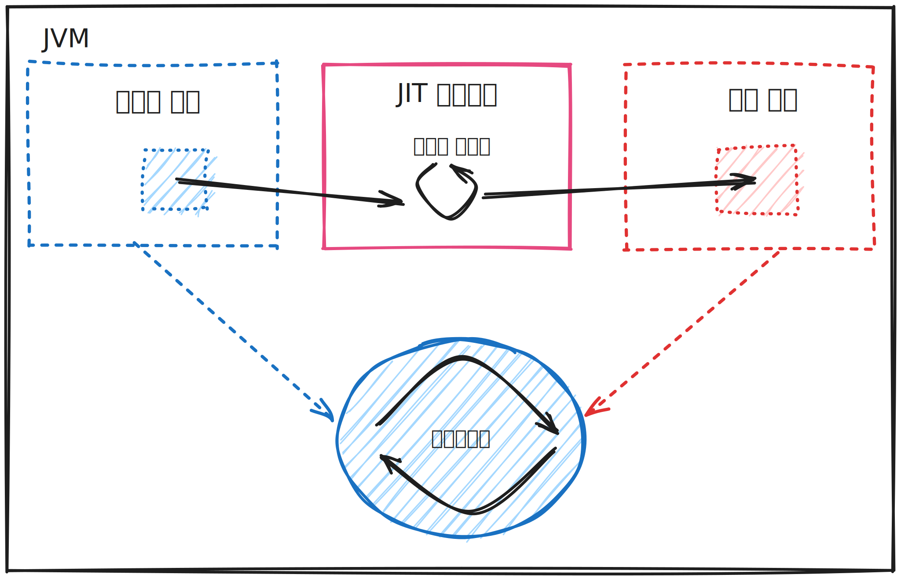

# 9장 JVM의 코드 실행

* JVM이 제공하는 가장 중요한 서비스는 메모리 관리(GC)와 사용하기 쉬운 애플리케이션 코드 실행 컨테이너입니다.
* 최신 제품급 자바 환경은 동적 컴파일 기능(JIT)을 통해 인터프리터의 성능 저하 문제를 해결합니다.
* JIT는 JVM이 실행 중인 메서드를 직접 실행 가능한 코드로 컴파일할 메서드를 분별하는 메커니즘입니다.

## 9.1 바이트코드 해석

* JVM 인터프리터는 스택 머신처럼 작동하기에 CPU에서의 레지스터는 없습니다.
* JVM 인터프리터는 작업할 값을 평가 스택에 넣고 스택 머신 명령어를 통해 스택의 값을 조작합니다.
* JVM은 다음 세 공간에 주로 데이터를 넣습니다.
    * 평가 스택 : 메서드별로 하나씩 생성됩니다.
    * 로컬 변수 : 결과를 임시 저장합니다.(특정 메소드별로 존재합니다.)
    * 객체 힙 : 메소드끼리, 스레드끼리 공유됩니다.

### 9.1.1 JVM 바이트코드 개요

* JVM에서 각 스택 머신 작업 코드(Opcode)는 1바이트로 나타냅니다.
* 옵코드(Opcode)는 0부터 255까지 지정가능하며, 그중 약 200개를 사용하고 있습니다.
* 자바는 이식성을 염두에 두고 설계된 언어이기에 JVM은 빅엔디안, 리틀 엔디안 하드웨어 아키텍처 모두 바이트코드 변경없이 실행 가능하도록 명세에 규정되어있습니다.
* 옵코드중에는 단축형(shortcut form)이 있어 인수를 생략하여 클래스 파일의 인수 바이트 공간을 절약할 수 있었습니다.
* 단축형 명령어, 타입별 명령어를 사용하면서 필요함 옵코드 개수가 증가하였고 여러 옵코드가 개념상 동일한 작업을 나타내는 경우도 있습니다.
* 바이트코드는 개념적으로 아주 단순하지만, 바이트코드로 나타낼 수 있는 기본 작업보다 훨씬 많은 옵코드가 할당되어 있습니다.

### 메소드 호출 바이트 코드

* 자바 프로그램에서 새 메소드로 제어권을 넘기는 유일한 장치입니다.
* 자바 플랫폼은 지역 흐름제어와 다른 메소드로 제어권을 넘기는 행위를 분명히 구분합니다.
* JVM 설계 구조상 메소드 호출 옵코드를 명시적으로 사용해야 하므로 기계어에는 이와 동등한 호출 작업이 없습니다.
* JVM 바이트 코드는 몇 가지 전문 용어를 사용합니다.
    * 호출부(call site)는 메소드(호출자, caller) 내부에서 다른 메소드(피호출자, callee)를 호출한 지점입니다.
    * 비정적(non static)메소드 호출의 경우, 어느 객체에 있는 메소드인지 반드시 해성해야 하는데, 이렇게 찾은 객체를 수신자 객체(receiver object), 이 객체의 런타임 타입을 수신자 타입(
      receiver type)이라고 합니다.
    * 정적 메소드 호출은 항상 invokestatic으로 컴파일되며 수신자 객체는 없습니다.

| 옵코드명            | 인수           | 설명                                              |
|:----------------|:-------------|:------------------------------------------------|
| invokevirtual   | c1           | CP#c1이 가리키는 메서드를 가상 디스패치를 통해 호출합니다.             |
| invokespecial   | c1           | CP#c1이 가리키는 메서드를 '특별한' 디스패치를 통해(즉, 정확하게) 호출합니다. |
| invokeinterface | c1, count, 0 | CP#c1이 가리키는 인터페이스 메서드를 인터페이스 오프셋 룩업을 이용해 호출합니다. |
| invokestatic    | c1           | CP#c1이 가리키는 정적 메소드를 호출합니다.                      |
| invokedynamic   | c1, 0, 0     | 호출해서 실행할 메소드를 동적으로 찾습니다.                        |

* 인스턴스 메소드 호출은 보통 invokevirtual로 변환됩니다.
* 자바 인터페이스에 선언된 메소드를 호출할 경우 invokeinterface로 바뀝니다.
* 컴파일 타임에 디스패치할 메소드를 특정할 수 있는 경우(즉, 프라이빗 메소드나 슈퍼클래스 호출) invokespecial 명령어로 컴파일 됩니다.
* invokedynamic은 자바 7부터 도입된 옵코드로, 주로 동적 언어와 같이 정적으로 타입화된 언어가 아닌 언어와의 상호작용을 지원하기 위해 도입됐습니다. 예로는 자바 8에 도입된 람다 표현식에서 사용됩니다.

### 바이트코드의 개별 의미와 세이프포인트

* 바이트코드는 구현 복잡도에 따라 대단위 바이트코드와 소단위 바이트코드로 명확히 구분됩니다.
* 산술 연산은 매우 소단위 작업이고 핫스팟에서 순수 어셈블리어로 구현됩니다.
* 대단위 연산(상수 풀 룩업, 메소드 디스패치가 필요한 작업들)은 핫스판 VM을 다시 호출할 수 밖에 없습니다.
* 세이프포인트란 개념은, JVM이 어떤 관리 작업을 수행하고 내부 상태를 일관되게 유지하는 데 필요한 지점입니다.
* 세이프 포인에는 (실행 중인 애플리케이션 스레드에 의해 아주 일반적인 방법으로 변경되는) 객체 그래프가 들어 있습니다.
* 일관된 상태를 유지하기 위해 JVM의 관리 작업 수행 도중 힙이 변경되지 않게 모든 애플리케이션 스레드가 멈춰야합니다. 이를 위해 다음과 같은 작업이 이루어집니다.
    * 인터프리티드 메소드를 실행하는 스레드에 대해 옵코드가 디스패치되는 시점에서 애플리케이션 스레드가 실행하는 것은 유저 코드가 아니라 JVM 인터프리터 코드입니다.
        * 옵코드 디스패치 : JVM은 바이트코드 명령어(옵코드)를 실행해야 할 때 해당 명령어를 찾아 실행합니다.
    * 즉, 바이트코드 사이사이에 옵코드 디스패치 단계가 있으며 이 단계에서 유저 코드가 실행되는게 아니기에 애플리케이션 스레드를 멈추기에 이상적인 지점이 되는것입니다.

### 9.1.2 단순 인터프리터

* 가장 단순한 인터프리터는 switch 문이 포함된 while 로프 형태일 것입니다.
* 오슬롯 프로잭를 통해 아주 기본적인 인터프리터를 학습할 수 있습니다.

### 9.1.3 핫스팟에 특정한 내용

* 핫스팟은 사용 제품급 JVM이자, 완전한 구현체입니다.
* 핫스팟은 템플릿 인터프리터라서 시작할 때마다 동적으로 인터프리터를 구축합니다.
* 핫스팟은 단순한 VM 작업을 구현하고 네이티브 플랫폼의 스택 프레임 레이아웃을 최대한 활용하여 성능을 조금이라도 높이기 위해 상당히 많은 어셈블리어 코드로 작성돼 있습니다.
* 핫스팟은 VMSpec에 없는 핫스팟 전용 바이트코드까지 정의해서 사용합니다. 이는 특정 옵코드의 일반적인 유스케이스와 핫하게 쓰는 경우를 차별화하려는 의도입니다.

## 9.2 AOT와 JIT 컴파일

### 9.2.1 AOT 컴파일

* AOT 컴파일은 사람이 읽을 수 있는 프로그램 소스 코드를 프로그램에 넣고 바로 실행 가능한 기계어를 뽑아내는 과정입니다.
* AOT의 목표는 프로그램을 실행할 플랫폼과 프로세서 아키텍처에 딱 맞는 실행 코드를 얻는 것입니다.
* 앞선 AOT의 목표로 인해 AOT 컴파일한 바이너리는 CPU 기능을 최대한 활용하지 못하는 경우가 다반사고 성능 향상의 숙제가 남습니다.

### 9.2.2 JIT 컴파일

* JIT 컴파일은 런타임에 프로그램을 고도로 최적화한 기계어로 변환하는 기법입니다.
* 핫스팟을 비롯한 대부분의 주요 사용 JVM이 이 방식으로 작동합니다.
* JIT 서브시스템은 실행 프로그램과 VM 리소스를 공유하므로 프로파일링 및 최적화 비용 및 성능 향상 기대치 사이의 균형을 맞춰야 합니다.
* 바이트코드를 네이티브 코드로 컴파일하는 비용은 런타임에 지불됩니다. 이 과정에서 프로그램 실행에만 온전히 동원됐을 일부 리소스(CPU, 메모리)가 소비되므로 JIT 컴파일은 산발적으로 수행됩니다.
* VM은 최적화하면 가장 좋은 지점을 파악하기 위해 각종 프로그램 관련 지표를 수집합니다.
* 핫스팟은 프로파일링 정보를 보관하지 않고 VM이 꺼지면 일체 폐기합니다. 이는 애플리케이션을 실행할 때마다 성능이 심한 편차를 보이기 때문입니다.

### 9.2.3 AOT 컴파일 VS JIT 컴파일

* AOT 컴파일은 소스 코드에서 바로 기계어가 생성되고 컴파일 단위별로 대응되는 기계어를 어셈블리로 바로 사용할 수 있습니다. 따라서 코드의 성능 특성이 그리 복잡하지 않습니다.
* AOT는 최적화 결정을 내리는 데 유용한 런타임 정보를 포기하는 만큼 장점이 상쇄됩니다. 링크 타임 최적화(LTO)나 PGO 같은 기법이 gcc 및 여타 컴파일러에서도 모습을 드러내기 시작했지만, 핫스팟에 구현된
  기술에 비하면 아직 초기 단계에 불과합니다.
* AOT의 문제는 확장성입니다. 다양한 아키텍처에서 최대 성능을 내려면 아키텍처마다 특화된 실행 코드가 필요합니다.
* 핫스팟은 새로 릴리즈할 때마다 새로운 프로세서 기능에 관한 최적화 코드를 추가할 수 있으며, 애플리케이션은 다시 컴파일하지 않아도 신기능을 사용할 수 있습니다.
* 자바 프로그램의 AOT 컴파일을 지원하는 사용 VM이 있습니다.

## 9.3 핫스팟 JIT 기초

* 핫스팟의 기본 컴파일 단위는 전체 메소드입니다.
* 핫스팟은 핫 루프를 온-스택 치환(OSR)이라는 기법을 이용해 컴파일하는 기능도 지원합니다.
* OSR은 어떤 메소드가 컴파일할 만큼 자주 호출되지 않지만, 컴파일하기 적합한 루프가 포함돼 있고 루프 바디 자체가 메소드인 경우 사용합니다.
* 핫스팟은 주로 (객체 oop의 klass 워드로 가리키는) klass 메타 데이터 구조체에 있는 vtable을 이용해 JIT 컴파일을 구현합니다.

### 9.3.1 klass 워드, vtable, 포인터 스위즐링

* 핫스팟은 멀티스레드 C++ 애플리케이션입니다.
* JIT 컴파일 서브시스템을 구성하는 스레드는 핫스팟 내부에서 가장 중요한 스레드들입니다.
* 컴파일 대상으로 낙점된 메소드는 컴파일러 스레드에 올려놓고 백그라운드에서 컴파일합니다.
* 최적화된 기계어가 생성되면 해당 klass의 vtable은 새로 컴파일된 코드를 가리키도록 수정됩니다.

### 9.3.2 JIT 컴파일 로깅

* **-XX:+PrintCompilation** 옵션을 사용하면 컴파일 이벤트 로그가 표준 출력 스트림에 생성됩니다.
* PrintCompliation 출력 결과는 비교적 형식이 단순합니다. 메소드가 컴파일된 시간이 제일 먼저 나오고, 그 다음에 이번 차례에 컴파일된 메소드의 순번이 표시됩니다. 그외는 다음과 같습니다.
    * n : 네이티브 메소드이다.
    * s : 동기화 메소드이다.
    * ! : 예외 핸들러를 지닌 메소드이다.
    * % : OSR을 통해 컴파일된 메소드이다.
* **-XX:+LogCompilation** 옵션을 사용하면 핫스팟 JIT 컴파일러가 어떤 결정을 내렸는지 더 자세한 정보를 볼 수 있습니다.
* LogCompilation은 진단용 옵션이라 **-XX:+UnlockDiagnosticVMOptions** 옵션을 사용해야 합니다.

### 9.3.3 핫스팟 내부의 컴파일러

* 핫스팟 JVM에는 C1, C2라는 두 JIT 컴파일러가 있습니다. 각각 클라이언트 컴파일러, 서버 컴파일러라고 부리기도 합니다.
* C1,C2 컴파일러는 모두 핵심 측정값, 즉 메소드 호출 횟수에 따라 컴파일 트리거링됩니다.
* 호출 횟수가 특정 한계치에 이르면 그 사실을 VM이 알림 받고 해당 메소드를 컴파일 큐에 넣습니다.
* 컴파일 프로세스는 가장 먼저 메소드의 내부 표현형을 생성한 다음, 인터프리티드 단계에서 수집한 프로파일링 정보를 바탕으로 최적화 로직을 적용합니다.
* 변수를 일체 재할당하지 않는 코드로 변환하는 단일 정적 할당(SSA)는 두 컴파일러 모두 사용하는 공통 기법입니다.

### 9.3.4 핫스팟의 단계별 컴파일

* 자바 6부터 JVM은 단계별 컴파일 모드를 지원합니다. 이는 인터프리티드 모드로 실행되다가 단순한 C1 컴파일 형식으로 바뀌고, 다시 C2가 보다 고급 최적화를 수행하는 방식으로 단계를 바꾸는 것입니다.
* VM 내부에는 5개 실행 레벨이 존재합니다.
    * 레벨 0 : 인터프리터
    * 레벨 1 : C1 - 풀 최적화(프로파일링 없음)
    * 레벨 2 : C1 - 호출 카운터 + 백엣지 카운터
    * 레벨 3 : C1 - 풀 프로파일링
    * 레벨 4 : C2

앞선 모든 레벨을 거치는 것은 아니며, 컴파일 방식마다 경로가 다릅니다.

| 경로      | 설명                                            |
|:--------|:----------------------------------------------|
| 0-3-4   | 인터프리터, C1 - 풀 프로파일링, C2                       |
| 0-2-3-4 | 인터프리터, C2는 바쁘니 재빨리 C1 컴파일 후 C1 풀 컴파일, 그 다음 C2 |
| 0-3-1   | 단순 메소드                                        |
| 0-4     | 단계별 컴파일 안 함(C2로 직행)                           |

* 단순 메소드는 일단 인터프리티드로 시작하지만, C1(풀 프로파일링)은 이 메소드가 정말 단순하지 판단할 수 있습니다.
* C1 컴파일러가 C2보다 더 나은 코드를 낼 리는 없기에 컴파일러는 C1단계에서 종료됩니다.

## 9.4 코드 캐시

* JIT 컴파일드 코드는 코드 캐시라는 메모리 영역에 저장됩니다. 이곳에는 인터프리터 부속 등 VM 자체 네이티브 코드가 함께 들어있습니다.
* VM 시작 시 코드 캐시는 설정된 최대 크기가 고정되므로 확장이 불가합니다. 코드 캐시가 꽉 차면 그때부터 더 이상 JIT 컴파일은 안되며, 컴파일 되지 않은 코드는 인터프리터에서만 실행됩니다.
* 코드 캐시는 미할당 영역과 프리 블록 연결 리스트를 담은 힙으로 구현됩니다. 
* 네이티브 코드가 제거될 때마다 해당 블록이 프리 리스트에 추가됩니다. 블록 재활용은 스위퍼라는 프로세스가 담당합니다.
* 네이티브 메소드가 새로 저장되면 컴파일드 코드를 담기에 크기가 충분한 블록을 프리 리스트에서 찾아봅니다. 만약 없다면 새로운 블록을 할당합니다.
* 다음의 경우, 네이티브 코드는 코드 캐시에서 제거됩니다.
  * (추측성 최적화를 적용한 결과 틀린 것으로 판명되어) 역최적화될 때
  * 다른 컴파일 버전으로 교체됐을 때(단계별 컴파일)
  * 메소드를 지닌 클래스가 언로딩될 때
* 코드 캐시의 최대 크기는 **-XX:ReservedCodeCacheSize** 옵션으로 지정할 수 있습니다.

### 9.4.1 단편화

* C1 컴파일러를 거친 중간 단계의 컴파일드 코드가 C2 컴파일러로 치환된 후 삭제되는 일이 잦아지면 코드 캐시는 단편화되기 쉽습니다.
* 메모리 블록을 재배치하지 않는 가비지 수집 방식에서 단편화는 불가피하며 코드 캐시도 예외는 아닙니다.
* 압착을 안 하면 코드 캐시는 단편화되고 컴파일은 중단될 것이비다. 캐시가 고갈 되는 또 다른 형태일 뿐입니다.

## 9.5 간단한 JIT 튜닝법

* 단순 JIT 튜닝의 대원칙은 정말 간단합니다. '컴파일을 원하는 메소드에게 아낌없이 리소스를 베풀라'는 것입니다. 이런 목표를 달성하기 위해 다음 항목을 점검해야 합니다.
  * 먼저, PrintCompilation 스위치를 켜고 애플리케이션을 실행합니다.
  * 어느 메소드가 컴파일됐는지 기록된 로그를 수집합니다.
  * ReservedCodeCacheSize를 통해 코드 캐시를 늘린다.
  * 애플리케이션을 재실행한다.
  * 확장된 캐시에서 컴파일드 메소드를 살펴본다.
* 성능 엔지니어는 JIT 컴파일에 내재된 불확정성을 고려해야 합니다. 이를 명심하면 두 가지 명백한 사실을 쉽게 관찰할 수 있습니다.
  * 캐시 크기를 늘리면 컴파일드 메소드 큐모가 유의미한 방향으로 커지는가?
  * 주요 트랜잭션 경로상에 위치한 주요 메소드가 모두 컴파일되고 있는가?
* 이는 코드 캐시 공간이 모자라는 일이 없게 함으로써 JIT 컴파일이 절대 끊기지 않도록 보장하는 전락입니다.

> 참조
>
> Why final methods in java are invoked using invokevirtual
> opcode(https://stackoverflow.com/questions/49633525/why-final-methods-in-java-are-invoked-using-invokevirtual-opcode)
