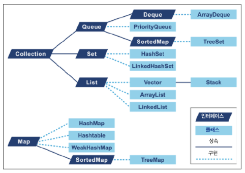
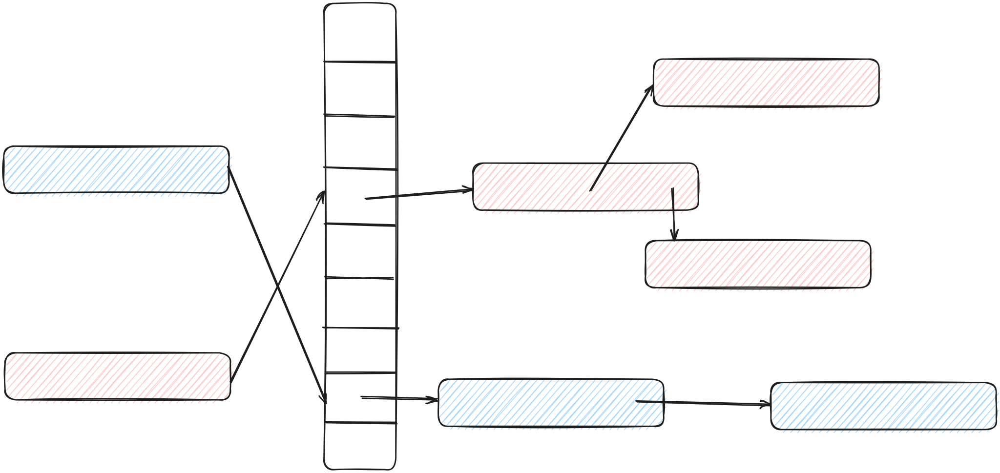

# 11장 자바 언어의 성능 향상 기법

* 자바 플랫폼 환경의 능력과 탄탄함 덕분에 JVM은 최적화가 한참 덜 된 코드도 마다 않고 매끄럽게 잘 작동시킵니다.
* 개발자가 성능 튜닝할 때 고려해야 할 부분은 네트워크 연결, I/O, DB 등의 애플리케이션 외부 요인 다음으로 병목을 일으킬 공산이 가장 큰 부분이 바로 코드 설계입니다.
* 설계는 바로 잡기가 지극히 어려울뿐더러 완벽할 설계란 있을 수 없습니다.
* 성능에 민감한 개발자는 반드시 마음에 새겨두어야 할 코드의 기본 원칙이 있습니다. 예로 데이터를 애플리케이션에 어떻게 저장할지는 매우 중요한 문제입니다.
* 데이터를 저장할 때 어떤 옵션을 사용 가능할 수 있는지 이해하려면 자바 컬렉션 API가 지원하는 자료 구조 및 구현 세부를 잘 알고 있어야 합니다.
* 자료 구조가 어떤 원리로 조회되고 수정되는지 모른 채 자료 구조를 선택하는 것처럼 위험한 일도 없습니다.

## 11.1 컬렉션 최적화

* 대부분의 프로그래밍 언어 라이브러리는 최소한 두 가지 컨테이너를 제공합니다.
  * 순차 컨테이너 : 수치 인덱스로 표기한 특정 위치에 객체를 저장합니다.
  * 연관 컨테이너 : 객체 자체를 이용해 컬렉션 내부에 저장할 위치를 결정합니다.
* 컨테이너에서 메소드가 정확히 작동하려면 저장할 객체가 호환성과 동등성 개념을 지니고 있어야 합니다.(Java hashCode(), equals())
* 자바는 메모리 서브 시스템이 알아서 가비지 수집을 해주는 대신, 저수준의 메모리 제어를 포기할 수밖에 없습니다. 메모리 수동 할당/해제는 물론, 저수준 메모리 레이아웃 제어까지 단념해야 합니다.
* 다음은 Java의 Collection 인터페이스를 구현한 컬렉션들의 계층 구조입니다.

## 11.2 List 최적화

* 자바에서는 List를 ArrayList와 LinkedList로 구현합니다.

### 11.2.1 ArrayList

* ArrayList는 고정 크기 배열에 기반한 리스트입니다.
* 배킹 배열의 최대 크기만큼 원소를 추가할 수 있고 이 배열이 꽉 차면 더 큰 배열을 새로 할당한 다음 기존 값을 복사합니다.
* 성능에 민감한 프로그래머는 크기 조정 작업 비용과 유연성을 잘 저울질해야 합니다.
* ArrayList는 처음에 빈 배열로 시작하고 처음 원소가 추가될 때 용량 10인 기반 배열을 할당합니다.
* ensureCapacity() 메소드를 이용해 용량을 미리 늘려놓을 수 있습니다.

~~~java
public class ArrayList<E> extends AbstractList<E>
        implements List<E>, RandomAccess, Cloneable, java.io.Serializable {
  private static final int DEFAULT_CAPACITY = 10;
  private static final Object[] DEFAULTCAPACITY_EMPTY_ELEMENTDATA = {};
  transient Object[] elementData;

  public ArrayList() {
    this.elementData = DEFAULTCAPACITY_EMPTY_ELEMENTDATA; // 빈 배열 초기화
  }

  private void add(E e, Object[] elementData, int s) { // 원소 추가
    if (s == elementData.length)
      elementData = grow(); // 배열 크기 늘리기
    elementData[s] = e;
    size = s + 1;
  }

  private Object[] grow(int minCapacity) { // 배열 크기 늘리는 메소드
    return elementData = Arrays.copyOf(elementData,
            newCapacity(minCapacity));
  }

  private Object[] grow() { // 배열 크기 늘리는 메소드
    return grow(size + 1);
  }

  private int newCapacity(int minCapacity) { // 늘릴 배열 크기 반환 메소드
    int oldCapacity = elementData.length;
    int newCapacity = oldCapacity + (oldCapacity >> 1);
    if (newCapacity - minCapacity <= 0) {
      if (elementData == DEFAULTCAPACITY_EMPTY_ELEMENTDATA) // 이 배열이 처음 생성된 경우
        return Math.max(DEFAULT_CAPACITY, minCapacity); // 기본 크기 10으로 설정
      if (minCapacity < 0) // overflow
        throw new OutOfMemoryError();
      return minCapacity;
    }
    return (newCapacity - MAX_ARRAY_SIZE <= 0)
            ? newCapacity
            : hugeCapacity(minCapacity);
  }
}
~~~

### 11.2.2 LinkedList

* LinkedList는 동적으로 증가하는 리스트입니다.
* 이중 연결 리스트로 구현되어 있어 리스트에 덧붙이는 작업은 항상 O(1)입니다.

### 11.2.3 ArrayList VS LinkedList

* ArrayList, LinkedList 둥 중 어느 것을 쓸지는 데이터 접근/수정 패턴에 따라 다릅니다.
* 리스트 끝에 원소를 삽입하는 작업은 ArrayList, LinkedList 모두 일정한 시간이 소요됩니다.
* 리스트 중간에 원소를 삽입하는 작업은 ArrayList는 다른 원소들을 모두 한 칸씩 우측으로 이동시켜야 합니다. LinkedList는 삽입 지점을 찾기위한 탐색 작업이 있지만 사입 작업은 삽입 위치의 앞뒤 노드만 연결하면 되므로 ArrayList보다 성능 이점이 있습니다.
* 원소 삭제도 LinkedList가 ArrayList에 비해 유리합니다.
* 리스트를 주로 랜덤 액세스하는 경우라면 ArrayList가 정답입니다.
* LinkedList의 고유 기능이 꼭 필요한 경우가 아니라면, 특히 랜덤 접근이 필요한 알고리즘을 구사할 때는 ArrayList를 사용하는 것이 좋습니다.

## 11.3 Map 최적화

### 11.3.1 HashMap

* HashMap은 요즘 환경에 맞게 몇 가지 부가 기능이 추가됐습니다.

~~~java
public class HashMap<K,V> extends AbstractMap<K,V> implements Map<K,V>, Cloneable, Serializable {

  static final int hash(Object key) {
    int h;
    return (key == null) ? 0 : (h = key.hashCode()) ^ (h >>> 16);
  }

  public V get(Object key) {
    Node<K,V> e;
    return (e = getNode(hash(key), key)) == null ? null : e.value;
  }

  final Node<K,V> getNode(int hash, Object key) {
    Node<K,V>[] tab; Node<K,V> first, e; int n; K k;
    if ((tab = table) != null && (n = tab.length) > 0 &&
            (first = tab[(n - 1) & hash]) != null) {
      if (first.hash == hash && // always check first node
              ((k = first.key) == key || (key != null && key.equals(k))))
        return first;
      if ((e = first.next) != null) {
        if (first instanceof TreeNode)
          return ((TreeNode<K,V>)first).getTreeNode(hash, key);
        do {
          if (e.hash == hash &&
                  ((k = e.key) == key || (key != null && key.equals(k))))
            return e;
        } while ((e = e.next) != null);
      }
    }
    return null;
  }

  static class Node<K,V> implements Map.Entry<K,V> {
      final int hash;
      final K key;
      V value;
      Node<K, V> next;

      Node(int hash, K key, V value, Node<K, V> next) {
          this.hash = hash;
          this.key = key;
          this.value = value;
          this.next = next;
      }
  }
~~~
~~~java
public class HashMap<K,V> extends AbstractMap<K,V> implements Map<K,V>, Cloneable, Serializable {

  static final int TREEIFY_THRESHOLD = 8;
  final V putVal(int hash, K key, V value, boolean onlyIfAbsent, boolean evict) {
    ...
    if (binCount >= TREEIFY_THRESHOLD - 1) // -1 for 1st
      treeifyBin(tab, hash);
    break;
    ...
  }
  final void treeifyBin(Node<K,V>[] tab, int hash) {
    int n, index; Node<K,V> e;
    if (tab == null || (n = tab.length) < MIN_TREEIFY_CAPACITY)
      resize();
    else if ((e = tab[index = (n - 1) & hash]) != null) {
      TreeNode<K,V> hd = null, tl = null;
      do {
        TreeNode<K,V> p = replacementTreeNode(e, null);
        if (tl == null)
          hd = p;
        else {
          p.prev = tl;
          tl.next = p;
        }
        tl = p;
      } while ((e = e.next) != null);
      if ((tab[index] = hd) != null)
        hd.treeify(tab);
    }
  }
}
~~~

* HashMap은 처음에 버킷 엔트리에 리스트를 저장합니다.
* 값을 찾기 위해서는 키 해시값을 계산하고 equals() 메소드로 리스트에서 해당 키를 찾습니다. 키를 해시하고 동등성을 기준으로 리스트에서 값을 찾는 메커니즘이므로 키 중복은 허용되지 않습니다. 같은 키를 넣으면 원래 HashMap에 있던 키를 치환합니다.
* HashMap 생성자에 전달하는 initialCapacity와 loadFactor 두 매개변수는 HashMap의 성능에 가장 큰 영향을 미칩니다.
* HashMap 용량은 현재 생성된 버킷 개수 (디폴트 값은 16)를 loadFactor는 버킷 용량을 자동 증가(2배)시키는 한계치입니다. (디폴트 값은 0.75)
* 용량을 2배로 늘리고 저장된 데이터를 다시 배치한 다음, 해시를 다시 계산하는 과정을 재해시라고 합니다.
* HashMap의 get(), put() 작업은 일정 시간이 소요되지만 순회를 하면 비용이 증가할 수 있습니다.
* 트리화도 성능에 영향을 주는 요인입니다.
* 트리화는 하나의 버킷에 TREEIFY_THRESHOLD에 정의된 값(디폴트 8) 개수만큼 키/값 쌍이 모이면 버킷을 TreeNode로 바꿔버립니다.
* TreeNode는 리스트 노드보다 약 2배 커서 그 만큼 공간을 더 차지합니다.
* HashMap은 다음과 같은 구조를 가집니다.

#### LinkedHashMap

* LinkedHashMap은 HashMap의 서브클래스로, 이중 연결 리스트를 사용해 원소의 삽입 순서를 관리합니다.
* LinkedHashMap의 기본 관리 모드는 삽입 순서이지만, 액세스 순서 모드로 바꿀 수 있습니다.
* LinkedHashMap은 순서가 중요한 코드에 많이 쓰이지만 TreeMap처럼 비용이 많이 들지 않습니다.

### 11.3.2 TreeMap

* TreeMap은 레드-블랙 트리를 구현한 Map입니다.
* 레드-블랙 트리는 기본 이진 트리 구조에 메타데이터를 부가(노드 컬러링)해서 트리 균형이 한쪽으로 치우치는 현상을 방지한 트리입니다.
* TreeMap은 다양한 키가 필요할 때 아주 유용하며, 서브맵에 신속히 접근할 수 있습니다. 또한 데이터 분할하는 용도로도 쓰입니다.

### 11.3.3 MultiMap은 없어요

* 자바는 MultiMap 구현체를 제공하지 않으며 대신 Map<k,List<V>>를 권장합니다.

## 11.4 Set 최적화

* 자바의 Set에 대해 성능에 관해 고려해야 할 사항은 Map과 비슷합니다.
* HashSet은 HashMap을 구현하며 관련 메소드 또한 value 값에 더미값을 넣어 유니크한 key 값을 유지할 수 있습니다.
* TreeSet은 TreeMap을 활용합니다.

## 11.5 도메인 객체

* 도메인 객체는 애플리케이션에 유의미한 비지니스 컨셉을 나타낸 코드입니다.
* 자바 힙에 관한 기본적인 사항은 다음과 같습니다
  * 가장 흔히 할당되는 자료 구조는 String, Char[], byte[], 자바 컬랙션 타입의 인스턴스입니다.
  * jmap에서 누수되는 데이터는 비정상적으로 비대한 데이터셋으로 나타납니다.
* 애플리케이션에 속한 도메인 객체가 jmap 상위 30위 정도 안에 든다면 메모리 누수가 발생한 신호라고 볼 수 있습니다.
* 메모리 누수를 일으키는 도메인 객체의 또 다른 특징은 '전체 세대' 효과입니다. 즉, GC에 의해 수집되지 않고 테뉴어드 영역까지 승격되는 객체를 말합니다.

## 11.6 종료화 안 하기

* 자바 finalizer() 메소드는 C++의 리소스 획득은 초기화 패턴과 마찬가지로 자동으로 리소스를 관리하려고 만든 장치입니다.

### 11.6.2 왜 종료화로 문제를 해결하지 않을까?

* Object의 finalize() 메소드는 자바의 시작부터 있었습니다. 기본적으로 아무것도 하지않는 메소드입니다.
* finalize()를 통해 JVM 가비지 수집기가 특정 객체의 사망 사실을 분명히 알리는 서브시스템 역할을 합니다.
* 다만, finalize() 메소드를 지원하는 타입으로 생성된 객체 중 finalize() 메소드를 오버라이드한 객체는 가비지 수집기가 특별한 처리를 합니다.
  * 종료화가 가능한 객체는 큐로 이동합니다.
  * 애플리케이션 스레드 재시작 후, 별도의 종료화 스레드가 큐를 비우고 각 객체마다 finalize() 메소드를 실행합니다.
  * finalize()가 종료되면 객체는 다음 사이클에 진짜 수집될 준비를 마칩니다.
* 이러한 특별한 과정으로 객체는 GC 사이클을 두 번 거치게 됩니다.
* 또 다른 문제는 finalize() 실행 도중 예외가 발생하면 무시되어 개발자가 개입할 여지가 없습니다.
* 종료화에 블로킹 작업이 있을지 모르니 JVM이 스레드를 하나 더 만들어 finalize() 메소드를 실행해야 합니다. 즉, 추가적인 오버헤드가 발생합니다.
* 가비지 수집은 딱 정해진 시간에 실행되지 않으므로 종료화를 통해 자동으로 리소를 관리하는 것 자체가 어불성설입니다.

### 11.6.3 try-with-resources

* try-with-resources는 자바 7부터 지원하는 기능으로, 자동으로 리소스를 해제해주는 기능입니다.
* try-with-resources를 통해 다른 클래스를 해제/정리하는 방법을 일일이 코드로 기술할 필요 없이 단순화할 수 있어 유용합니다.

## 11.7 메소드 핸들

* 자바 7에 추가된 invokedynamic 명령어 덕분에 호출부에서 실행할 메소드를 아주 유연하게 결정할 수 있게 됐습니다. 핵심은 invokedynamic 호출부가 실제로 어느 메소드를 호출할지 런타임 전까지 결정되지 않는다는 점입니다.
* 호출부가 인터프리터에 이르면 특수한 보조 메소드(부트스트랩 메소드, BSM)가 호출되고, BSM은 호출부에서 호출됐어야 할 실제 메소드를 가리키는 객체를 반환합니다. 이 객체를 호출대상이라고 하며, 호출부 내부에 '가미됐다'고 표현합니다.
* 핵심은 메소드 핸들입니다. 메소드 핸들은 invokedynamic 호출부에 의해 호출되는 메소드를 나타낸 객체입니다.
* 자바 7부터 일부 클래스, 패키지가 추가되어 실행 가능한 메소드의 레퍼런스를 직접 반영할 수 있게 됐습니다.
* 메소드 핸들은 리플렉션으로 할 수 없는 신선한 기능을 갖추고 있습니다.
* 메소드 핸들 API는 룩업 컨텍스트라는 방식으로 접근합니다. 반면, 리플렉션은 setAccessible()라는 꼼수밖에는 다른 도리가 없어 자바의 안전한 액세스 제어 체계에 큰 허점을 노출시킵니다.
