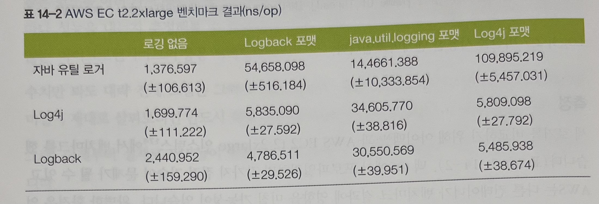

# 14장 고성능 로깅 및 메시징

* 자바 플랫폼의 기본 철학은 저수준의 세부 관심사에서 개발자를 해방시키는 것입니다.
* 가비지 수집을 비롯해 JVM에 추상화된 고수준의 관리 기능은 성능이 주 관심사인 상황에서 결과를 예측하기 어렵습니다.
* 지연에 매우 민감한 애플리케이션에서는 당연히 이러한 불확정성을 최소화해야 합니다.
* 저지연, 고성능 시스템에서 핵심적인 고려 사항 두 가지는 역시 로깅과 메시징입니다.

## 14.1 로깅

* 개발자들은 대부분 프로젝트에서 로깅 라이브러리를 그리 신경 쓰지 않고 그 선택 과정도 대충 일사천리로 진행하는 경우가 있습니다.
* 제품급 로깅 시스템을 선정 시 바람직하지 않은 안티패턴입니다.
  * 10년짜리 로거 : 누군가 이미 로거를 잘 설정해놨다. 뭐 하러 다시 만드나? 그냥 편하게 갖다 쓰면 되지
  * 프로젝트 전체 로거 : 누군가 프로젝트 각 파트마다 따로 로거를 재구성하지 않아도 되게끔 로거를 감싸놓았다.
  * 전사 로거 : 누군가 전사적으로 사용가능한 로거를 만들었다.
* 로그는 모든 애플리케이션에 가장 중요한 부분입니다.
* 대부분의 고성능 환경에서는 처리 정확도와 리포팅이 속도만큼이나 중요합니다.
* 시스템에 있는 여느 컴포넌트처럼 로거를 단순히 비용으로 취급해선 곤란합니다. 프로젝트를 할 때 신중하게 잘 살펴서 포함시커야 할 주요기능입니다.

### 14.1.1 로깅 벤치마크

* 결과
    * 대체로 Logback 성능이 좋고 자바 유틸 로거가 제일 나빴습니다.
    * Log4j 포맷은 전반적으로 가장 일관된 결과를 보였습니다.

## 14.2 성능에 영향이 적은 로거 설계하기

* 로깅은 모든 애플리케이션의 필수 컴포넌트이지만, 저지연 애플리케이션에서 로거는 비지니스 로직 성능에 병목 현상을 초래해서는 안 됩니다.
* Log4j의 2.6버전부터는 ThreadLocal 필드를 이용해 스트링 -> 바이트 변환 시 버퍼를 재사용하는 식으로 객체를 재사용하여 GC 발생에서 자유롭습니다.

## 14.3 리얼 로직 라이브러리를 이용해 지연 줄이기

* 리얼 로직은 저수준 세부의 이해가 고성능 설계에 영향을 미친다는 기계 공감 접근 방식을 주장한 마틴 톰슨이 설립한 영구 회사입니다.
* 아그로나 : 자바용 고성능 자료 구조 및 유틸리티 메소드
* 단순 바이너리 인코딩(SBE) : 고성능 메시지 코덱
* 에어론 : 효율적/안정적인 UDP 유니캐스트, UDP 멀티캐스트, IPC 메시지 전송
* 아티오 : 탄력적인 고성능 FIX 게이트웨이

### 14.3.1 아그로나

* 아그로나 프로젝트는 저지연 애플리케이션 전용 구성 요소를 담아놓은 라이브러리입니다.
* 아그로나는 진정한 저지연 애플리케이션용 라이브러리 세트를 제공합니다.
* 버퍼
    * 자바에는 다이렉트/논다이렉트 버퍼를 추상화한 ByteBuffer 클래스가 있습니다.
    * 다이렉트 버퍼는 자바 힙 밖에 있기에 온-힙 버퍼(논다이렉트 버퍼)보다 할당/해제율은 낮은 편입니다.
    * 다이렉트 버퍼의 장점은 중간 단계의 매핑 없이 직접 구조체에 명령어를 실행하는 것입니다.
    * ByteBuffer는 일반화한 유스케이스가 가장 큰 문제로, 버퍼 타입별로 최적화를 적용할 수 없습니다.
    * 아그로나는 복사를 지양하며 저마다 독특한 특성을 지닌 버퍼를 네 가지 지원합니다.
        * DirectBuffer 인터페이스 : 버퍼에서 읽기만 가능하며 최상위 상속 계층에 위치한다.
        * MutableDirectBuffer 인터페이스 : DirectBuffer를 상속하며 버퍼 쓰기도 가능합니다.
        * AtomicBuffer 인터페이스 : MutableDirectBuffer를 상속하며 메모리 액세스 순서까지 보장합니다.
        * UnsafeBuffer 클래스 : Unsafe를 이용해 AtomicBuffer를 구현한 클래스입니다.
* 리스트, 맵, 세트
    * 아그로나는 int 또는 long 형 배열에 기반한 리스트 구현체를 여럿 제공합니다.
    * 자바는 배열 안에서 객체를 나란히 배치하는 장치가 따로 없으며, 표준 컬랙션의 결과물은 항상 레퍼런스의 배열입니다.
    * 아그로나 ArrayListUtil을 사용하면 리스트 순서는 안 맞지만 ArrayList에서 신속하게 원소를 제거할 수 있습니다.
    * 아그로나 맵, 세트 구현체는 키/값을 해시 테이블 자료 구조에 나란히 저장합니다. 동일한 캐시 라인에 있는 기본형 매핑을 재빠르게 액세스할 때 딱 맞는 자료 구조입니다.
* 큐
    * 아그로나의 동시성 패키지에는 큐, 링 버퍼를 비롯해 쓸만한 자료 구조 및 동시성 유틸리티가 있습니다.
    * 아그로나 큐는 표준 인터페이스를 준수하므로 표준 큐 구현체 대신 쓸 수 있고, 순차 처리용 컨테이너 지원 기능이 부가된 org.agrona.concurrent.Pipe 인터페이스도 함께 구현되어 있습니다.
    * 큐는 모두 락-프리하고 Unsafe를 사용하므로 저지연 시스템에 안성맞춤입니다.
* 링 버퍼
    * 아그로나가 제공하는 org.agrona.concurrent.RingBuffer는 프로세스 간 통신용 바이너리 인코딩 메시지를 교환하는 인터페이스입니다.
    * RingBuffer는 DirectBuffer를 이용해 메시지 오프-힙 저장소를 관리합니다.

### 14.3.2 단순 바이너리 인코딩

* 단순 바이너리 인코딩(SBE)는 저지연 성능에 알맞게 개발된 바이너리 인코딩 방식으로, 금용 시스템에서 사용하는 FIX 프로토콜에 특화되어 있습니다.
* SBE는 메시지를 인코딩/디코딩하는 애플리케이션 계층의 관심사입니다.
* SBE는 GC를 유발하지 않고 메모리 액세스 같은 문제를 최적화하지 않고도 효율적으로 자료 구조를 통해 저지연 메시지를 전달할 수 있습니다.
* 카피-프리, 네이티브 타입 매핑
    * 복사는 비용이 듭니다. 조그마한 객체는 별로 안 비싸지만, 크기가 커질수록 복사 비용도 함께 증가합니다.
    * 메모리가 자동 관리되는 덕분에 레퍼런스만 갖고 작업하는 일이 당연한 자바 프로그래머는 이런 문제를 신경쓸 일이 거의 없습니다.
    * SBE의 카피-프리 기술은 중간 버퍼를 쓰지 않고 메시지를 인코딩/디코딩하도록 설계됐습니다.
* 정상 상태 할당
    * 저지연 애플리케이션 설계 시 자바의 객체 할당 방식은 당연히 문제가 됩니다.
    * GC는 STW, 즉 중단을 자주 일으킵니다. 거의 동시 작동하는 고급 수집기도 마찬가지입니다.
    * 중단 시간 수치를 제한해도 GC 프로세스는 성능 모델에 유의미한 편차를 가져옵니다.
    * SBE는 하부 버퍼에 플라이웨이트 패턴을 사용하므로 할당-프리 합니다.
* 스트리밍/단어 정렬 액세스
    * 자바에서 메모리 액세스는 범접할 수 없는 대상입니다.
    * SBE는 메시지를 진행 방향으로 인코딩/디코딩하도록 설계되어 있어서 정확하게 단어를 정렬할 수 있는 틀이 잡혀 있습니다.
    * 정렬이 엉망인 상태에서는 프로세서 수준에서 성능 문제가 불거 질 수 있습니다.

### 14.3.3 에어론

* 에어론은 SBE와 아그로나에 기반한 툴입니다.
* 에어론은 자바 및 C++ 용도로 개발된, UDP 유니캐스트, 멀티캐스트, IPC 메시지를 전송하는 수단입니다.

### 14.3.4 에어론의 설계 개념

* 전송 요건 : 정렬, 신뢰성, 배압, 혼잡, 다중화
* 지연 및 애플리케이션 원칙
    * 정상 상태에서 가비지-프리 실현
    * 메시지 경로에 스마트 배칭 적용
    * 메시지 경로의 락-프리 알고리즘
    * 메시지 경로의 논블로킹 I/O
    * 메시지 경로의 비예외 케이스
    * 단일 출력기 원칙을 적용
    * 공유 안 하는 상태가 더 좋다
    * 쓸데없이 데이터를 복사하지 말라
* 내부 작동 원리
    * 기존 프로토콜은 대부분 효율적인 메시지 처리 시스템을 구축하기 위해 스킵 리스트 같은 복잡한 자료 구조를 동원합니다.
    * 복잡도는 주로 포인터 간접화 탓에 가중되는데, 결국 시스템의 지연 양상을 더욱 예측하기 힘들게 만듭니다.
    * 에어론은 최대한 깔끔하고 단순한 방식으로 자료 구조에 메시지 시퀀스를 생성합니다.

