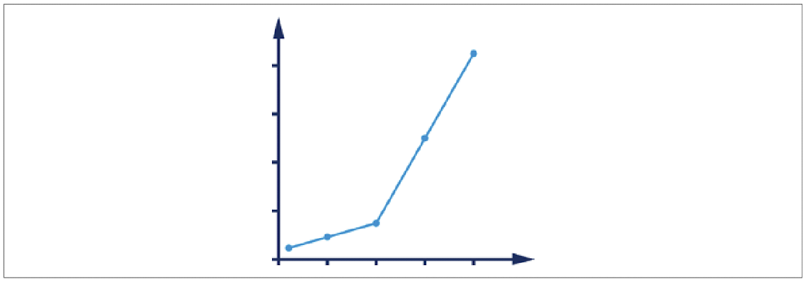
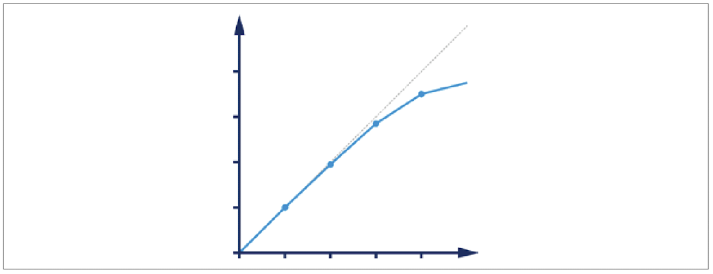
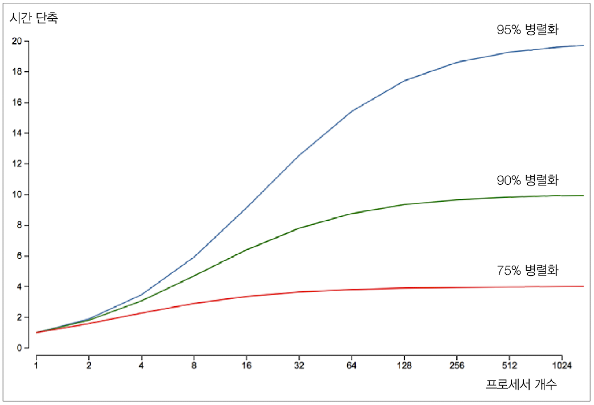
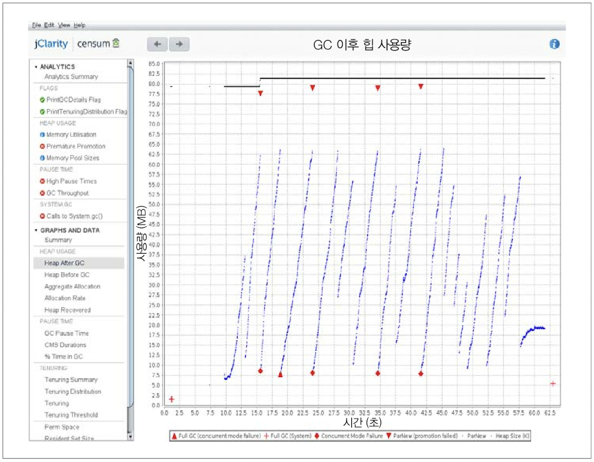
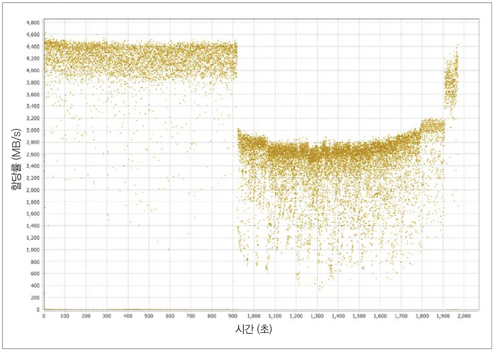
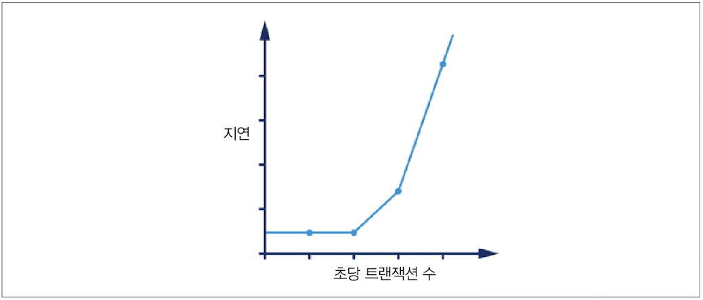

# 1장: 성능과 최적화
성능 분석 =  **경험주의** + **인간 심리학**

## 1.1: 자바 성능: 잘못된 방법
자바 초창기의 메서드 디스패치 성능은 최악이었다. 따라서 과거엔 메서드를 잘게 나누지 말고 하나의 큰 메서드로 작성하는 것이 성능 면에서 뛰어났다.
하지만 시간이 지나고 가상 디스패치 성능이 향상되었으며, 최신 JVM에서는 자동 인라이닝 덕분에 가상 디스패치조차 사용하지 않는다. 특히 현대 JIT 컴파일러에서 하나의 큰 메서드를 작성하는 방식은 전혀 어울리지 않는다.

- *메서드 디스패치란?*   
어떤 메서드를 호출할 것인지 결정하고 실행하는 과정으로, 정적과 동적으로 나뉜다.  
정적 메서드 디스패치는 컴파일 타임에, 동적 메서드 디스패치는 런타임에 어떤 메서드가 실행될지 결정하는 것이다.   
**Java**에서 동적 메서드 디스패치와 동적 바인딩은 동의어로 사용된다.
(https://en.wikipedia.org/wiki/Late_binding#Late_binding_in_Java)

- *JIT 컴파일이란?*  
프로그램을 실제 실행하는 시점에 기계어로 번역하는 컴파일 기법으로, 인터프리터 방식과 정적 컴파일 방식을 혼합한 방식으로 볼 수 있다. **인터프리터 방식으로 기계어 코드를 생성하면서 그 코드를 캐싱**하기 때문에 같은 함수가 여러 번 호출될 때 매번 기계어 코드를 생성하는 것을 방지한다. 경우에 따라 정적 컴파일보다 좋은 성능을 내기도 한다.  
**Java**에서 JIT 컴파일은 컴파일러에서 변환된 바이트코드를 JVM이 실행할 때 지원된다.
(https://ko.wikipedia.org/wiki/JIT_%EC%BB%B4%ED%8C%8C%EC%9D%BC)

### 우수한 성능 목표를 달성하기 위해 필요한 단면
* 전체 소프트웨어 수명주기의 성능 방법론
* 성능과 연관된 테스트 이론
* 측정, 통계, 툴링
* 시스템 + 데이터 분석 스킬
* 하부 기술과 메커니즘

**모든 최적화 기법에는 사용하기 전에 알아두어야 할 함정 및 Trade-off가 존재하므로 단순히 코드만을 사용하지 말자!**

## 1.2 자바 성능 개요
자바는 '블루 칼라 언어'라고 불릴 정도로 처음부터 지극히 실용적인 언어였다. 성능보다는 개발자의 생산성, 즉 실용성을 더욱 중시하는 언어였는데, 최근 JVM의 발전으로 자바 환경 또한 고성능 컴퓨팅 애플리케이션에 적합한 수준에 이르렀다.

자바의 실용성은 여러 방면에서 드러나는데, 그 중 **관리되는 서브시스템**이 가장 대표적이다.
메모리 관리를 예로 들자면, JVM이 탈착형 가비지 수집 서브시스템 형태로 메모리를 자동 관리하기 때문에 프로그래머는 수동으로 메모리를 의식하며 개발할 필요가 없다.   
*(이는 Dangling Pointer나 Garbage 관리의 문제를 없애지만, 저수준 메모리 관리가 불가능하기 때문에 성능 면에서 불리하다.)*

하지만 JVM에서 사용되는 **관리되는 서브시스템**은 JVM 애플리케이션의 런타임 동작에 복잡도를 유발하며, 성능 측
정에 어려움을 겪도록 한다. 성능 측정값이 정규 분포를 따르지 않아 기초 통계 기법을 사용하기 어려우며, 아웃라이어가 중요한 의미를 가질 수 있어 샘플링에 주의해야 한다. 성능을 측정하는 행위 자체도 오버헤드를 일으키므로, 자바 성능 측정은 우직한 기법이 아닌 세심한 손질을 통해 접근해야 한다.

## 1.3 성능은 실험과학이다
JVM은 1990년대 후반 이후로 다재다능한 초고성능, 범용 실행 환경으로 거듭났지만, 당연하게도 최상의 성능을 발휘하려면 어느 수준 이상의 스킬과 경험을 필요로 한다. JVM 성능 튜닝은 기술, 방법론, 정량적 측정값, 툴을 망라한 개념으로, 시스템 소유자/ 사용자가 추구하는 측정 결과를 얻는 것을 목표로 한다.

* 원하는 결과를 정의한다.
* 기존 시스템을 측정한다.
* 요건을 충족시키려면 무슨 일을 해야 할지 정한다.
* 개선 활동을 추진한다.
* 다시 테스트한다.
* 목표가 달성됐는지 판단한다.

성능은 위와 같은 과정을 통해 원하는 결과를 얻기 위한 일종의 실험과학이다.  
무엇을 측정할 지 대상을 확정하고 목표를 기록하는 행위는 프로젝트 결과물과 제품 일부를 형성하며, 성능 분석을 통해 비기능 요건을 정의하고 달성할 수 있다. 성능 분석은 통계치에 근거해 적절히 결과를 처리해야 한다.

## 1.4 성능 분류
7가지의 기본적인 성능 지표에 대해 알아본다. 대부분의 프로젝트에서 이 모든 직표가 동시에 최적화 되는 경우는 거의 없으며, 성능 이터레이션을 수행할 때마다 많아야 2~3개 지표가 개선된다. 실제로는 하나의 지표가 최적화되면 다른 지표들이 악화되는 경우가 흔하다. (*Trade-off*)

### 1.4.1 처리율 (Throughput)
처리율은 (서브)시스템이 수행 가능한 작업 비율을 나타낸 지표이며, **일정 시간 동안 완료한 작업 단위 수**로 표시한다. 처리율은 수치를 얻은 기준 플랫폼에 대한 내용 기술 또한 필요로 한다. (하드웨어, OS, 처리할 작업량의 일관성 등) 수도관에 빗대었을 때, 1초에 100리터를 흘려보내는 수도관의 처리율은 1초에 처리되는 부피 100L이다. 

### 1.4.2 지연 (Latency)
지연은 수도관에 빗대었을 때 수도관 자체의 길이에 해당한다. **트랜잭션 하나를 처리하고 그 결과를 반대편 수도관 끝에서 바라볼 때까지 소요된 시간을 말하며, 종단 시간**이라고도 불린다.

### 1.4.3 용량 (Capacity)
용량은 **시스템이 보유한 작업 병렬성의 총량, 즉 시스템이 동시 처리 가능한 작업 단위(트랜잭션) 개수**를 말한다.
시스템에 동시 부하가 증가할 수록 처리율과 지연도 당연히 영향을 받으므로, 용량은 처리율 및 지연과 밀접한 연관을 가진다. 따라서 용량은 보통 어떤 처리율이나 지연 값을 전제로 가능한 처리량으로 표시한다.

### 1.4.4 사용률 (Utilization)
사용률은 **CPU나 메모리 등 리소스의 사용률**을 말한다. 워크로드에 따라 리소스별로 들쑥날쑥한 경향이 있다.

### 1.4.5 효율 (Efficiency)
전체 시스템의 **효율은 처리율을 리소스 사용률로 나눈 값**으로 측정된다. 대형 시스템에서는 리소스의 가격을 사용해 효율을 측정하는 경우도 있다.

### 1.4.6 확장성 (Scalability)
확장성은 **리소스를 추가로 투입한 만큼 처리율이 변경되는 형태**를 말한다. 서버 클러스터 기반으로 구축된 시스템에서, 클러스터를 2배 확장하였을 때 처리율 또한 정확히 2배가 되긴 매우 어렵다. 어느 정도까지는 거의 선형적인 확장이 가능하지만, 부하가 높아지면 완벽한 확장의 한계점에 봉착하게 된다.

### 1.4.7 저하 (Degradation)
요청 개수의 증가, 요청 접수 속도의 증가 등 **시스템의 부하가 증가하면 지연 및 처리율 측정 값 등에 변화**가 발생한다. 이 변화는 사용률에 따라 다른데, 시스템을 덜 사용하고 있으면 측정값이 느슨하게 변하지만, 시스템 가동률이 높은 상태면 처리율이 늘어나지 않고 지연이 증가한다. 이런 현상을 부하 증가에 따른 저하라고 한다.

### 1.4.8 측정값 사이의 연관 관계
다양한 성능 측정값은 어떤 식으로든 서로 연결돼 있으며, 구체적인 상호 관계는 시스템의 가동률에 따라 변화한다. 일반적으로 부하가 증가하면 사용률도 달라지지만, 시스템을 많이 사용하지 않는 시간에는 크게 변하지 않을 수도 있고, 이미 시스템에 상당한 부하가 걸려있으면 다른 측정 값이 크게 요동칠 수도 있다. 다른 예시로 확장성과 저하가 있다. 확장성을 감안하면 부하가 늘 때 가용 리소스 또한 함께 늘려야 하는데, 시스템이 이렇게 확장한 리소스를 제대로 활용할 수 없을 수도 있다. 만약 부하가 늘었는데 리소스는 그대로라면 지연의 저하 등이 있을 것이다. 부하가 증가하여 시스템이 고성능 모드로 전환되는 경우에는 오히려 지연이 감소하는 모습을 볼 수도 있다.

핫스팟 JIT 컴파일러를 예시로 들면, '충분히 빈번하게' 인터프리티드 모드로 실행되는 메서드는 JIT 컴파일의 대상이 된다. 따라서 부하가 적은 경우에는 핵심 메서드가 인터프리티드 모드에서 실행되지만, 부하가 많아 호출 빈도가 증가하면 JIT 컴파일 대상이 되어 같은 메서드지만 나중에 호출하는게 훨씬 더 빨리 실행될 수 있다.

## 1.5 성능 그래프 읽기
성능 테스트에서 자주 등장하는 패턴에 대해 알아보자.

위 그래프는 부하가 증가하면서 예기치 않게 지연이 증가한 그래프이며, 보통 **성능 엘보**라고 불린다.

위 그래프는 클러스터에 장비를 추가함에 따라 거의 선형적으로 처리율이 확장되는 운이 좋은 케이스를 나타낸 그래프이다. 환경이 극단적으로 순조로울 때(예: 서버 하나에 무상태 프로토콜을 확장하는 경우)에나 가능하다.

암달의 법칙에 따르면 근본적으로 확장성에는 제약이 따른다. 위 그래프는 프로세스 개수의 증가와 실행 시간의 단축을 나타낸 그래프이다. 하부 태스크를 75%, 90%, 95% 세 가지 다른 비율로 병렬화하여 나타냈는데, 95% 병렬화의 경우 순차 비율이 겨우 5%인 알고리즘도 시간을 1초에서 12초로 20배 단축하는데 프로세서가 32개나 필요하다는 점을 확인할 수 있다. 대부분의 알고리즘은 순차 비율이 5%보다 높기 때문에 최대 속도 향상은 더욱 힘들다.

JVM 가비지 수집 서브시스템의 메모리 사용 패턴은 하부 기술 때문에 부하가 거의 없는 건강한 애플리케이션도 이러한 톱니 모양을 나타낸다.

위 그래프는 피보나치 수열을 계산하는 애플리케이션을 할당하여 얻은 그래프이다. 애플리케이션에서 메모리 할당률을 성능 튜닝할 때 아주 중요한 메모리 그래프로, 90초 부근에서 갑자기 할당률이 급격히 감소하는 것을 확인할 수 있다. 다른 그래프에서 이 지점에서 심각한 가비지 수집 문제가 발생했다는 점과 가비지 수집 스레드들이 CPU 경합을 벌인 탓에 메모리를 충분히 할당 받지 못했다는 점을 확인할 수 있다.   
할당 서브시스템 또한 4GB/s라는 너무 빠른 속도로 메모리를 할당하고 있으며, 이는 최신 시스템 대부분의 권장 최대 용량을 훨씬 웃돌고 있다. 6장에서 메모리 할당에 대해 더 자세히 다루도록 한다.

위 그래프는 시스템 리소스가 누수될 때 흔히 나타내는 징후이며, 부하가 증가하며 지연이 점점 악화되다가 성능이 급락하는 변곡점에 이르게 되는 모습을 보인다.

## 1.6 마치며
자바 성능이란 무엇인지 알아보았고, 기본적인 용어와 측정값에 대해 배웠다. 마지막으로, 성능 테스트를 하면 볼 수 있는 몇 가지 사례를 간단하게 분석해보았다. 다음 장부터는 JVM의 주요 파트를 하나씩 살펴보도록 한다.