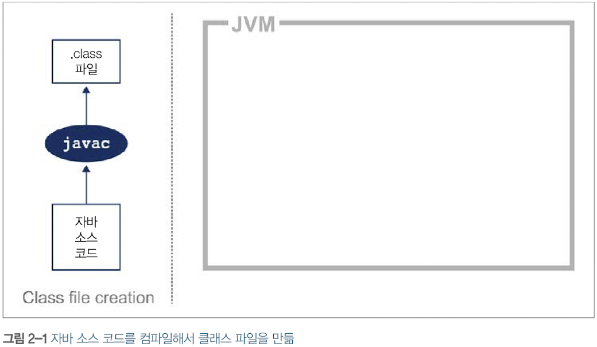
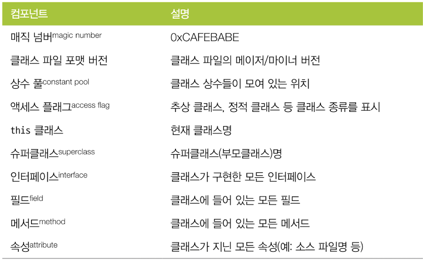
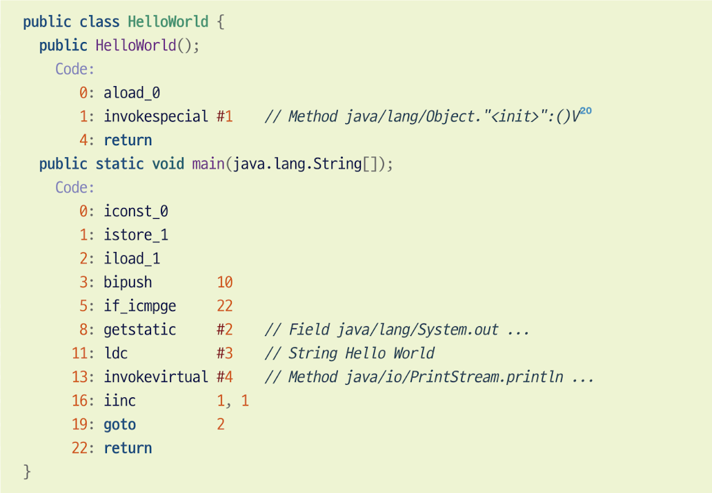
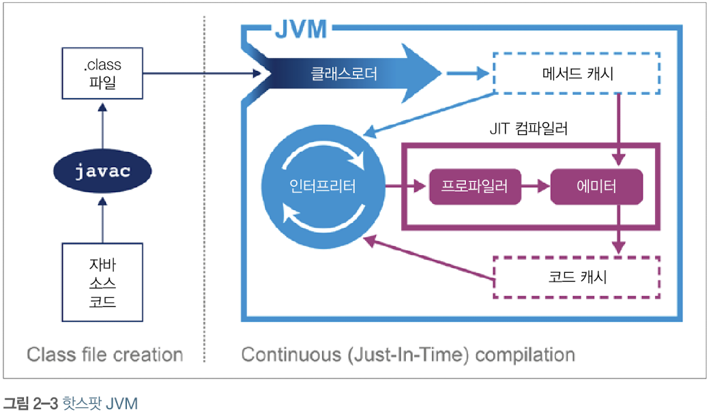
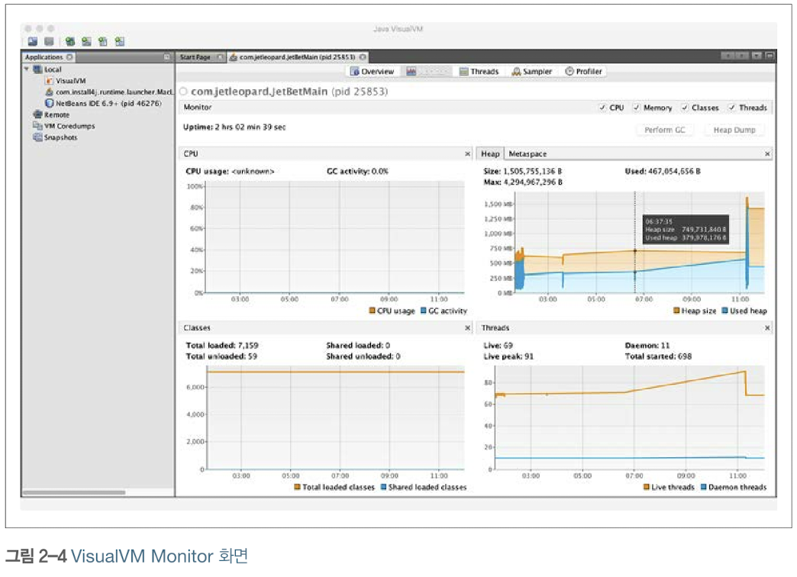

# 2장: JVM 이야기
기본적인 JVM 기술 스택의 구조

## 2.1 인터프리팅과 클래스로딩
JVM은 스택 기반의 해석 머신으로, opcode를 순서대로 처리하는 'while 루프 안의 switch문'이라고 간단하게 생각할 수 있다. 자바 애플리케이션을 실행하면 가상 머신 프로세스가 구동된다. 이 때 자바 가상 환경이 구성되고 스택 머신이 초기화 된 다음 유저가 작성한 클래스 파일이 실행된다.  
애플리케이션의 진입점은 클래스 안의 main() 메서드인데, 제어권을 이 클래스로 넘기려면 가상 머신이 실행되기 전에 이 클래스를 로드해야 한다. 여기에 자바 클래스로딩 메커니즘이 관여한다.  
1. 부트스트랩 클래스가 **최소한의 필수 클래스만 담고 있는 자바 런타임 코어 클래스**를 로드한다.  
2. 확장 클래스 로더가 부트스트랩 클래스로더를 자기 부모로 설정하고, 필요한 경우 네이티브 코드를 제공하고 기본 환경을 오버라이드한다.  
3. 애플리케이션 클래스로더가 생성되고 지정된 클래스패스에 위치한 유저 클래스를 로드한다.  
클래스로딩 메커니즘은 이 과정으로 실행되며, 프로그램 실행 과정에서 새 클래스는 **디펜던시**에 로드된다. 클래스를 찾지 못하면 부모 클래스로더에게 룩업 과정을 넘기고, 부트스트랩도 룩업하지 못하면 ClassNotFoundException이 발생하므로 빌드 시 운영 환경과 동일한 클래스패스로 컴파일하는 것이 좋다.

## 2.2 바이트코드 실행
자바 소스 코드는 실행되기 전에 먼저 javac에 의해 컴파일 된다. javac는 자바 소스코드를 바이트코드로 구성된 .class 파일로 변경한다. javac를 수행하는 동안 최적화는 거의 수행되지 않아 바이트코드를 javap와 같은 역어셈블리 툴로 쉽게 확인할 수 있다. (https://blog.lse.epita.fr//2014/04/28/0xcafebabe-java-class-file-format-an-overview.html)

바이트코드는 특정 컴퓨터 아키텍처에 특정하지 않은 중간 표현형이다.   
아키텍처에 종속되지 않으므로 이식성이 뛰어나 JVM 지원 플랫폼 어디서든 실행할 수 있다. 클래스 파일은 컴파일 되었을 때 다음과 같은 구조를 가진다.

간단하게 작성된 HelloWorld 클래스를 컴파일했을 때 변환된 바이트코드를 확인해보자.
```
    public class HelloWorld {
        public static void main(String[] args) {
            for (int i = 0; i < 10; i++){
                System.out.println("Hello World");
            }
        }
    }
```
javap를 사용해 바이트코드를 확인한 결과이다.

기본적으로 메서드는 main()뿐이었지만 자동적으로 기본 생성자를 추가된 모습을 확인할 수 있다. aload_0 명령으로 this 레퍼런스를 스택에 올리고, invokespecial 명령으로 부모 생성자를 호출한 뒤 객체를 생성하는 작업을 담당하는 인스턴스 메서드를 실행한다.  
main() 메서드 안에서는 iconst_0으로 0을 평가 스택에 푸시하고, istore_1로 이 상수를 1번째 지역 변수에 저장한다. 이 변수를 iload_1을 통해 스택으로 다시 로드한 뒤, 상수 10을 bipush를 통해 푸시하여 if_icmpge를 사용해 둘을 비교한다. for 문을 탈출하기 위한 조건이 만족되지 않으면, 8번 줄에서 getstatic을 통해 System.out의 정적 메서드를 해석하고 "Hello World"라는 문자열을 ldc를 통해 로드한다. 그 다음 invoke virtual 명령으로 System.out에 속한 인스턴스 메서드(println())를 실행한다. 정숫값은 1 증가되고, goto를 통해 다시 2번 명령으로 되돌아간다.

## 2.3 핫스팟 입문
핫스팟 가상 머신이 개발된 이후로, 자바는 C/C++에 필적하는 성능을 가지게 되었다.

C++은 제로 코스트 추상화 사상에 근거한 기계에 가까운 언어이고, 자바는 개발자의 우수한 생산성을 장점으로 두고 엄격한 저수준 제어를 대행하는 언어이다. C++은 이론적으로 더 뛰어난 성능을 발휘할 수 있지만, 개발자가 아주 세세한 저수준까지 코딩해야 하며, AOT 컴파일을 통해 컴파일되기 때문에 플랫폼에 종속적인 단점이 있다. 자바는 이와 다르게 핫스팟이 프로그램의 런타임 동작을 분석하고 성능에 가장 유리한 방향으로 영리한 최적화를 적용하는 방식으로 동작한다.

### 2.3.1 JIT 컴파일이란?
자바 프로그램은 바이트코드 인터프리터가 가상화한 스택 머신에서 명령어를 실행하며 시작된다. 이 방식으로도 클래스 파일을 문제 없이 실행할 수 있지만, 프로그램이 성능을 최대로 내려면 네이티브 기능을 활용하여 CPU에서 직접 프로그램을 실행시켜야 한다.  
이를 위해 핫스팟은 JIT 컴파일을 사용하여 메서드와 루프 등의 프로그램 단위를 바이트코드에서 네이티브 코드로 컴파일한다. 핫스팟은 애플리케이션을 모니터링하면서 가장 자주 실행되는 코드 파트를 발견해 JIT 컴파일을 수행한다. 이렇게 분석하는 동안 추적 정보가 취합되며 더욱 정교하게 최적화를 수행할 수 있다.  
JIT 방식의 가장 큰 장점은 **컴파일러가 해석 단계에서 수집한 추적 정보를 근거로 최적화를 결정한다는 점**이다. 자바 소스 코드가 바이트코드로 변환된 뒤 JIT를 거친 후 실제로 실행되는 코드는 처음에 작성된 소스 코드와는 전혀 다르다는 점을 기억하자. 자바는 C++과 같은 언어와 다르게 성능을 쉽게 예측할 수 없지만, AOT 플랫폼에서 불가능한 방식으로 런타임 정보를 활용하므로 동적 인라이닝 또는 가상 호출로 성능을 개선하며, CPU의 타입을 감지(JVM 인트린직)해 특정 프로세서의 기능에 맞게 최적화를 적용할 수 있는 장점이 있다. 마지막으로, 자바에서는 '상식적인' 추론으로 애플리케이션이 실제로 동작하는 방식을 넘겨짚지 않도록 주의해야 한다.

## 2.4 JVM 메모리 관리
C와 C++과 같은 언어는 메모리 할당/해제 작업을 개발자가 직접 수행한다. 스마트 포인터를 도입해 개선되긴 했지만, 개발자가 메모리를 제대로 관리하지 않아 에러가 발생하는 일이 비일비재했다. 반면 자바는 **가비지 수집**이라는 프로세스를 활용해 힙 메모리를 자동으로 관리한다. GC는 불확정적 프로세스로, 여러 가지 가비지 수집 알고리즘이 개발되었고 GC가 실행되는 동안에는 다른 애플리케이션이 모두 중단되고 하던 일 또한 멈춰야 하므로 무시할 수 없는 오버헤드가 발생한다.

## 2.5 스레딩과 자바 메모리 모델(JMM)
자바는 멀티스레드 프로그래밍을 기본적으로 지원한다. 자바 어플리케이션 스레드는 정확히 하나의 전용 OS 스레드에 대응되며, 공유 스레드 풀을 사용하면 만족할 만한 수준의 성능이 나오지 않는다. 자바의 멀티스레드 방식은 다음 세 가지 기본 설계 원칙에 기반한다.
- 자바 프로세스의 모든 스레드는 가비지가 수집되는 하나의 공용 힙을 가진다.
- 한 스레드가 생성된 객체는 그 객체를 참조하는 다른 스레드가 액세스할 수 있다.
- 기본적으로 객체는 변경 가능(mutable)하다. 즉, 객체 필드에 할당된 값은 프로그래머가 Final 키워드로 불변(immutable) 표시하지 않는 한 바뀔 수 있다.
JMM은 다른 실행 스레드가 객체 안에서 변경되는 값을 어떻게 바라보는 지를 기술한 공식 메모리 모델이다. 예를 들어, 스레드 A와 B가 동시에 객체 obj를 참조할 때 스레드 A가 obj 값을 변경하는 경우에는 스케줄러가 CPU 코어에서 스레드를 방출하는 경우에 스레드 B가 무효 상태의 객체를 바라보는 가능성이 존재하므로 간단하지 않은 문제이다. 상호 배타적 락을 통해 코드가 동시 실행되는 도중 객체가 손상되는 현상을 막을 수 있지만, 애플리케이션에서 사용하려면 상당히 복잡해질 수 있다.

## 2.6 JVM 구현체 종류
- OpenJDK  
자바 기준 구현체를 제공하는 특별한 오픈 소스 프로젝트이다.
- 오라클 자바(Oracle)  
가장 널리 알려진 구현체로, OpenJDK를 기반으로 한다.
- 줄루(Zulu)  
아줄 시스템이 제작한 자바 풀 인증을 받은 OpenJDK 구현체이다.
- 아이스티(IcedTea)  
레드햇이 제작한 풀 인증을 받은 OpenJDK 기반 자바 구현체이다.
- 징(Zing)  
아줄 시스템이 제작한 고성능 사용 JVM이며, 대용량 힙 메모리와 멀티 CPU 서버급 시스템에서 구동되는 64비트 리눅스에서만 작동한다.
- J9  
IBM에서 제작되었으며, IBM 사용 제품의 근간을 이루고 있다.
- 에비안(Avian)  
JVM의 세부 작동 원리가 궁금한 개발자에게 훌륭한 학습 도구 역할을 하는 오픈 소스 프로젝트이다.
- 안드로이드(Android)  
자체 런타임에서 직접 지원되는 OpenJDK 8 클래스 라이브러리를 사요한느 방향으로 옮겨가는 추세이다.

### 2.6.1 JVM 라이선스
오라클 자바는 OpenJDK 코드 베이스이지만 오픈 소스가 아닌 상용 제품이다. 오라클 JDK와 OepnJDK는 라이선스 외에는 아무런 차이가 없지만, 오라클 라이선스의 경우에는 회사 밖으로 오라클 바이너리를 재배포해서는 안되고, 사전 동의 없이 오라클 바이너리를 패치하면 안된다는 등의 몇 가지 조항이 있으므로 JVM 업체를 신중하게 고려하여 선정하는 것이 좋다.

## 2.7 JVM 모니터링과 툴링
JVM은 실행중인 애플리케이션을 인스트루먼테이션(오류 진단 혹은 성능 개선을 위해 애플리케이션에 특정한 코드를 끼워넣는 것), 모니터링, 관측하는 다양한 기술을 제공한다. 다음은 이런 종류의 툴에 쓰이는 몇 가지 기술이다.
- 자바 관리 확장(JMX)  
JVM과 그 위에서 동작하는 애플리케이션을 제어하고 모니터링하는 강력한 범용 툴이며, 메서드를 호출하고 매개변수를 변경할 수 있는 JVM 관리용 기본 수단이다.
- 자바 에이전트  
자바 언어로 작성된 툴 컴포넌트로, java.lang.instrument 인터페이스로 메서드 바이트코드를 조작한다. 매니페스트를 작성하고, premain() 메서드를 구현하는 에이전트 클래스명을 반드시 지정해야 한다.
- JVM 툴 인터페이스(JVMTI)  
JVM의 네이티브 인터페이스이며, JVM 이벤트를 모니터링하며 알림을 받을 수 있도록 만든 통신 인터페이스이다. 네이티브 코드(C/C++)로 JVMTI 에이전트를 개발하기 떄문에 애플리케이션에 악영향을 미칠 가능성이 있다.
- 서비서빌리티 에이전트(SA)  
자바 객체, 핫스팟 자료 구조 모두 표출 가능한 API와 툴을 모아놓은 것으로, 대상 JVM에서 코드를 실행하지 않고 심볼 룩업이나 프로세스 메모리를 읽어 디버깅을 수행할 수 있다.

### 2.7.1 VisualVM
넷빈즈 플랫폼 기반의 시각화 툴로, JVM 어태치 메커니즘(자바 Attach API를 이용해 애플리케이션을 타깃 JVM에 부착하는 장치)을 이용해 실행 프로세르를 실시간으로 모니터링한다.

원격 프로세스에 VisualVM을 연결할 수도 있는데, 원격지와의 인바운드 접속을 허용(원격 호스트에서 jstat 실행)되어야 한다. 탭에서 hostname과 display name을 입력하여 원격 프로세스에 접속할 수 있다.  다음은 VisualVM의 다섯 가지 기본 탭이다.
- 개요  
자바 프로세스에 관한 요약 정보를 표시한다.
- 모니터  
CPU, 힙 사용량, 로드/언로드된 클래스 개수 및 실행 중인 스레드 개수 등의 현황을 알 수 있다.
- 스레드  
실행 중인 애플리케이션 각 스레드가 시간대별로 표시되고, 스레드 덤프를 뜰 수도 있다.
- 샘플러 및 프로파일러   
CPU 및 메모리 사용률에 관한 단순 샘플링 결과가 표시된다.

### 2.8 마치며
JVM 내부의 전체 모습을 빠르게 훑어보았으며, 다음 장에서는 운영체제 및 하드웨어의 작동 세부, 그리고 VM과 네이티브 서브시스템이 상호작용 하는 예제 코드를 살펴본다.