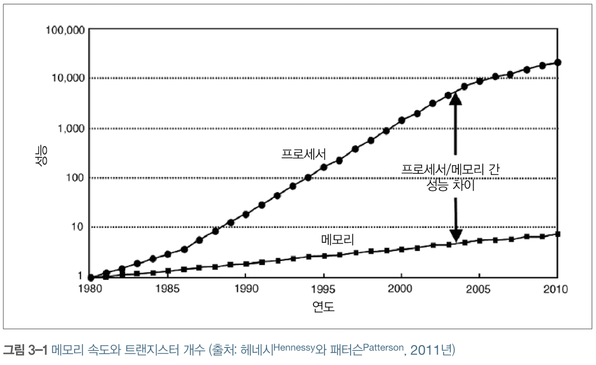
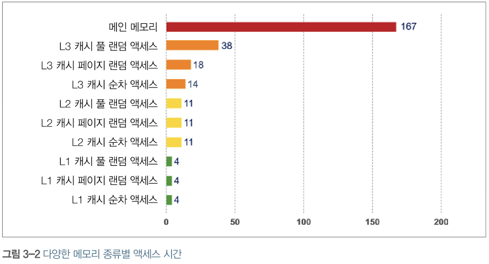
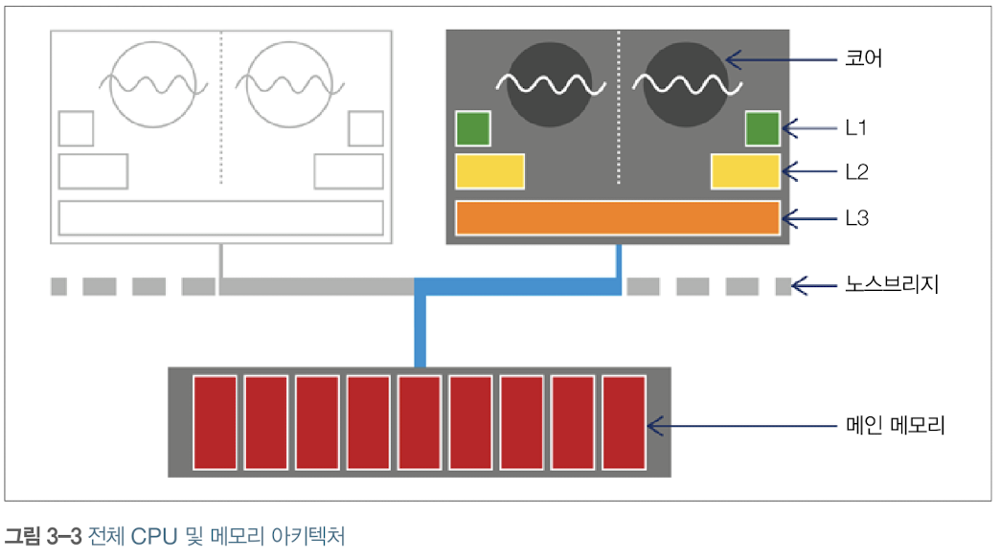
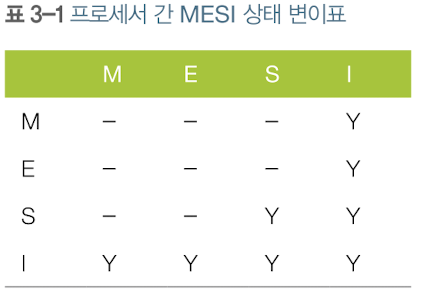
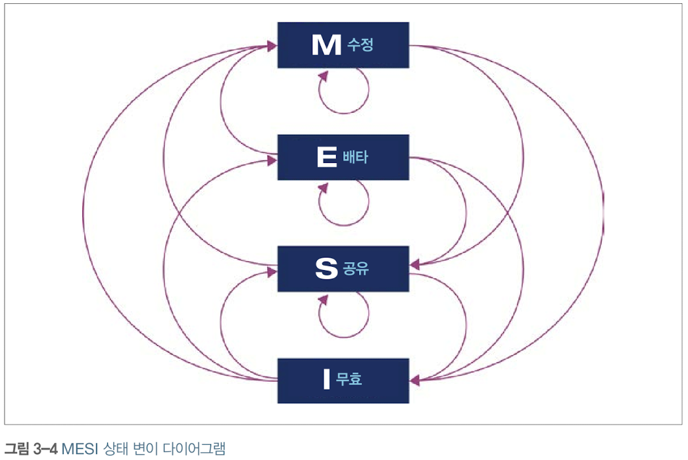
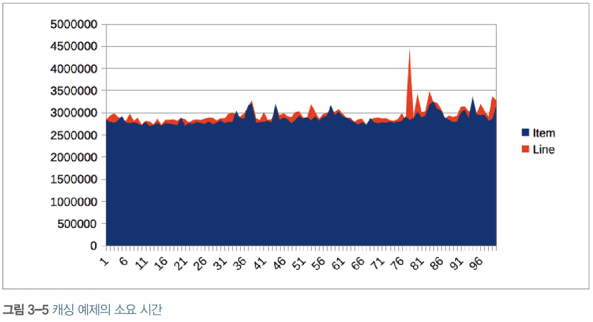
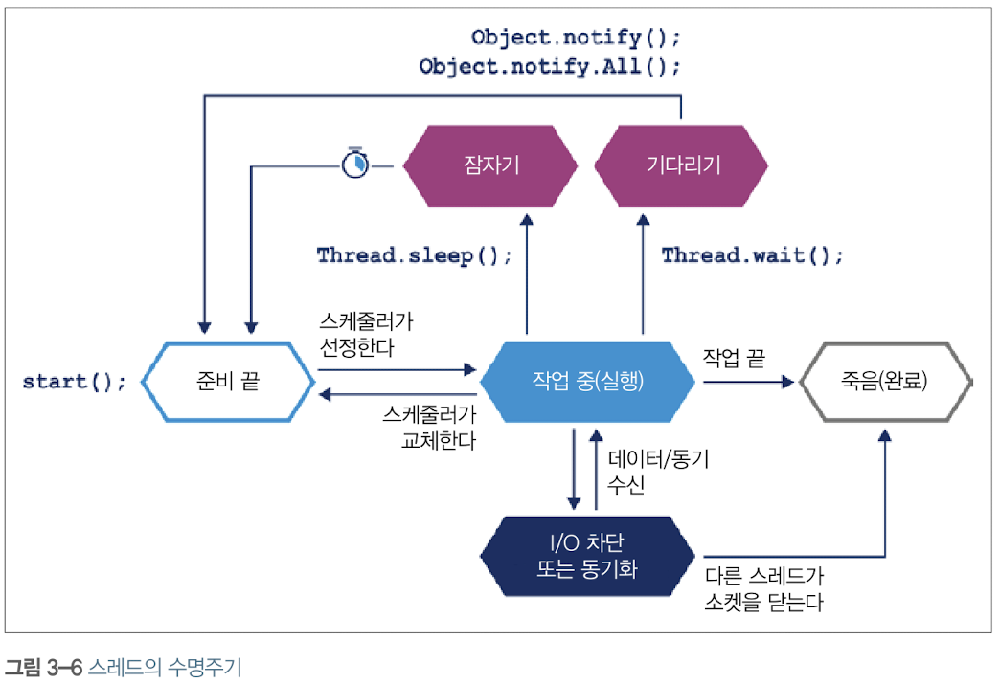
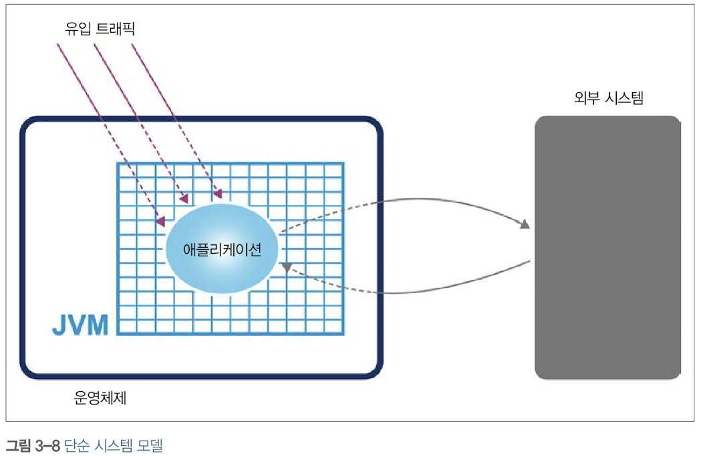
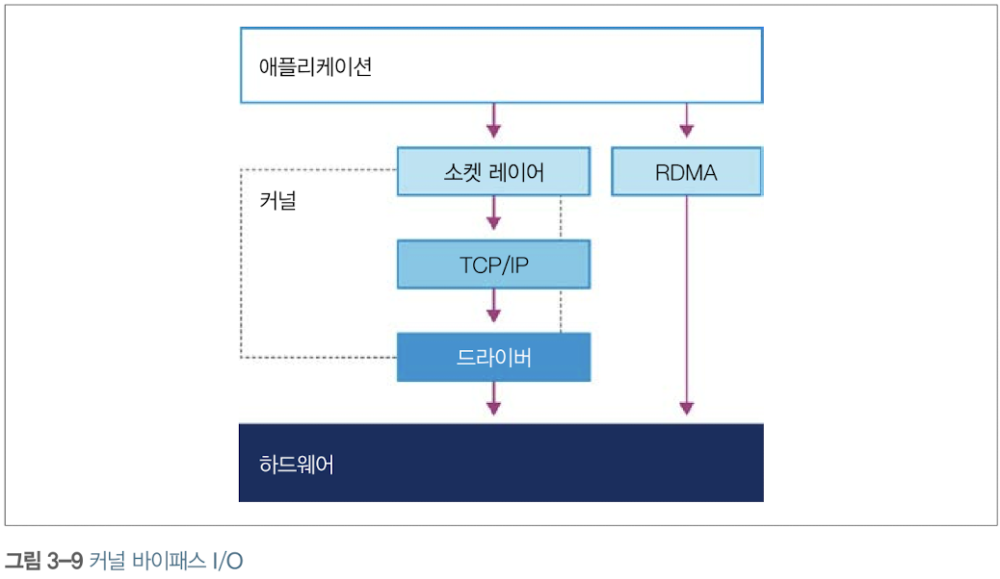
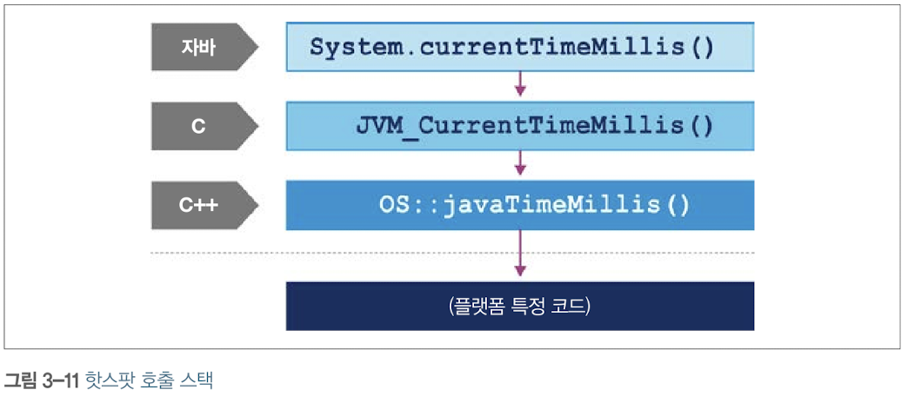

# 3. 하드웨어와 운영체제
최신 하드웨어와 OS에 관한 기본 지식

## 3.1 최신 하드웨어 소개
대학교의 하드웨어 아키텍처 수업 시간에는 너무 간단하고 고전적인 하드웨어 내용을 배운다. 1990년대 이후 인텔 x86/x64 아키텍처는 많은 변화를 겪었으므로 그간 발전된 여러 가지 CPU 기술에 대해 알아보자.

## 3.2 메모리

트랜지스터 개수의 급증으로 클록 속도가 4.77MHz에서 2GHz까지 높아졌는데, 메인 메모리의 성능은 이에 비례하지 않았다. 따라서 클록 속도가 올라가도 데이터가 도착할 때까지 CPU가 기다릴 필요가 있었다.

### 3.2.1 메모리 캐시
이런 문제를 해결하기 위해 CPU 캐시가 고안되었다. CPU 캐시는 CPU에 있는 메모리 영역으로, 레지스터보다 느리지만 메인 메모리보다 빠르다. 자주 액세스하는 메모리 위치는 CPU가 메인 메모리를 재참조할 필요 없도록 사본을 캐시에 보관하는 방식이다.  
요즘 CPU에는 액세스 빈도가 높은 캐시일 수록 프로세서 코어와 더 가까이 위치하는 식으로 여러 계층이 있는데, 가장 가까운 캐시를 L1, 그 다음을 L2라고 명명한다. 일반적으로 각 실행 코어에 전용 프라이빗 캐시 L1, L2를 두고, 일부 또는 전체 코어가 공유하는 L3 캐시를 둔다.  

캐시 아키텍처를 이용해 액세스 시간을 줄이고 코어가 처리할 데이터를 계속 채워 넣을 수 있고, 최신 CPU는 더 많은 예산을 캐시에 투자한다. 다음은 전체적인 아키텍처이다.

CPU 코어마다 전용 L1, L2 캐시가 있고 모든 코어가 공유하는 L3 캐시가 있으며, 메인 메모리는 노스브릿지 컴포넌트를 거쳐 액세스하고 이 버스를 관통하여 메인 메모리 액세스 시간이 감소한다.  
캐시 아키텍처를 추가한 덕분에 프로세서 처리율은 개선되었지만, 메모리에 있는 데이터를 어떻게 캐시로 가져오고 어떻게 메모리에 다시 쓸지 결정할 필요가 있었다. **캐시 일관성 프로토콜**이라는 방법으로 이 문제를 해결한다.  
MESI 프로토콜은 프로세서의 가장 저수준에서 사용하고, 캐시 라인 상태를 다음 4가지로 정의한다.
- Modified: 데이터가 수정된 상태
- Exclusive: 이 캐시에만 존재하고 메인 메모리 내용과 동일한 상태
- Shared: 둘 이상의 캐시에 데이터가 들어 있고 메모리 내용과 동일한 상태
- Invalid: 다른 프로세스가 데이터를 수정하여 무효한 상태


프로세서가 처음 나왔을 때에는 매번 캐시 연산 결과를 바로 메모리에 기록하는 **동시 기록(Write-through)** 방식을 사용하였으나, 효율이 낮아 나중에 출시된 프로세서는 **후기록(Write-back)** 방식을 사용하여 캐시 블록이 교체될 때 프로세서가 변경된 캐시 블록만 메모리에 기록한다.  
최대 전송률은 메모리 클록 주파수, 메모리 버스 폭(보통 64비트), 인터페이스 개수(보통 2개)에 비례하여 변한다.

다음은 캐시 하드웨어의 작동 원리를 나타낸 간단한 코드이다.  
```java
public class Caching {
    private final int ARR_SIZE = 2 * 1024 * 1024;
    private final int[] testData = new int[ARR_SIZE];
    private void run() {
        System.err.printIn("Start: " + System.currentTimeMillis());
        for (int i = 0; i < 15_000; i++) {
            touchEveryLine();
            touchEveryItem();
        }
        System.err.println("Warmup Finished: " + System.currentTimeMillis());
        System.err.println("Item Line");
        for (int i = 0; i < 100; i++) {
            long tO = System.nanoTime();
            touchEveryLine();
            long t1 = System.nanoTime());
            touchEveryItem()};
        long t2 = System.nanoTime();
        long elItem = t2 - t1;
        long elline = t1 - t0;
        double diff = elItem - elLine;
        System.err.printIn(elItem + " " + elLine + " " + (100 * diff / elLine));
    }
    private void touchEveryItem() {
        for (int i = 0; i‹ testData.length; i++)
            testData[i]++;
    }
    private void touchEveryLine() {
        for (int i = 0; i‹ testData.length; i += 16)
            testData[i]++;
    }
    public static void main(String[] args) {
        Caching c = new Caching();
        c.run();
    }
}
```
코드를 보면 touchEveryItem() 메서드가 touchEveryLine() 메서드보다 16배 더 많은 일을 할 것 같지만, 실제로는 그렇지 않다.



이 그래프에서 16배 차이 나는 경우는 보이지 않고, 두 메서드를 이용해 배열을 메인 메모리에서 캐시로 가져가는 경우에 메모리 버스를 예열시키는 부분이 가장 큰 영향을 끼친다. 대략 100MB짜리 메모리 덩이를 나르는 단순 메모리 연산을 약 3ms에 1회 수행한 것으로 보인다.

## 3.3 최신 프로세서들의 특성
메모리 캐시뿐만 아니라 증가한 트랜지스터를 활용하는 여러가지 다른 기술이 있다.

### 3.3.1 변환 색인 버퍼(TLB)
변환 색인 버퍼는 여러 캐시에서 중요하게 쓰이는 장치로, 가상 메모리 주소를 물리 메모리 주소로 맵핑하는 페이지 테이블의 캐시 역할을 수행한다. 페이지 테이블의 크기는 매우 크지만, 모든 주소가 사용되지 않기 때문에 TLB를 사용해 성능을 크게 개선할 수 있다.

### *가상 메모리란?*
가상 메모리는 메모리가 실제 메모리보다 많아 보이게 하는 기술이다. 프로세스를 실행하기 위해 코드는 반드시 메모리에 적재되어야 하는데, 실제 사용하는 메모리는 용량이 크지 않기 때문에 여러 프로세스를 동시에 실행하는 시스템에서는 가상 메모리를 반드시 필요로 한다. 또한 가상 메모리를 통해 프로레스 메모리 영역 간 침범을 방지할 수 있다.  
프로세스는 가상 주소(Virtual address)를 사용하고, 실제 해당 주소에서 데이터를 읽고 쓰는 경우에만 물리 주소(Physical address)를 사용하면 된다. 이 때 가상 주소를 물리 주소로 변환하는 장치가 바로 CPU 내의 MMU이다.

### *페이징이란?*
하나의 프로세스에서 특정 시간 동안 쓰는 메모리 영역은 아주 일부분이므로 이 일부분만 물리 메모리에 적재하자는 것이 가상 메모리의 기본적인 개념이다. 이 때 얼마만큼 물리 메모리에 적재할 지는 페이지라는 단위로 다룬다. 보통 리눅스에서는 4KB 단위로 페이징하며, **페이지 번호를 기반으로 가상 주소와 물리 주소의 맵핑 정보를 기록한 뒤 사용**한다. 따라서 페이지로 이루어진 가상 메모리와 프레임으로 이루어진 물리 메모리가 있고, 이 둘의 맵핑 정보를 기록하는 **페이지 테이블**이 존재한다.    
프로세스가 실행될 때 페이지 테이블의 주소는 PCB에 적재되어 있고, 가상 주소는 페이지 번호 p와 오프셋 d로 이루어져 있어 해당 페이지 번호를 통해 물리 메모리에 접근한 뒤 오프셋만큼 움직여 실제 물리 주소에 접근할 수 있다. 페이지 테이블에는 이 외에도 Validation bit가 있는데, 해당 페이지가 현재 물리 메모리에 적재되어있는 지를 나타낸다.  
다중 단계 페이징을 사용하여 페이지 번호가 2^20 값을 갖게 하지 않고 페이지 디렉토리가 2^10, 페이지 번호가 2^10을 갖게 하는 방식을 사용해 실제로 접근되는 디렉터리에서만 페이지 테이블을 생성하게 되어 페이징을 더욱 효율적으로 처리할 수 있다.

### 3.3.2 분기 예측과 추측 실행
분기 예측은 최신 프로세서의 고급 기법으로, 조건 분기하는 기준값을 평가하는 동안 대기하지 않고 가장 발생 가능성이 큰 브랜치를 미리 결정해 파이프라인을 채운다. 만약 추측이 맞아 떨어지면 CPU는 계속해서 다음 작업을 진행하고, 틀리면 부분적으로 실행한 명령을 모두 폐기한 뒤 파이프라인을 다시 비운다.

### 3.3.3 하드웨어 메모리 모델
멀티코어 시스템에서 메모리에 관한 가장 근본적인 질문으로, *어떻게 하면 서로 다른 여러 CPU가 일관되게 동일한 메모리 주소를 액세스할 수 있을까?*가 있다. 이 답은 하드웨어에 따라 다르지만 JIT 컴파일러인 javac와 CPU는 현재 스레드가 바라보는 결과에 아무런 영향이 없다는 전제에서 일반적으로 코드 실행 순서를 바꿀 수 있다.
```java
    myInt = otherInt;
    intChanged = true;
```
실행 스레드 입장에선 이 두 문장을 바꾸어도 되지만, 다른 스레드 입장에서는 myInt가 옛날 값을 읽을 수 있다. 순서 바꾸기 방식은 로드, 스토어문의 배치와 CPU 아키텍처에 따라 조금씩 차이가 있으므로 JMM은 이를 고려하여 명시적으로 약한 모델로 설계되었다. 따라서 멀티스레드 코드가 제대로 작동하게 하려면 락과 volatile를 정확히 사용해야 한다.

## 3.4 운영체제
OS는 여러 실행 프로세스가 공유하는 리소스 액세스를 관리하고, 이 중에서도 메모리와 CPU 시간을 중요하게 관리한다. MMU를 통한 Virtual addressing과 페이지 테이블이 메모리 액세스 제어의 핵심이다. TLB는 여기서 물리 메모리 주소 룩업 시간을 줄여준다. MMU는 개발자가 직접 손대기엔 너무 저수준 영역이므로, OS 액세스 스케줄러에 대해 살펴보도록 하자ㅏ.

### 3.4.1 스케줄러
프로세스 스케줄러는 실행 큐를 사용해 CPU 액세스를 통제한다. 스케줄러는 인터럽트에 응답하고 CPU 코어 액세스를 관리한다. 다음 그림은 자바 스레드의 수명주기이다.



OS는 그 특성상 CPU에서 코드가 실행되지 않는 시간을 유발하므로, 코드가 정작 실행되는 시간보다 기다리는 시간이 더 많을 수 있다. 그러므로 실제로 관측한 프로세스에서 나온 통계치가 다른 프로세스에 영향을 받을 수 있으며, 이런 지터와 스케줄링 오버헤드는 측정 결과에 노이즈를 끼게 만든다. 다음과 같은 코드로 스케줄링 오버헤드를 짐작할 수도 있다.

```java
    long start = System.currentTimeMillis();
    for (int i = 0; i < 1000; i++){
        Thread.sleep(1);
    }
    long end = System.currentTimeMillis();
    System.out.println("Millis elapsed: " + (end - start) / 4000.0);
```

### 3.4.2 시간 문제
타이밍은 성능 측정, 프로세스 스케줄링 등의 파트에서 아주 중요한데, 자바에서는 os::javaTimeMills() 함수를 사용한다. 이는 호스트 OS 기능에 의존하는 함수여서 네이티브 메서드로 구현된다. 따라서 자바에서 타이밍 콜을 해도 작동 방식은 OS와 OS가 위치한 머신에 따라 달라질 수 있다.

### 3.4.3 컨텍스트 교환
컨텍스트 교환은 스케줄러가 현재 실행 중인 태스크를 없애고 대기 중인 다른 태스크로 대체하는 프로세스이다. 이는 유저 스레드 사이에서도 발생하고, 유저 모드와 커널 모드 사이에서도 발생하는데 이러한 모드 교환은 특히 비용이 많이 든다. 유저 스레드가 타임 슬라이스 도중 커널 모드로 바뀌어 기능을 실행해야할 때가 있는데, 이러한 경우에 유저 공간에 있는 코드가 액세스하는 메모리 영역과 커널 코드가 액세스하는 영역이 다르기 때문에 캐시를 어쩔 수 없이 비워야 한다.  
커널 모드로 컨텍스트 교환이 이루어지면 모든 캐시가 무효화되고, 이로 인해 유저 공간으로 다시 제어권이 넘어간 후에도 이 여파가 남아 있다. 그래서 다음 그림의 시스템 콜의 진짜 비용이 가려진다.

리눅스에서는 이 단점을 극곱갛기 위해 가상 동적 공유 객체(vDSO)라는 장치를 제공하는데, 이는 커널 프리빌리지가 필요 없는 시스템 콜의 속도를 높이기 위해 사용하는 유저 공간의 메모리 영역이다. 예를 들어 gettimeofday()는 커널 자료 구조를 읽어 시스템 클록 시간을 얻는 시스템 콜인데, Side effect가 없으므로 프리빌리지가 필요 없다. 이 자료 구조를 vDSO로 유저 프로세스의 주소 공간에 맵핑시키면 컨텍스트 교환으로 인한 손해를 없앨 수 있다. 자바 애플리케이션에서 이런 식으로 타이밍 시 성능을 끌어올릴 수 있다.

## 3.5 단순 시스템 모델
여기서는 단순한 시스템 모델을 예로 들어 성능 무넺를 일으키는 근원을 알아본다. 이 모델은 OS 측정값으로 나타낼 수 있으며, 다음 기본 컴포넌트로 구성된다.
- 애플리케이션이 실행되는 하드웨어와 OS
- 애플리케이션이 실행되는 JVM/컨테이너
- 애플리케이션 코드 자체
- 애플리케이션이 호출하는 외부 시스템
- 애플리케이션으로 유입되는 트래픽

다음 절에서 시스템의 특정 부위를 좁히거나 격리하는 방법으로 어디가 문제인지 밝혀내는 단순한 진단 기법을 알아본다.

## 3.6 기본 감지 전략
성능 진단의 첫 단추는 어느 리소스가 한계에 다다랐는지 밝히는 일이다. 부족한 리소스를 알아야 성능 지표를 제대로 튜닝할 수 있다.

### 3.6.1 CPU 사용률
CPU 사용률은 애플리케이션 성능을 나타내는 핵심 지표이다. 또한 부하가 집중되면 사용률이 가능한 100%에 가까워야 한다. 애플리케이션 성능을 분석할 때에는 시스템에 충분한 부하를 가하는 것이 핵심이다.  
성능 엔지니어라면 vmstat, iostat 두 가지 기본 툴은 쓸 줄 알아야 한다. 이 두 명령어는 현재 가상 메모리 및 I/O 서브시스템 상태에 관한 유용한 데이터를 신속히 제공한다.
```
    ubuntu@ip-172-31-45-83:~$ vmstat 1
    procs -----------memory---------- ---swap-- -----io---- -system-- ------cpu-----
    r  b   swpd   free   buff  cache   si   so    bi    bo   in   cs us sy id wa st
    11  0  87808  79128  54224 427352    0    1     6     9    4    2  0  0 100  0  0
    9  0  88320  83552  52960 417776    4  648  1352   648  426 3070 89 11  0  0  0
    9  0  91904  84144  50864 409888    0 3584   800  3584  376  660 91  9  0  0  0
    9  0  95232  83556  48200 397404   24 3272  1680 13240  916 1874 84 16  0  0  0
    9  0  98304  86796  47564 382568    0 3004  3676 12372  558 2835 88 12  0  0  0
    9  0  98304  74448  47664 385608    0    0   468     0  402 1508 90 10  0  0  0
    11  0  98816  76148  47452 381692    0  464   836  9336  701 3079 87 13  0  0  0
```
vmstat 1은 1초마다 한번씩 다음 줄에 결과를 표시한다. 다음은 각 섹션에 대한 설명이다.
- proc: 실행 가능한 프로세스 r, 블로킹된 프로세스 개수 b
- memory: 스왑 메모리 swap, 미사용 메모리 free, 버퍼로 사용된 메모리 buff, 캐시로 사용된 메모리 cache
- swap: 디스크로 교체되어 들어간 스왑-인 메모리 si, 디스크에서 교체되어 나온 스왑-아웃 메모리 so
- io: 블록-인 bi, 블록-아웃 bo
- system: 인터럽트 in, 초당 컨텍스트 교환 cs
- cpu: 유저 시간 us, 커널 시간 sy, 유휴 시간 id, 대기 시간 wa, 도둑맞은 시간 st

이러한 도구를 사용해 CPU 사용률이 예상보다 낮을 때 컨텍스트 교환이나 I/O 단에서 문제가 발생했는지 확인할 수 있다. 하지만 스레드 락 경합을 감지하기 위해선 VisualVM과 같은 도구가 필요하다.

### 3.6.2 가비지 수집
핫스팟 JVM은 시작 시 메모리를 유저 공간에 할당/관리하므로 메모리 할당이나 가비지 수집을 위해 커널 교환을 할 일이 거의 없다. 따라서 시스템 CPU 사용률에 GC는 영향을 거의 미치지 않지만, 어떤 JVM 프로세스가 CPU를 유저 공간에서 많이 사용하고 있다면 GC가 영향을 미쳤을 가능성이 높다. 따라서 이런 상황에서는 GC 로그를 확인하고 새 항목이 추가되는 빈도를 알아보는 게 좋다.  
GC 로깅은 거의 비용이 들지 않으며, 분석용으로 가치가 높기 때문에 운영 환경에서는 GC 로그를 꼭 남겨야 한다.

### 3.6.3 입출력
파일 I/O는 가상 메모리라는 격리 장치가 존재하지 않아 개발자가 추상화할 장치가 존재하지 않어 전체 시스템 성능에 안 좋은 영향을 끼친다. 자바 프로그램은 다행히 단순한 I/O만 처리하기 때문에, 성능 분석자는 애플리케이션에서 I/O가 어떻게 일어나는지 인지하는 것으로 충분하다. iostat 같은 툴이 제공하는 bi, bo와 같은 기본 카운터 기능만 있어도 진단용으로 활용하기 충분하다.

**커널 바이패스 I/O**  
커널을 이용해 데이터를 복사해 유저 공간에 넣는 작업이 비용이 큰 경우, 네트워크 카드에 있는 데이터라면 네트워크 카드에서 직접적으로 유저가 접근 가능한 영역으로 데이터를 맵핑하는 전용 하드웨어/소프트웨어를 사용해 이중 복사를 막을 수 있다. 이는 아주 유용한 패턴이므로 고성능 I/O가 필요한 시스템에서 구현되고 있다.


### 3.6.4 기계 공감
기계 공감은 성능을 조금이라도 쥐어짜내야 하는 상황에서 하드웨어를 폭넓게 이해하고 공감할 수 있는 능력이 무엇보다 중요하다는 생각이다. 비록 JVM이 하드웨어를 추상화했지만, 고성능 및 저지연이 필수인 분야에서 개발자가 JVM을 효과적으로 활용하려면 JVM이 무엇인지, 하드웨어와 어떻게 상호작용하는지 이해해야 한다.  
캐시 라인 동작을 예로 들어보자. 캐시 라인을 사용하면 메모리 블록을 미리 가져올 수 있지만, 멀티스레드 환경에서 두 스레드가 동일한 캐시 라인에 있는 변수를 읽거나 쓰려고 하면 문제가 발생한다. 이 경우에 두 스레드가 캐시 라인을 번갈아가면서 무효화하고 메모리에서 다시 읽어들이면서 잘못된 공유를 하게되고 성능이 급락하게 된다.  
기계 공감 사상에 따르면 이런일이 발생할 수 있은을 이해하고 있어야 해결 방법을 찾을 수 있다. 캐시 라인을 공유한 변수를 찾고, 주변에 패딩을 넣어 다른 캐시 라인으로 보내는 것도 한 가지 방법이다.

## 3.7 가상화
가상화는 이미 실행 중인 호스트 OS 위에서 게스트 OS를 하나의 프로세스로 실행시키는 것을 말한다. 가상화된 환경에서는 일반적인 환경과 다르게 게스트 OS가 하드웨어에 직접 액세스할 수 없기 때문에 프리빌리지드 명령어를 언프리빌리지드 명령어로 고쳐 쓰고, 컨텍스트 교환 동안 지나친 캐시 플러시가 일어나지 않도록 일부 OS 커널의 자료 구조는 Shadowing한다. 이러한 점에 의해 가상 환경 내에서 프로그램을 실행하는 것은 성능 분석 및 튜닝을 복잡하게 한다.

## 3.8 JVM과 운영체제
JVM에서 스레드 스케줄링과 같은 서비스는 하부 OS에 반드시 액세스할 필요가 있다. 이런 기능은 native 키워드를 붙인 네이티브 메서드로 구현하며, C 언어로 작성된다. 이를 자바 메서드처럼 액세스하게 해주는 인터페이스를 자바 네이티브 인터페이스(JNI)라고 하며, Object 클래스에 getClass, hashCode, clone, notify, wait과 같은 함수는 논프라이빗 네이티브 메서드로 선언되어 있다. 
```C
    /* Only register the performance-critical methods */
    static JNINativeMethod methods[] = {
        {"currentTimeMillis", "()J", (void *) &JVM_CurrentTimeMillis},
        {"nanoTime", "()J", (void *) &JVM_NanoTime},
    ...
```
System.currentTimeMillis()를 예로 들어보면, 실제 코드는 C++로 작성됐지만 자바에서 C 코드 브릿지를 통해 엑세스할 수 있다. 이 메서드는 JVM_CurrentTimeMillis()라는 JVM 엔트리 포인트 메서드에 맵핑된다. 이 맵핑 관계는 .java/lang/System.c 파일의 JNI에 설정되어 있다.

여기서 os::javaTimeMillis()는 OS 이름 공간에 정의되어있고, OpenJDK 코드베이스의 OS별 서브디렉터리 어딘가에 소스 코드가 존재한다. 이렇게 플랫폼에 독립적인 자바 요소가 하부 OS 및 하드웨어가 제공하는 서비스를 호출하는 방식에 대해 간단히 살펴보았다.
```C
    {"arraycopy", "(" OBJ "I" OBJ "II)V", (void *)&JVM_ArrayCopy), };
    #undef OBJ
    JNIEXPORT void JNICALL
    Java_java_lang_System_registerNatives(JNIEnv *env, jclass cls)
    {
        (*env) -> RegisterNatives (env, cls,
                                        methods, sizeof(methods)/sizeof(methods[0]));
    }
```
